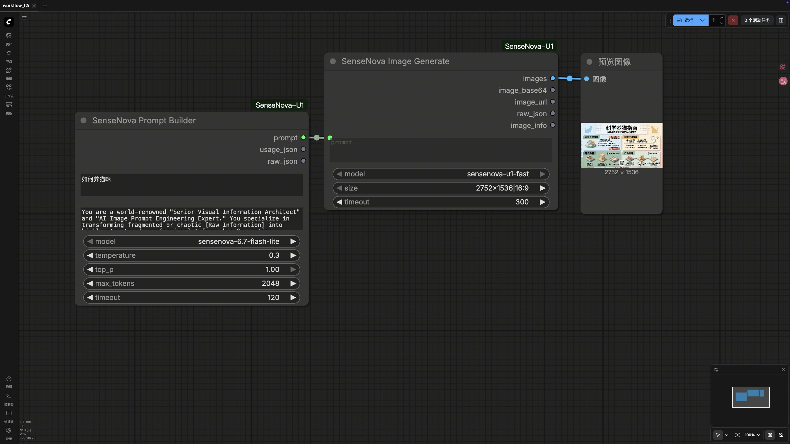
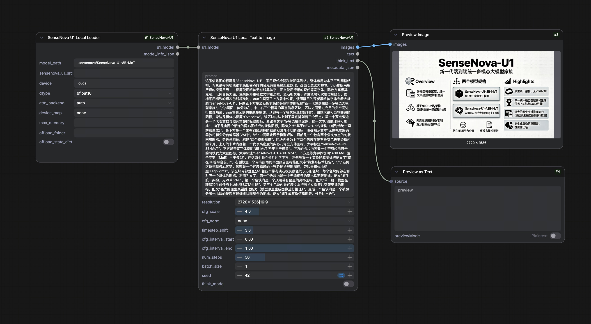
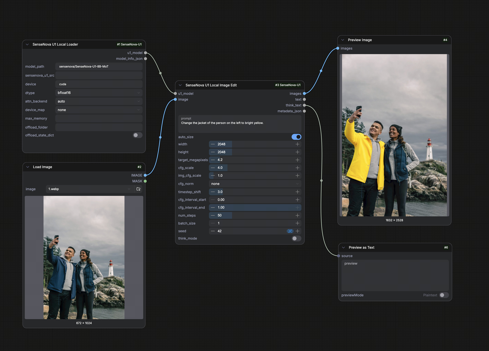
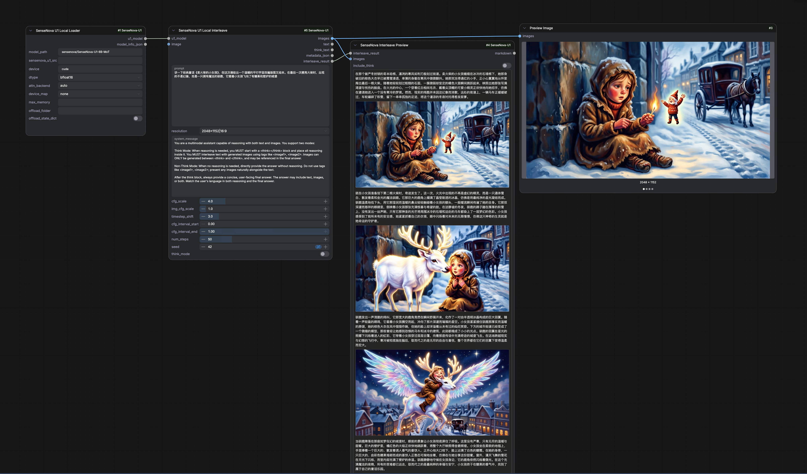

# SenseNova-U1 for ComfyUI

ComfyUI custom nodes for SenseNova-U1 API and local inference.

> Source of truth lives in [`OpenSenseNova/SenseNova-U1`](https://github.com/OpenSenseNova/SenseNova-U1)
> under `apps/comfyui/`. The standalone repo
> [`OpenSenseNova/ComfyUI-SenseNova-U1`](https://github.com/OpenSenseNova/ComfyUI-SenseNova-U1)
> is a read-only publish mirror used by Comfy Registry; please open PRs against
> the monorepo.

> Requires a ComfyUI build that ships the v3 node API (`comfy_api.latest`). The nodes are registered through `comfy_entrypoint()`; older ComfyUI installs that only support the v1 `NODE_CLASS_MAPPINGS` registration will not load them.

## Nodes

- `SenseNova Image Generate`: calls the U1-Fast image API.
- `SenseNova Chat`, `SenseNova Vision URL`, `SenseNova Vision Image`: utility API nodes.
- `SenseNova Prompt Builder`: rewrites raw ideas into image-generation prompts.
- `SenseNova U1 Local Loader`: loads a local or HuggingFace SenseNova-U1 checkpoint.
- `SenseNova U1 Local Text to Image`: runs local `t2i_generate`.
- `SenseNova U1 Local Image Edit`: runs local `it2i_generate`.
- `SenseNova U1 Local Interleave`: runs local `interleave_gen`.
- `SenseNova Interleave Preview`: renders ordered interleaved text / image results.

## Install

### Recommended (end users): ComfyUI Manager / Comfy Registry

Search for **SenseNova-U1** in ComfyUI Manager, or:

```bash
comfy node install ComfyUI-SenseNova-U1
```

This pulls the latest published release from https://registry.comfy.org and
installs the declared dependencies (including the `sensenova-u1` Python package
needed for local inference) into ComfyUI's Python environment automatically.
Restart ComfyUI afterwards.

### Developer install (from the SenseNova-U1 monorepo)

If you're hacking on the nodes alongside the model source:

```bash
python apps/comfyui/install.py --comfyui /path/to/ComfyUI
python -m pip install -r apps/comfyui/requirements.txt --no-deps  # skip the git-URL line
python -m pip install -e .                                        # install sensenova-u1 from src/
```

`install.py` symlinks (or copies, with `--copy`) `apps/comfyui/` into
`<ComfyUI>/custom_nodes/ComfyUI-SenseNova-U1`. Restart ComfyUI after installation.

**Source path auto-discovery is location-bound to the symlink.** In the
default symlink mode, `local_pipeline.default_source_path()` resolves
`__file__` through the symlink and uses `<repo>/src/` if it sees the file
sitting under `apps/comfyui/` — no `SENSENOVA_U1_SRC` needed. If you move,
rename, or delete the monorepo checkout, the link breaks; re-run
`install.py` to recreate it. With `--copy`, the files no longer point back
to the repo, so set `SENSENOVA_U1_SRC=/path/to/SenseNova-U1/src` (or fill
the loader node's `sensenova_u1_src` input) yourself.

## Workflows

Example workflows live in `example_workflows/`. Each links to a screenshot of the loaded graph in `docs/`:

| Workflow | Description | Preview |
| --- | --- | --- |
| `api_u1_fast_t2i.json` | API U1-Fast text-to-image |  |
| `local_t2i.json` | Local SenseNova-U1 text-to-image |  |
| `local_editing.json` | Local SenseNova-U1 image editing |  |
| `local_interleave.json` | Local SenseNova-U1 interleaved generation |  |

Drag a workflow JSON into ComfyUI, then update `model_path`, `device`, `device_map`, and prompt
settings as needed. For a smoke test, set `num_steps` to `1` or `2` before returning to the
recommended `50`.

## API Environment

API nodes read credentials from environment variables or `.env`:

```bash
export SN_API_KEY="your-api-token"
export SN_BASE_URL="https://token.sensenova.cn/v1"
```

Tokens are not exposed as node inputs, so they are not saved into ComfyUI workflows.

## GGUF Quantized Checkpoints

The `SenseNova U1 Local Loader` exposes an optional `gguf_checkpoint` dropdown
populated from `<comfyui>/models/gguf/` and the stock ComfyUI
`<comfyui>/models/diffusion_models/` folder (the default location used by
ComfyUI-GGUF style distributions). When a file is selected, weights are loaded
through `diffusers`' GGUF quantizer (dequantizing `nn.Linear` -> `GGUFLinear`)
instead of safetensors; config and tokenizer still come from `model_path`. The
default empty selection keeps the safetensors path.

Drop your `.gguf` file into either folder and restart ComfyUI to refresh the
dropdown.

Requirements: install the `gguf` extra in the ComfyUI Python environment, e.g.

```bash
python -m pip install -e ".[gguf]"     # from this repo, or
python -m pip install "gguf>=0.10.0" "diffusers>=0.30.0"
```

`gguf_checkpoint` cannot be combined with a non-`none` `device_map` — pick one.

## Notes On Samplers

Local U1 generation uses the sampling loop implemented by `t2i_generate`, `it2i_generate`, and
`interleave_gen`. It does not directly plug into ComfyUI's `KSampler` / latent model interface.
You can still reuse ComfyUI image IO and post-processing nodes around these U1 nodes.
