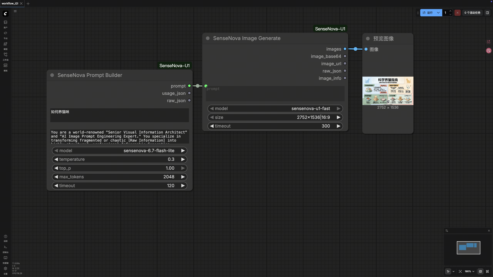

# ComfyUI SenseNova U1

用于 ComfyUI 的 SenseNova 自定义节点，支持文本对话、视觉理解、提示词构建和文生图。

[English README](README.md)

## 功能节点

- `SenseNova Chat`：调用 SenseNova Chat API，输入文本，输出文本、usage JSON 和原始 JSON。
- `SenseNova Prompt Builder`：默认使用 `prompts/builder_prompt.txt` 作为可编辑 `system_prompt`，将原始需求、素材文本或失败反馈改写成可用于生图的 prompt。
- `SenseNova Image Generate`：调用 SenseNova 文生图 API，输出 ComfyUI `IMAGE`、图片 base64、图片 URL、原始 JSON 和 tensor 调试信息。
- `SenseNova Vision URL`：输入图片 URL 和 prompt，调用视觉对话接口，输出文本、usage JSON 和原始 JSON。
- `SenseNova Vision Image`：输入 ComfyUI `IMAGE`，转为 PNG base64 data URL 后调用视觉对话接口。

## 安装

将本仓库克隆到 ComfyUI 的 `custom_nodes` 目录：

```bash
cd ComfyUI/custom_nodes
git clone https://github.com/OpenSenseNova/ComfyUI-SenseNova-U1.git
cd ComfyUI-SenseNova-U1
pip install -r requirements.txt
```

安装依赖后重启 ComfyUI。

## Token Plan 与环境变量

本项目当前通过 SenseNova token/API 服务调用模型。API token 只从环境变量或本地 `.env` 读取，不作为节点输入暴露，也不应保存进 ComfyUI workflow。

使用前请先完成：

1. 前往 SenseNova 平台注册或登录：https://platform.sensenova.cn/
2. 开通账号所需的 API 服务和模型能力。
3. 在平台获取 API key/token。
4. 如需了解模型、计费或接口细节，请查看 SenseNova 文档：https://platform.sensenova.cn/docs

启动 ComfyUI 前设置：

```bash
export SN_API_KEY="your-api-token"
```

默认 API Base URL：

```text
https://token.sensenova.cn/v1
```

如需覆盖：

```bash
export SN_BASE_URL="https://token.sensenova.cn/v1"
```

也可以在本地 `.env` 文件中配置：

```text
SN_API_KEY=your-api-token
SN_BASE_URL=https://token.sensenova.cn/v1
```

不要提交 `.env`。

## 支持模型

Chat：

- `sensenova-6.7-flash-lite`
- `deepseek-v4`

Vision：

- `sensenova-6.7-flash-lite`

Image：

- `sensenova-u1-fast`

`SenseNova Image Generate` 固定使用 `n=1`。节点 UI 中的尺寸显示为 `widthxheight|aspect_ratio`，例如 `2752x1536|16:9`；实际请求只发送 `widthxheight`。

## Prompt Builder

`prompts/builder_prompt.txt` 同时用于 builder 和 refine 场景。

将原始需求、素材文本或失败反馈写入 `SenseNova Prompt Builder.prompt`，保留默认 `system_prompt` 或自行编辑，然后把 Builder 的 `prompt` 输出接到 `SenseNova Image Generate.prompt`。

如果想使用更底层的 `SenseNova Chat` 节点，也可以把同一个模板粘贴到 `SenseNova Chat.system_prompt`。

## 截图

`SenseNova Prompt Builder` 可以直接连接到 `SenseNova Image Generate`，再把 `images` 输出连接到 ComfyUI `Preview Image`。



## 依赖策略

- `requirements.txt` 只列直接运行依赖，不固定版本，避免强制升级或降级已有 ComfyUI 环境中的共享包。
- `pyproject.toml` 是项目元数据、开发依赖和 ruff 的来源。
- 不在依赖中声明 `torch`，因为 ComfyUI 环境已经提供 PyTorch。
- Python 要求：`>=3.10`。

## 本地推理占位

`deps/` 目录预留给未来本地推理集成。当前版本不包含本地推理后端。不要提交模型权重、虚拟环境、生成缓存或大型二进制文件。

## 开发

项目开发使用 `uv`：

```bash
uv sync --dev
uv run ruff check .
uv run ruff format --check .
```

`requirements.txt` 作为面向 ComfyUI 用户的宽松兼容安装文件手动维护。

## License

MIT
