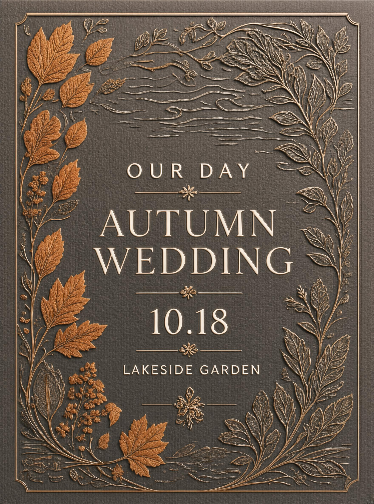
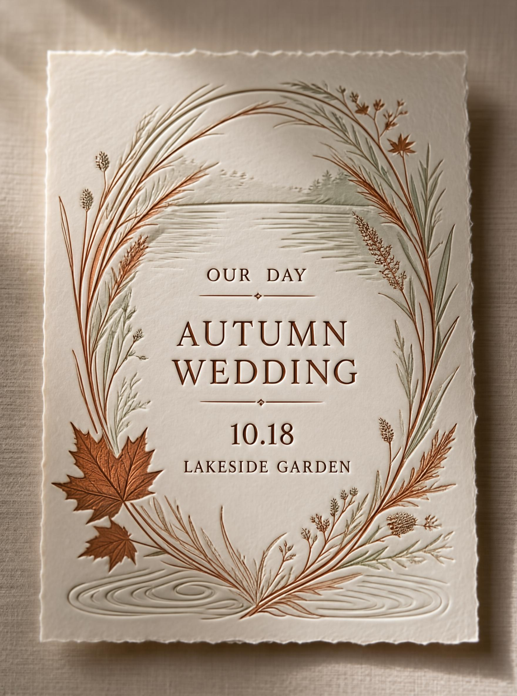

# SenseNova-U1.5 Showcases and Best Practices

<p align="center">
  <strong>English</strong> | <a href="./u1.5_best_practices_CN.md">简体中文</a>
</p>

This page keeps the main README compact while providing an expandable home for official-release showcases and practical workflows. For tasks with a clear subject and few constraints, start with a direct natural-language prompt; use the optional workflows below when a request benefits from additional planning or contains several preservation constraints.

## Showcase Gallery

This section is intentionally organized as a growing gallery. Official-release examples can be added here without expanding the main README or mixing raw-model results with workflow-assisted outputs.

### Text-to-Image Gallery

`[U1.5_TEXT_TO_IMAGE_GALLERY_TBD]`

Suggested coverage: general creation and photorealism, Chinese and English text rendering, complex posters and infographics, native 4K detail, and structured visual control.

### Image Editing Gallery

`[U1.5_IMAGE_EDITING_GALLERY_TBD]`

Suggested coverage: local and text editing, subject and background preservation, insertion and replacement, multi-reference editing, and structured region control.

### Workflow-Assisted Comparisons

The checked-in examples below illustrate how optional planning workflows affect a request. They are workflow comparisons, not raw-model benchmark results.

#### Short Brief to Render JSON

The Image PE Skill expands a short wedding-invitation brief into explicit copy, hierarchy, composition, material, palette, and exclusion constraints.

| Direct brief | With Image PE |
| :----------: | :-----------: |
|  |  |

#### Reference Image to Editable Prompt

Caption-to-Prompt decomposes a reference into reusable composition, hierarchy, palette, typography, material, lighting, and constraint decisions. The resulting prompt can reconstruct the design language or change selected content.

| Reference | Reconstruction | Color edit | Scene edit |
| :-------: | :------------: | :--------: | :--------: |
|  |  |  |  |

#### Editing PE

For reference-guided generation or complex editing, Editing PE clarifies the role of each input image, the edit target, exact text and layout requirements, and the regions that must remain unchanged.

| Reference image | Direct instruction | With Editing PE |
| :-------------: | :----------------: | :-------------: |
|  |  |  |

## Best Practices

> **Capability attribution:** Image PE, Caption-to-Prompt, and Editing PE are optional planning workflows external to the base model. Examples and benchmark results that use PE should be labeled explicitly.

### Choose a Workflow

| Scenario | Recommended approach |
| :------- | :------------------- |
| Clear subject with few constraints | Direct natural-language prompt |
| Short creative brief that needs a complete design plan | SenseNova Image PE Skill |
| A strong reference composition or visual language should be re-created, rethemed, or modified | Reference-image retrieval + Caption-to-Prompt |
| Complex editing, multiple reference images, or many preservation requirements | Editing PE |

### SenseNova Image PE Skill

Use the [Image PE Skill](../src/sensenova_u1_5/prompt-enhancement-skill/SKILL.md) to convert a short brief into compact Render JSON while preserving required subjects, visible copy, counts, layout constraints, and exclusions.

From the repository root, copy the Skill into the Agent skills directory:

```bash
SKILL_DIR="$HOME/.agents/skills/sensenova-u1-5-prompt-enhancement"
mkdir -p "$SKILL_DIR"
cp src/sensenova_u1_5/prompt-enhancement-skill/SKILL.md "$SKILL_DIR/"
cp -R src/sensenova_u1_5/prompt-enhancement-skill/agents \
  src/sensenova_u1_5/prompt-enhancement-skill/references \
  "$SKILL_DIR/"
```

Invoke `sensenova-u1-5-prompt-enhancement` through the Agent's Skill mechanism. A useful request shape is:

```text
Convert the brief below into one compact Render JSON object. Preserve the
required visible copy, counts, layout constraints, and exclusions. Return only
the JSON object.

Brief: ...
```

The checked-in wedding example includes the [short brief output](../src/sensenova_u1_5/prompt-enhancement-skill/examples/u1_5_pe_skill_wedding_raw.jpg), [Render JSON](../src/sensenova_u1_5/prompt-enhancement-skill/examples/u1_5_pe_skill_wedding_prompt.json), and [PE-assisted output](../src/sensenova_u1_5/prompt-enhancement-skill/examples/u1_5_pe_skill_wedding_enhanced.jpg).

### Reference Retrieval and Caption-to-Prompt

Use this path when abstract style terms are insufficient. Select a well-designed, appropriately licensed reference image, then use the [Caption script](../src/sensenova_u1_5/caption/caption.py) to extract its visual decisions into an editable prompt:

```bash
pip install openai pillow
export OPENAI_API_KEY="your-api-key"

python src/sensenova_u1_5/caption/caption.py path/to/reference.jpg
python src/sensenova_u1_5/caption/caption.py path/to/reference.jpg > result.json
```

The goal is to understand why the reference works, not simply to copy it. Preserve the useful layout or visual language while replacing the theme, copy, subject, or local structure. Always respect the reference image's source, authorization, and license.

### Editing PE

Editing PE rewrites the prompt; it does not modify pixels itself. State the requested change and everything that must remain unchanged. For multi-image tasks, provide images in their intended order and explain each image's role.

To inspect the rewritten prompt without running generation:

```bash
export OPENAI_API_KEY="your-api-key"

python src/sensenova_u1_5/edit/edit_pe.py \
  path/to/input.png \
  "Change the sky to a sunset while preserving the subject, pose, and framing."
```

Enable it in the editing inference entrypoint with `--use-edit-pe`. Use `--print-edit-pe` to compare the original and rewritten prompts, or `--edit-pe-model` to select the rewriter model.

### Inference Tuning

- Start from `cfg_scale=4.0`, `timestep_shift=3.0`, and `num_steps=50`.
- If dense high-frequency textures or vivid colors appear over-emphasized or oversaturated, gradually lower `cfg_scale`. Lower CFG can also weaken prompt adherence, so compare results per prompt.
- For editing, state both the target change and preservation requirements. Pre-scale the input near 2048×2048 while preserving its aspect ratio for the most predictable behavior.
- Keep PE-assisted results clearly separated from raw-model results in showcases and evaluations.
