# SenseNova-U1.5 Cookbook

<p align="center">
  <strong>English</strong> | <a href="./u1.5_best_practices_CN.md">简体中文</a>
</p>

This guide first introduces SenseNova-U1.5 inference, followed by the strongly recommended Image PE workflow for transforming text-to-image requests into a format closer to the model's training prompts. It also provides recipes for reference-image decomposition and complex editing.

## Quick Start

The reference inference implementation is available in the [SenseNova-U1 GitHub repository](https://github.com/OpenSenseNova/SenseNova-U1).

### Installation

```bash
git clone https://github.com/OpenSenseNova/SenseNova-U1.git
cd SenseNova-U1
uv sync
source .venv/bin/activate
```

The upstream environment currently uses Python 3.11, PyTorch 2.8, and CUDA 12.8. For other CUDA versions and optional FlashAttention configurations, see the [installation guide](./installation.md).

### Text-to-Image

```bash
python examples/t2i/inference.py \
  --model_path sensenova/SenseNova-U1.5-8B-MoT \
  --prompt "A cinematic mountain lake at sunrise, realistic photography." \
  --width 2048 --height 2048 \
  --device_map auto \
  --output output.png
```

### Image Editing

```bash
python examples/editing/inference.py \
  --model_path sensenova/SenseNova-U1.5-8B-MoT \
  --image input.png \
  --prompt "Change the jacket to cobalt blue. Preserve the face, pose, background, lighting, and framing." \
  --output edited.png
```

See [`examples/README.md`](../examples/README.md) for more inference options, supported resolutions, and batch processing.

## Recipes (Best Practices)

We recommend using Image PE as the default step before inference to help the model interpret subjects, composition, visible copy, spatial relationships, and canvas settings more consistently. Caption-to-Prompt and Editing PE are intended for reference-based creation and image editing, respectively.

### Recipe 1: Image Prompt Enhancement

Use the standalone [Image PE script](../src/sensenova_u1_5/image_pe.py) to convert a short brief into compact Render JSON while preserving required subjects, visible copy, counts, layout constraints, and exclusions. It is a Python entrypoint for any OpenAI-compatible Responses API:

```bash
pip install openai
export PE_MODEL_API_KEY="your-api-key"
export PE_MODEL_API_BASE_URL="https://your-provider.example/v1"

python src/sensenova_u1_5/image_pe.py \
  --prompt "Create a vertical independent book-fair poster. Exact copy: 'PAPER TRAIL', '7 NOV', 'CENTRAL LIBRARY'. Add no other text." > enhanced_prompt.json
```

Pass the resulting JSON directly to text-to-image inference:

```bash
python examples/t2i/inference.py \
  --model_path sensenova/SenseNova-U1.5-8B-MoT \
  --prompt "$(cat enhanced_prompt.json)" \
  --width 1664 --height 2496 \
  --device_map auto \
  --output output.png
```

We recommend `gpt-5.6-terra` for Prompt Enhancement. GPT models can optionally use hosted web search to ground current or source-dependent facts:

```bash
python src/sensenova_u1_5/image_pe.py \
  --prompt "Search the web to verify the west facade and reconstructed spire of Notre-Dame de Paris after its 2024 reopening. Create a portrait architecture-magazine cover titled 'NOTRE-DAME REBORN' with no other text." \
  --enable-gpt-search
```

Comparison: each pair below uses the same U1.5 model and canvas settings to illustrate outputs before and after Image PE.

<table>
  <thead>
    <tr>
      <th width="34%">Prompt before PE</th>
      <th width="33%">Before PE</th>
      <th width="33%">After PE</th>
    </tr>
  </thead>
  <tbody>
    <tr>
      <td valign="top">
        <details>
          <summary><b>Independent Book-Fair Poster</b></summary>
          <pre><code>Create a vertical independent book-fair poster. Exact copy: “PAPER TRAIL”, “7 NOV”, “CENTRAL LIBRARY”. Add no other text.</code></pre>
        </details>
      </td>
      <td align="center" valign="middle">
        <a href="./assets/showcases/image_pe/paper_trail_before_pe.webp">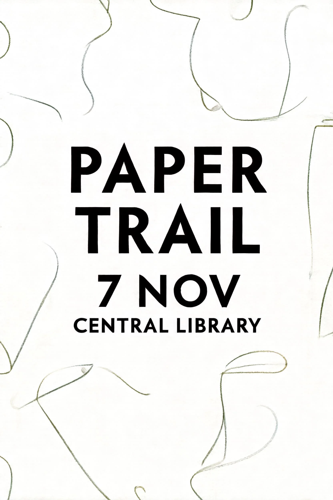</a>
      </td>
      <td align="center" valign="middle">
        <a href="./assets/showcases/image_pe/paper_trail_after_pe.webp">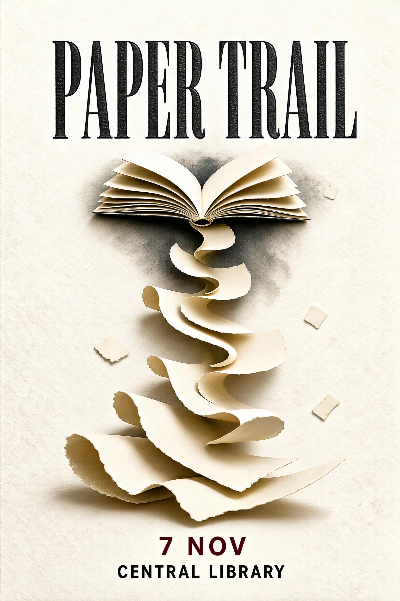</a>
      </td>
    </tr>
    <tr>
      <td valign="top">
        <details>
          <summary><b>Notre-Dame Architecture Cover</b></summary>
          <pre><code>Search the web to verify the west facade and reconstructed spire of Notre-Dame de Paris after its 2024 reopening. Create a portrait architecture-magazine cover titled “NOTRE-DAME REBORN” with no other text.</code></pre>
        </details>
      </td>
      <td align="center" valign="middle">
        <a href="./assets/showcases/image_pe/notre_dame_before_pe.webp">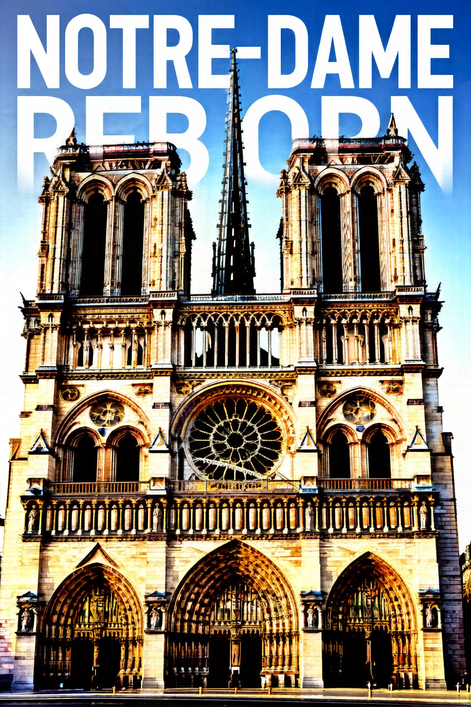</a>
      </td>
      <td align="center" valign="middle">
        <a href="./assets/showcases/image_pe/notre_dame_after_pe.webp">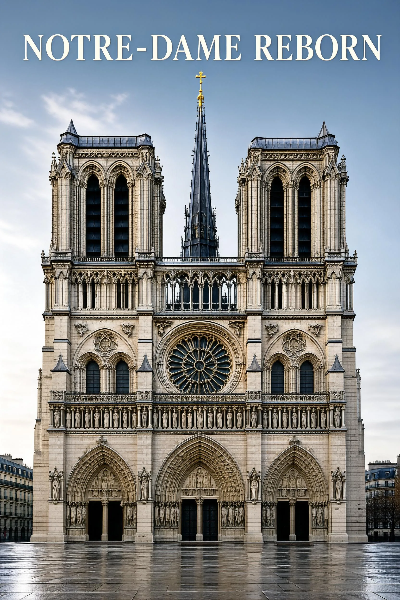</a>
      </td>
    </tr>
  </tbody>
</table>

### Recipe 2: Caption-to-Prompt

**Best for:** reconstructing or adapting the composition and visual language of a reference image.

When abstract style terms are insufficient, use the [Caption script](../src/sensenova_u1_5/caption/caption.py) to extract a reference image's visual decisions into an editable prompt:

```bash
pip install openai pillow
export OPENAI_API_KEY="your-api-key"

python src/sensenova_u1_5/caption/caption.py path/to/reference.jpg
python src/sensenova_u1_5/caption/caption.py path/to/reference.jpg > result.json
```

Use the generated prompt as a starting point: preserve the useful layout or visual language while replacing the theme, copy, subject, palette, or local structure. Only use reference images whose source, authorization, and license permit the intended use.

### Recipe 3: Editing Prompt Enhancement

**Best for:** complex edits, multiple input images, or requests with strict preservation requirements.

Editing PE rewrites the prompt; it does not modify pixels itself. State the requested change and everything that must remain unchanged. For multi-image tasks, provide images in their intended order and explain each image's role.

To inspect the rewritten prompt without running generation:

```bash
export OPENAI_API_KEY="your-api-key"

python src/sensenova_u1_5/edit/edit_pe.py \
  path/to/input.png \
  "Change the sky to a sunset while preserving the subject, pose, and framing."
```

Enable it in the editing inference entrypoint with `--use-edit-pe`. Use `--print-edit-pe` to compare the original and rewritten prompts, or `--edit-pe-model` to select the rewriter model.

The following example compares the result from the original prompt with the result after enabling Editing PE. Click an image to view it at its original resolution.

<table>
  <thead>
    <tr>
      <th width="33%" align="center">Input Image</th>
      <th width="33%" align="center">Model Output (without PE)</th>
      <th width="34%" align="center">Model Output (with PE)</th>
    </tr>
  </thead>
  <tbody>
    <tr>
      <td align="center" valign="top">
        <a href="./assets/showcases/editing_pe/input_01.webp">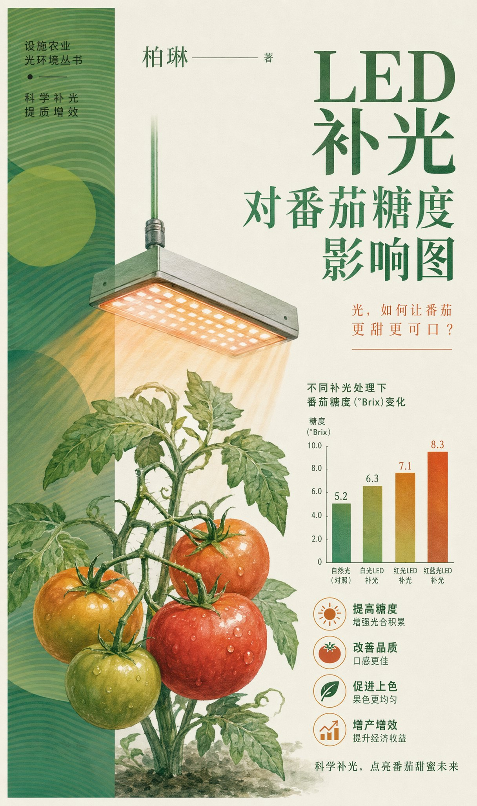</a>
      </td>
      <td align="center" valign="top">
        <a href="./assets/showcases/editing_pe/original_output_01.webp">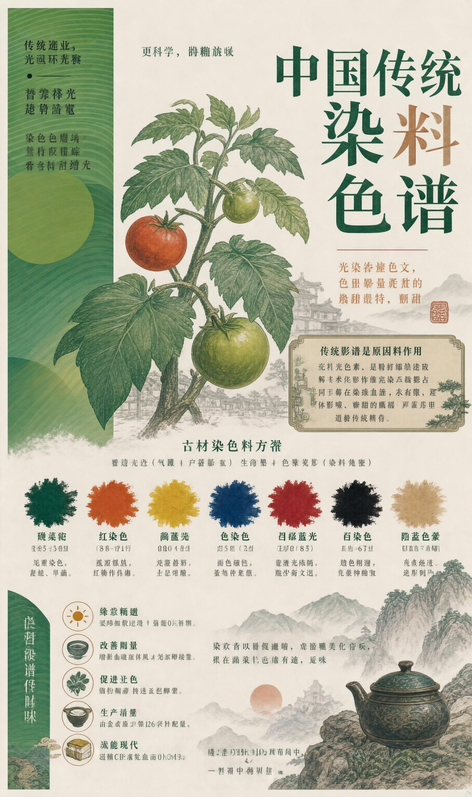</a>
      </td>
      <td align="center" valign="top">
        <a href="./assets/showcases/editing_pe/output_01.webp">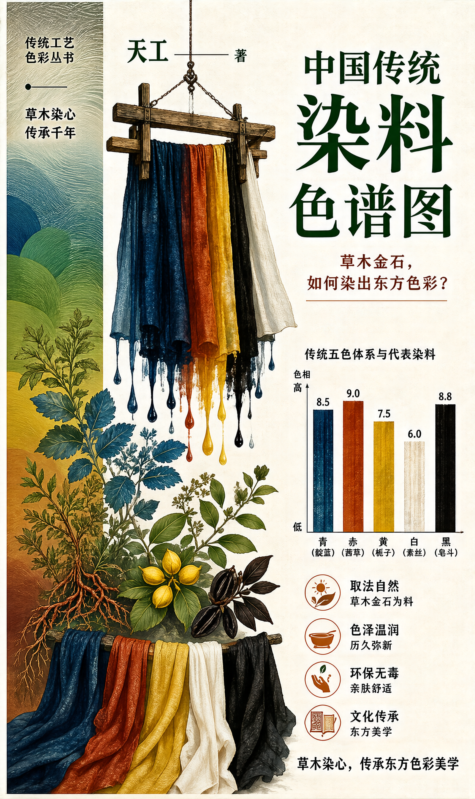</a>
      </td>
    </tr>
  </tbody>
</table>

## Gallery

Below are selected examples. If you have more interesting use cases, we would love to hear from you.

### Text-to-Image

Selected SenseNova U1.5 outputs are shown below. Their full prompts and recommended generation resolutions are available in [u1_5_gallery.jsonl](../examples/t2i/data/u1_5_gallery.jsonl), ordered from left to right and top to bottom.

<table>
  <tbody>
    <tr>
      <td width="50%" align="center" valign="top">
        <a href="./assets/showcases/t2i_gallery/u15_papercut_mountain.webp"></a>
        <br><sub><b>Paper-cut Imagination</b></sub>
      </td>
      <td width="50%" align="center" valign="top">
        <a href="./assets/showcases/t2i_gallery/u15_cafe_lifestyle.webp"></a>
        <br><sub><b>Café Lifestyle</b></sub>
      </td>
    </tr>
    <tr>
      <td width="50%" align="center" valign="top">
        <a href="./assets/showcases/t2i_gallery/u15_no_rewind_poster.webp">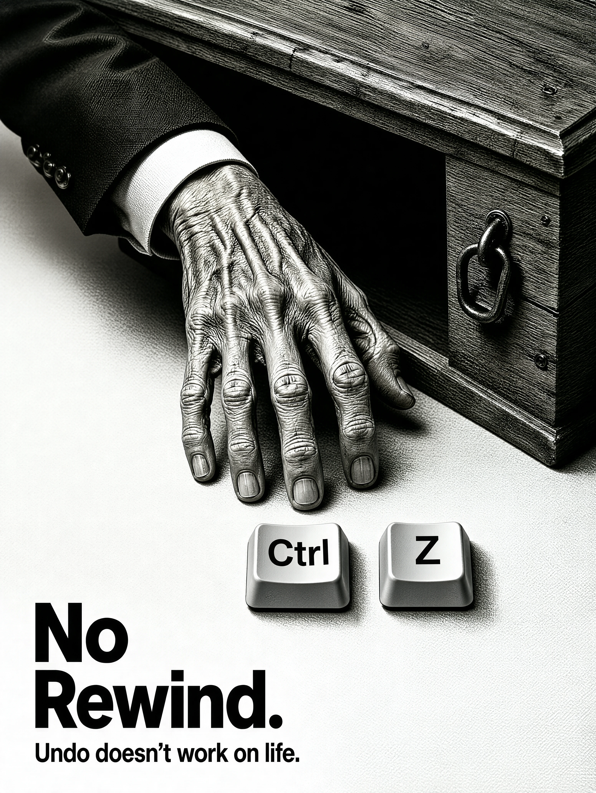</a>
        <br><sub><b>No Rewind</b></sub>
      </td>
      <td width="50%" align="center" valign="top">
        <a href="./assets/showcases/t2i_gallery/u15_sky_dragon.webp">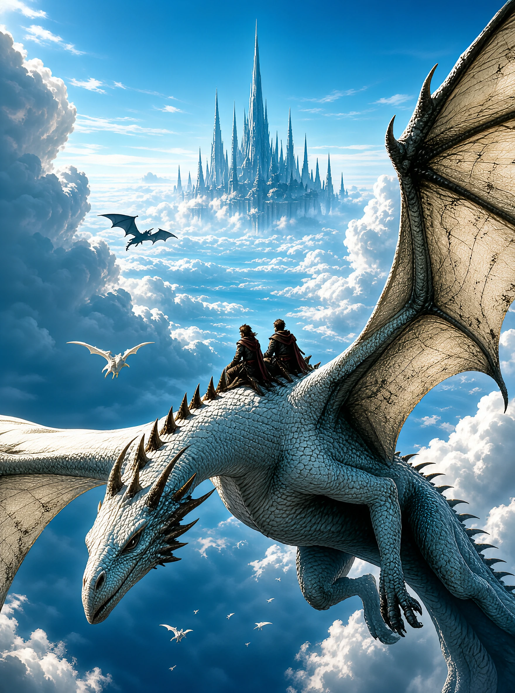</a>
        <br><sub><b>Sky Dragon</b></sub>
      </td>
    </tr>
    <tr>
      <td width="50%" align="center" valign="top">
        <a href="./assets/showcases/t2i_gallery/u15_nature_heals_poster.webp"></a>
        <br><sub><b>Nature Heals Everything</b></sub>
      </td>
      <td width="50%" align="center" valign="top">
        <a href="./assets/showcases/t2i_gallery/u15_carrot_fashion.webp">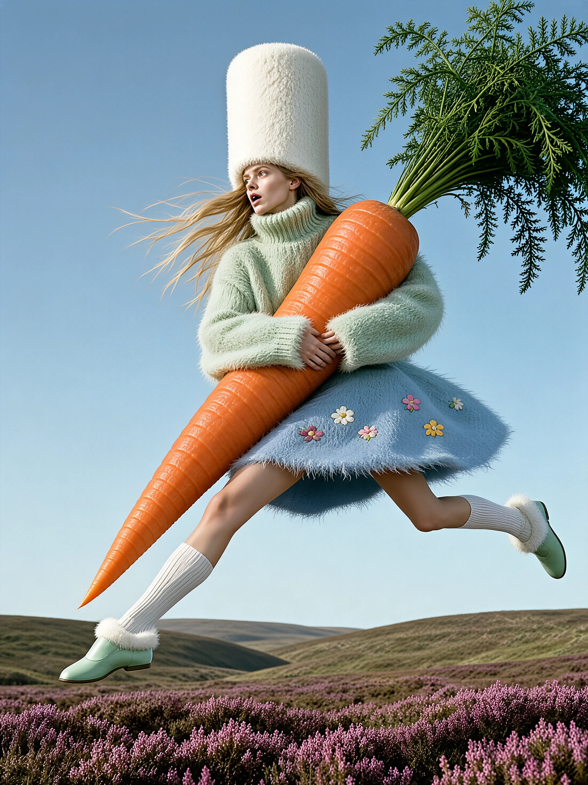</a>
        <br><sub><b>Carrot Fashion</b></sub>
      </td>
    </tr>
  </tbody>
</table>

### Image Editing


<table>
  <thead>
    <tr>
      <th width="34%">Prompt</th>
      <th width="33%">Input Images</th>
      <th width="33%">Output Image</th>
    </tr>
  </thead>
  <tbody>
    <tr>
      <td valign="top">
        <details>
          <summary><b>Multi-Image Subject and Scene Compositing</b></summary>
          <pre><code>请将第一张图中的橘猫完美融合到第三张图咖啡馆落地窗边的场景中，并且让它坐在第二张图中的复古金属玩具车上。具体要求如下：
【角色与道具融合】：提取第一张图中橘猫的标志性面部特征（微胖的脸、绿色的眼睛）以及胸前那块倒三角形状的浓密白色毛发，使其姿态调整为骑在第二张图的金属玩具车上——橘猫的两只前爪需要搭在玩具车的电镀车把上，身体后半部稳稳坐在棕色皮革座椅上，猫咪的肉垫与金属车把、大腿毛发与车鞍边缘要产生自然的挤压、贴合与物理遮挡，绝对不能有生硬的贴纸感。
【空间透视调整】：将第二张图中原本为正面的玩具车，调整为符合第三张图地面透视的四分之三侧面角度，并等比例缩小放置在靠近玻璃窗的木地板上。
【物理光影与材质适配】：严格采用第三张图中斜向射入的金色午后阳光作为主光源。橘猫的背部、耳朵边缘和蓬松的毛发边缘必须被勾勒出一圈温暖闪耀的金色轮廓光（逆光效果）；第二张图中的墨绿色金属烤漆车身、金属轮毂和电镀把手需要产生真实的日光高光反射，并映射出窗外的微弱街景；整辆玩具车（包含车上的橘猫）必须在右侧的木地板上投下符合光源方向、带有真实软边过渡的深色阴影。</code></pre>
        </details>
      </td>
      <td align="center" valign="middle">
        <a href="./assets/showcases/editing_gallery/u15_official_case01_input01.webp"></a>
        <a href="./assets/showcases/editing_gallery/u15_official_case01_input02.webp">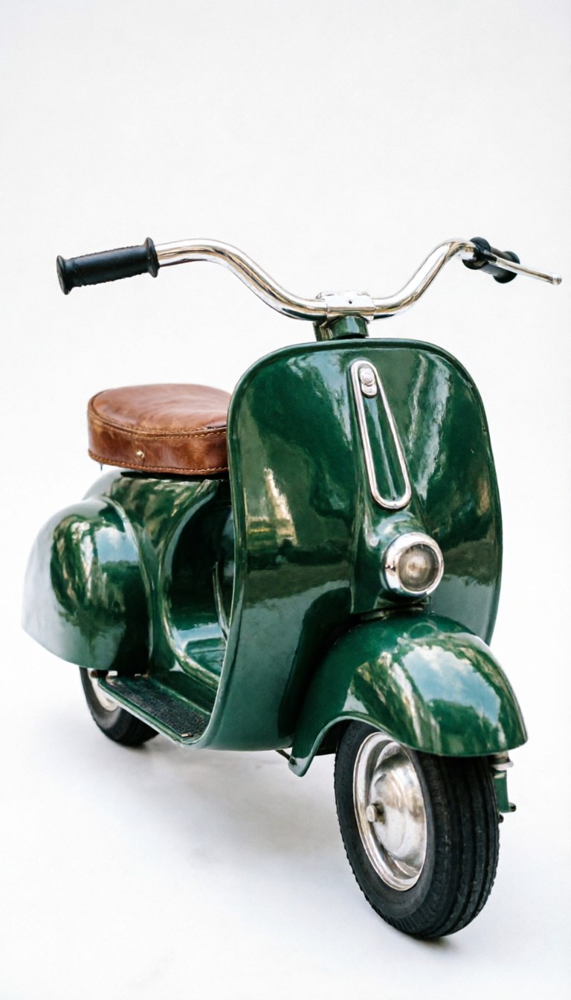</a>
        <br>
        <a href="./assets/showcases/editing_gallery/u15_official_case01_input03.webp">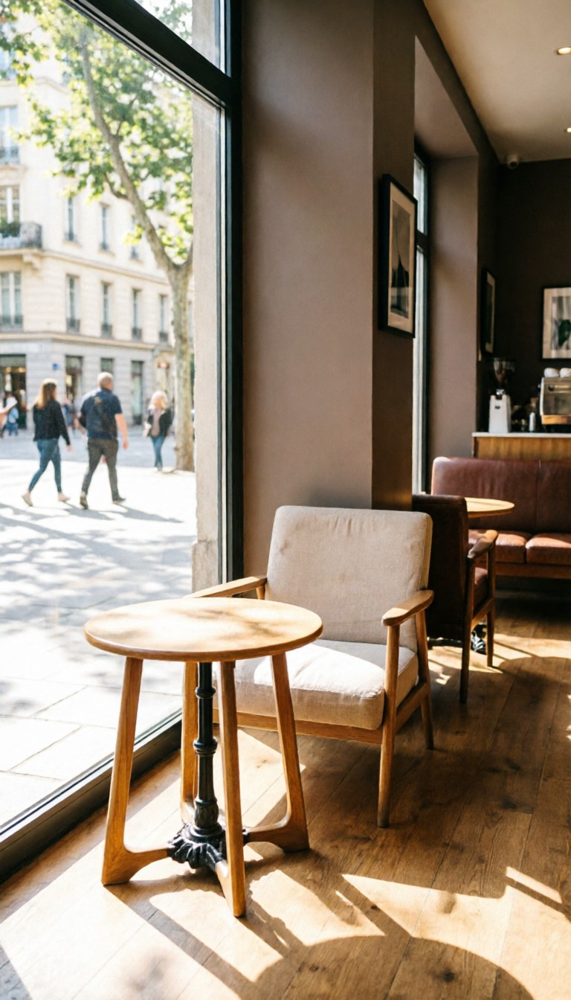</a>
      </td>
      <td align="center" valign="middle">
        <a href="./assets/showcases/editing_gallery/u15_official_case01_result.webp">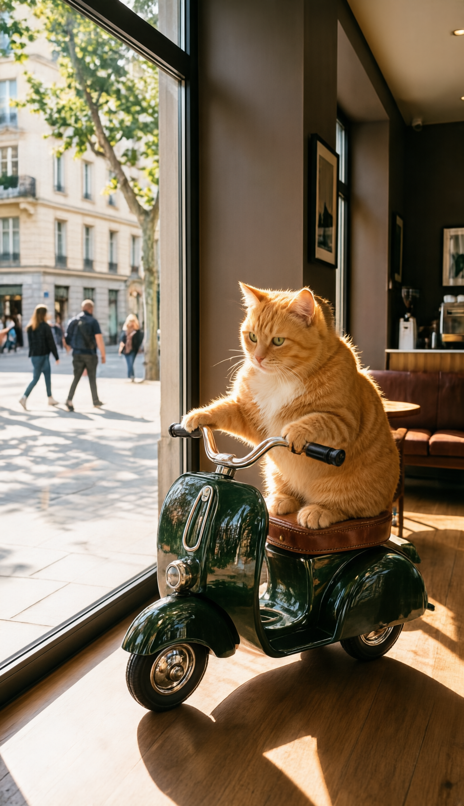</a>
      </td>
    </tr>
    <tr>
      <td valign="top">
        <details>
          <summary><b>Multi-Reference Food Poster Layout</b></summary>
          <pre><code>请将Image-1中的巧克力蛋糕卷、Image-2中的黄金炸豆腐、Image-3中的豆腐汤、Image-4中的南瓜饼和Image-5中的千层糕拼贴组合，制作一张精致、温馨的暖色调美食分享海报。
海报背景采用米白色棉麻质感，带有柔和的阴影。画面左上角摆放Image-1的巧克力蛋糕卷，右上角摆放Image-2的黄金炸豆腐，正中间摆放Image-3的豆腐汤，左下角摆放Image-4的南瓜饼，右下角摆放整齐切块的Image-5千层糕。每道菜品旁使用虚线和精致的标签框，分别标注名称："巧克力蛋糕卷"、"黄金炸豆腐"、"豆腐汤"、"南瓜饼"、"千层糕"。
海报顶部中央设计艺术手写体大标题"美食分享"，下方配副标题"好味道 好心情 好生活"。顶部右侧添加一张淡黄色便签纸，写有手写体文字"用心制作 美味相伴 幸福食光"。左下角添加艺术字体文案"美食治愈一切 生活值得热爱"。底部排列三个小图标，下方分别对应文字"用心食材"、"营养美味"、"快乐分享"。整体风格温暖、干净、富有生活气息。</code></pre>
        </details>
      </td>
      <td align="center" valign="middle">
        <a href="./assets/showcases/editing_gallery/u15_official_case02_input01.webp">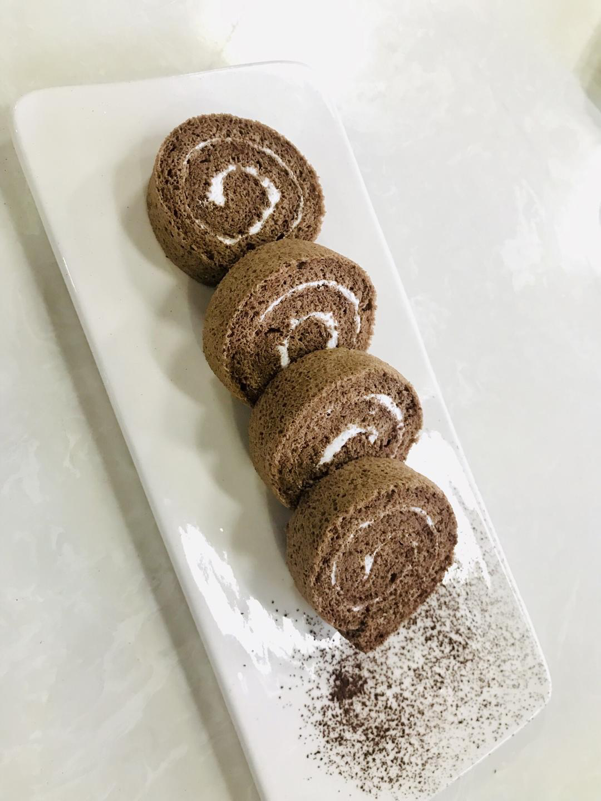</a>
        <a href="./assets/showcases/editing_gallery/u15_official_case02_input02.webp">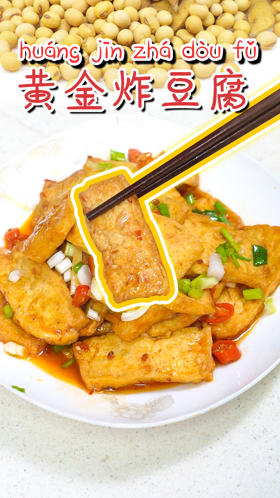</a>
        <br>
        <a href="./assets/showcases/editing_gallery/u15_official_case02_input03.webp">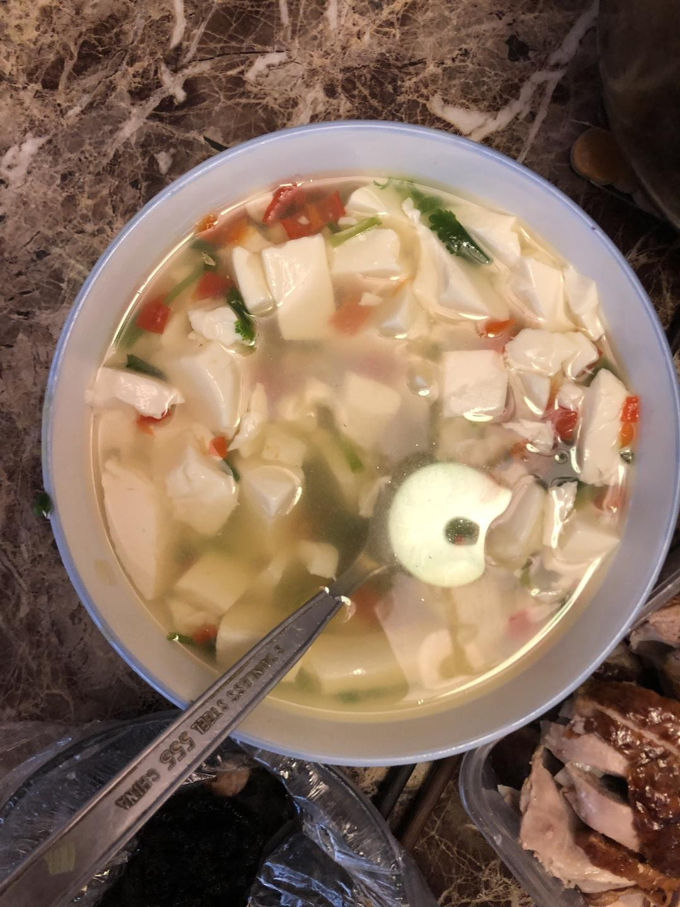</a>
        <a href="./assets/showcases/editing_gallery/u15_official_case02_input04.webp">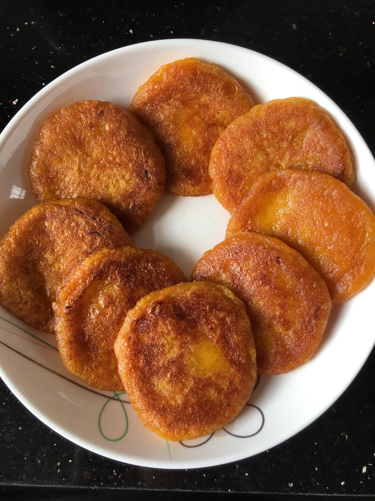</a>
        <br>
        <a href="./assets/showcases/editing_gallery/u15_official_case02_input05.webp">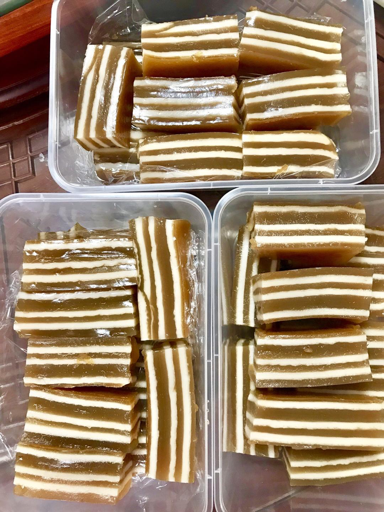</a>
      </td>
      <td align="center" valign="middle">
        <a href="./assets/showcases/editing_gallery/u15_official_case02_result.webp">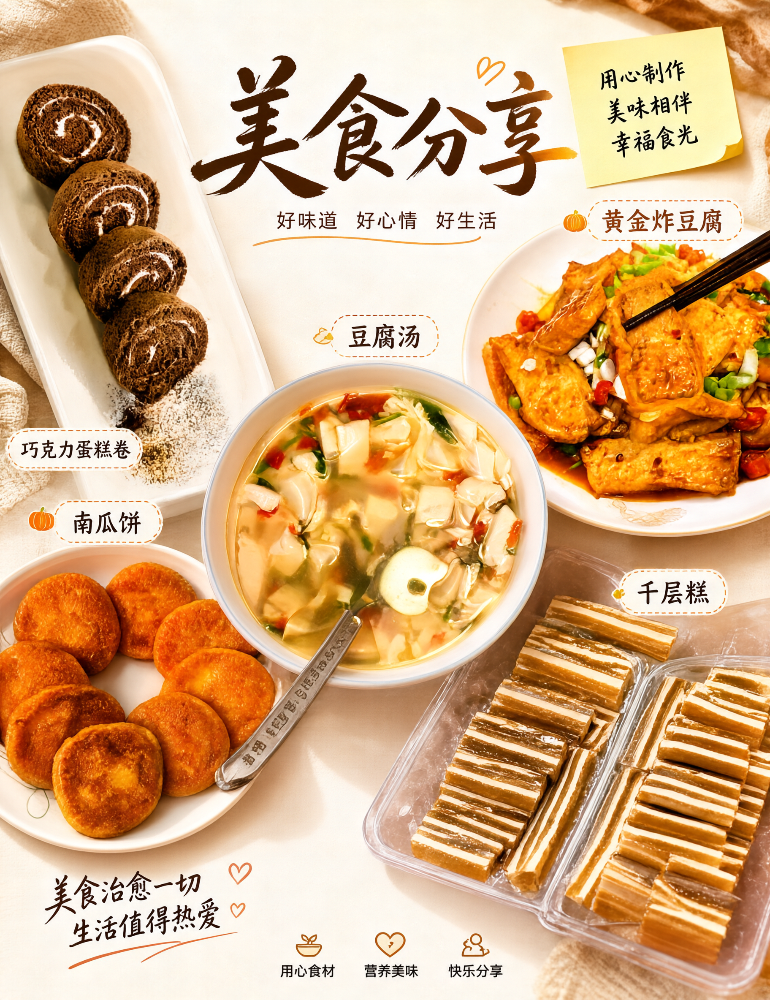</a>
      </td>
    </tr>
    <tr>
      <td valign="top">
        <details>
          <summary><b>Multi-Reference Urban Mural Reconstruction</b></summary>
          <pre><code>Transform Image 1 into a cohesive urban mural poster composition while preserving its vertical collage layout, gridded concrete texture, line-art city style, and foreground silhouette figures. Remove the blue "Artwork" text block completely and fill that area with matching mural elements and street details so there is no empty gap.
Integrate the elevated train, street crossing, pedestrians, and tall city buildings from Image 2 into the background of Image 1. Place the elevated train across the mid-to-lower background, behind the foreground figures, and blend it with the existing skyline using the same illustrated mural texture and black outline style. Adapt the buildings from Image 2 into the upper and middle background so they merge naturally with the existing urban architecture.
Add the painter from Image 3 on the right side of the composition. Keep his black cap, dark paint-splattered jacket, side/back-facing pose, and raised arm holding a paint roller. Show him actively painting a large geometric mural on a wall on the right side, using bold abstract shapes, diagonal blocks, circles, and arches inspired by Image 3. Make the painter fit the poster scale and style, with crisp black outlines and textured flat colors.
Shift the entire color palette from red and blue to teal, ochre/gold, black, white, and gray. Replace existing red and blue accents with teal and ochre/gold while keeping strong black-and-white contrast. Update the visible text colors as follows: keep the text "Urban Mural" in the upper-right area, using black for "Urban" and teal for "Mural"; keep the text "City Skyline" in its sign panel, using black and teal; keep the text "Minimalist Lines" in the lower sign panel, using black for "Minimalist" and teal for "Lines". Preserve the exact wording and capitalization of "Urban Mural", "City Skyline", and "Minimalist Lines".
Keep the foreground silhouette figures from Image 1, including their poses, profiles, backpacks, and walking direction, but integrate them naturally into the updated street environment with consistent shadows, scale, and layering. Maintain the overall urban mural aesthetic with concrete wall texture, fine architectural linework, geometric patterns, leaves, halftone dots, and collage-like poster composition.</code></pre>
        </details>
      </td>
      <td align="center" valign="middle">
        <a href="./assets/showcases/editing_gallery/u15_official_case03_input01.webp">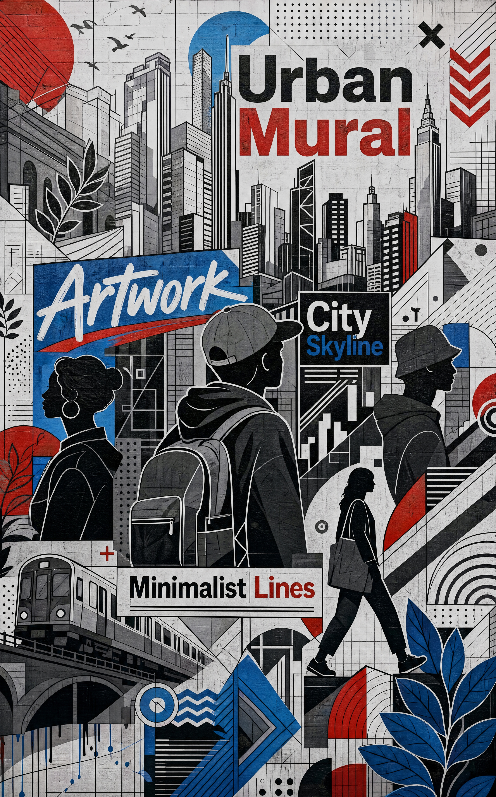</a>
        <a href="./assets/showcases/editing_gallery/u15_official_case03_input02.webp">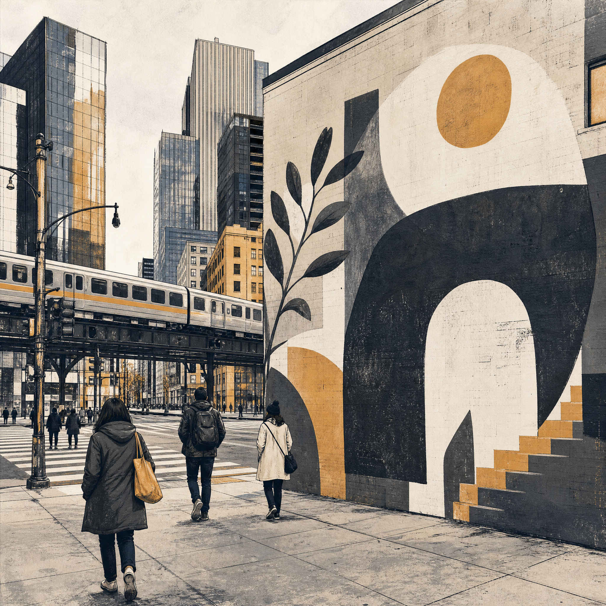</a>
        <br>
        <a href="./assets/showcases/editing_gallery/u15_official_case03_input03.webp">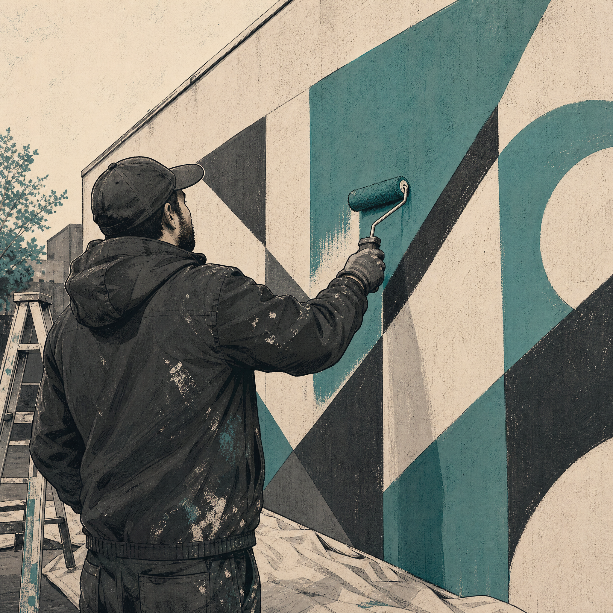</a>
      </td>
      <td align="center" valign="middle">
        <a href="./assets/showcases/editing_gallery/u15_official_case03_result.webp">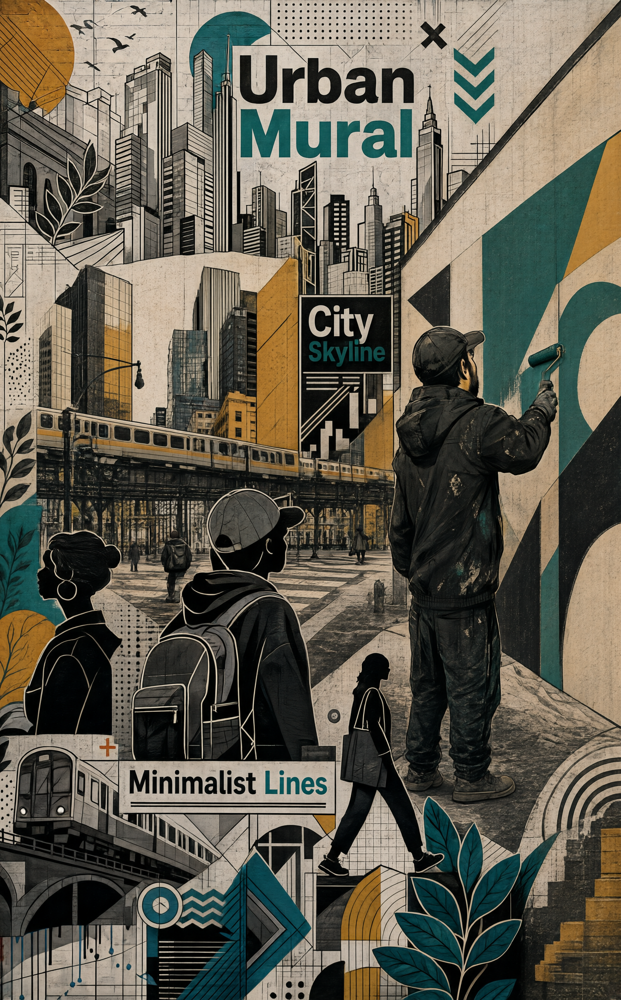</a>
      </td>
    </tr>
    <tr>
      <td valign="top">
        <details>
          <summary><b>Reference-Layout Theme Transfer</b></summary>
          <pre><code>以输入参考图作为视觉风格与版式的直接参考，生成一张全新主题画面；必须实际依据参考图，而不是仅依据文字化风格描述重新设计。沿用参考图左侧大标题区的排版层级与底部深色信息栏的三列分割关系，按照参考图从左到右的模块数量与节奏组织底部信息。画面主体展示天文台场景：巨大的天文望远镜圆顶与金属支架结构占据中景右侧（对应原图起重机与货船位置），前景排列着几辆载有精密观测仪器的车辆（对应原图集装箱运输车），背景为连绵山脉与布满星辰的夜空（对应原图山峦与天空）。所有文字使用英文。需实际渲染的文字包括：左上角主标题 "OBSERVATORY PUBLIC OPEN DAY"；主标题下方副标题 "Stargazing Experience", "Scientific Exploration", "Cosmic Discovery"；底部左侧栏目标题 "OPEN DAY PERIOD:" 及日期 "JUNE 15, 2026 – JUNE 16, 2026" 和日历图标旁文字 "JUNE 15, 2026 OPENING DAY"；底部中间栏目标题 "LOCATION:" 及地址 "MOUNTAIN TOP OBSERVATORY", "STAR CITY, HIGHLAND" 和定位图标旁文字 "DOME A MAIN HALL"；底部右侧栏目标题 "KEY HIGHLIGHTS:" 及三个列表项 "TELESCOPE OBSERVATION &amp; GUIDED TOUR", "ASTROPHYSICS LECTURES &amp; WORKSHOPS", "NIGHT SKY PHOTOGRAPHY"。沿用参考图的色彩分布与纹理质感来表现天文设备与星空环境。</code></pre>
        </details>
      </td>
      <td align="center" valign="middle">
        <a href="./assets/showcases/editing_gallery/u15_official_case04_input01.webp"></a>
      </td>
      <td align="center" valign="middle">
        <a href="./assets/showcases/editing_gallery/u15_official_case04_result.webp">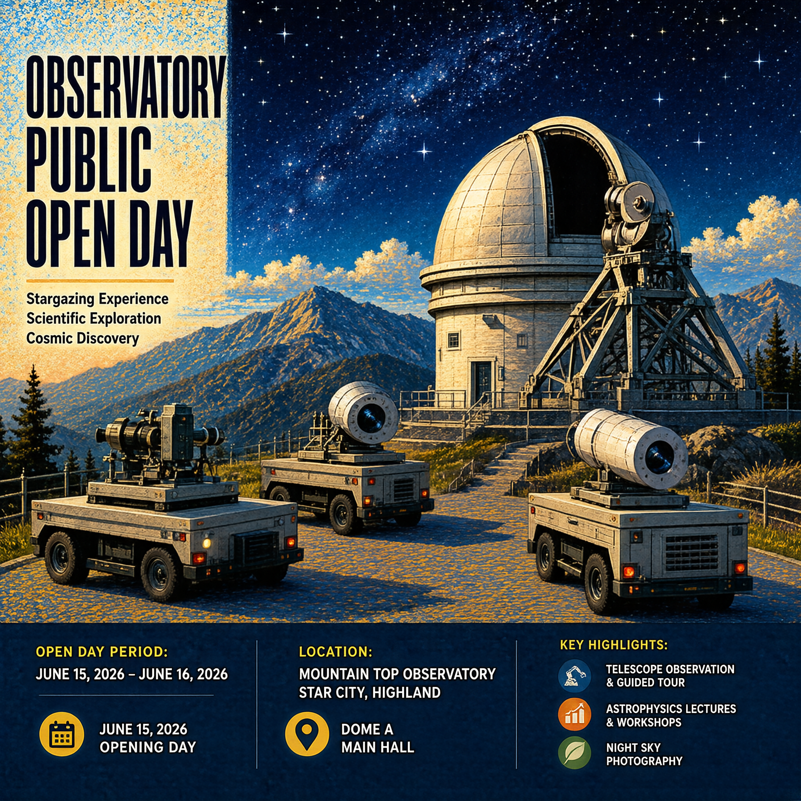</a>
      </td>
    </tr>
    <tr>
      <td valign="top">
        <details>
          <summary><b>Sketch-to-Retro-Comic Rendering</b></summary>
          <pre><code>将这张手绘草图渲染为一幅复古暖色调的手绘漫画风格插图，背景呈现米黄色纸张质感，整体光影温馨柔和，重点突出烛光下的专注氛围。保持原草图的版式构图：中心为主场景，周围环绕五个带编号的分镜面板。
文字与排版要求：
1. 左上角主标题：使用巨大的毛笔字体书写“敲击灵魂的机械轴”。
2. 标题下方标签：添加一个绿色标签，内含文字“每一颗轴，都是我与世界对话的方式。”。
3. 中心画面对话框：
- 少年上方气泡：“深夜の工作台，只有我、烛光，还有这些小家伙。”
- 旁边黑猫气泡：“又在折腾键盘啊？喵~”
4. 分镜面板①（右上角）：
- 标题：“① 选个靠谱的‘壳’！”
- 配文：“定制金属外壳，沉甸甸的安全感！”
5. 分镜面板②（右侧中间）：
- 标题：“② 挑选心仪的‘轴’！”
- 配文：“红轴轻盈，茶轴均衡，青轴清脆...总有一款击中灵魂！”
6. 分镜面板③（右下角）：
- 标题：“③ 拔键器，yyds！”
- 拟声词：“咔哒！”
- 配文：“拔键、换轴、换键帽，自由才是机械键盘的浪漫！”
7. 分镜面板④（左侧中间）：
- 标题：“④ 透明键帽，透出光芒！”
- 配文：“灯光透过键帽的那一刻，整个世界都温柔了。”
8. 分镜面板⑤（左下角）：
- 标题：“⑤ 大功告成！”
- 配文：“每一次敲击，都是灵魂的回响！”
9. 底部中间动态特写：
- 绿色爆炸框文字：“这就是属于我的声音！♡”
- 底部拟声词：“哒哒哒哒哒!!”
10. 右下角角落：
- 小猫气泡：“机械键盘的魅力，在于创造，更在于热爱。喵~”
画面细节与视觉特征：
- 中心主场景：描绘一位戴着护目镜的少年，在烛光下神情专注地用螺丝刀组装机械键盘。桌面上放置印有“BUILD SOUL”字样的马克杯，以及散落的机械轴体零件。光线主要来自桌上的蜡烛，营造温暖、静谧的深夜工作氛围。
- 面板①：展示一个质感厚重的绿色金属键盘外壳，体现金属光泽。
- 面板②：清晰展示四种不同颜色的机械轴体（红、茶、青等），色彩区分明显。
- 面板③：特写镜头，展示拔键器正在取下键帽的动作，强调工具的使用细节。
- 面板④：展示一堆具有反光质感的透明键帽，表现晶莹剔透的效果。
- 面板⑤：展示组装完成的键盘，发出温暖的背光，按键排列整齐。
- 底部特写：少年兴奋敲击键盘的动态瞬间，表情生动快乐，配合震动线表现敲击的力度与节奏。
- 右下角角落：一只小猫安静地看着蜡烛，神态慵懒可爱。
- 整体风格：保留手绘线条的笔触感，色彩以暖黄、棕色、橙色为主调，辅以绿色点缀，模拟复古漫画印刷效果，噪点适中，细节丰富。</code></pre>
        </details>
      </td>
      <td align="center" valign="middle">
        <a href="./assets/showcases/editing_gallery/u15_official_case05_input01.webp">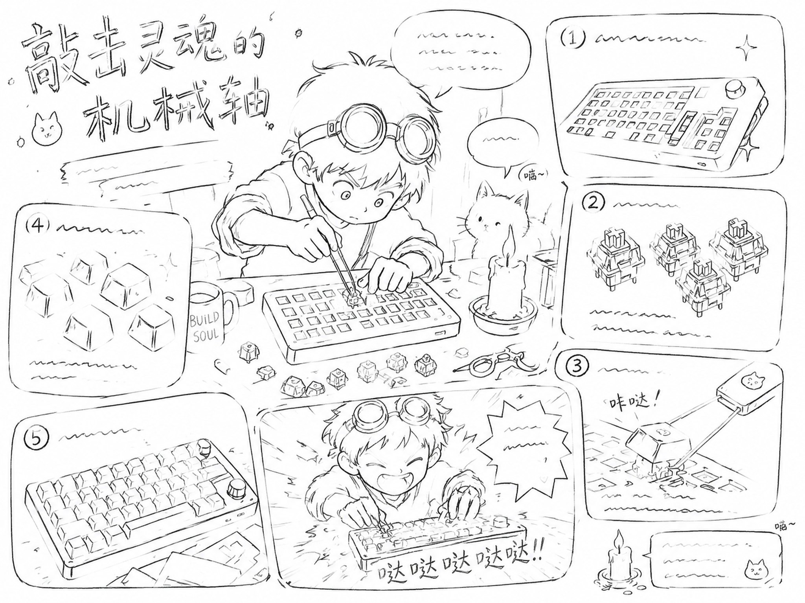</a>
      </td>
      <td align="center" valign="middle">
        <a href="./assets/showcases/editing_gallery/u15_official_case05_result.webp">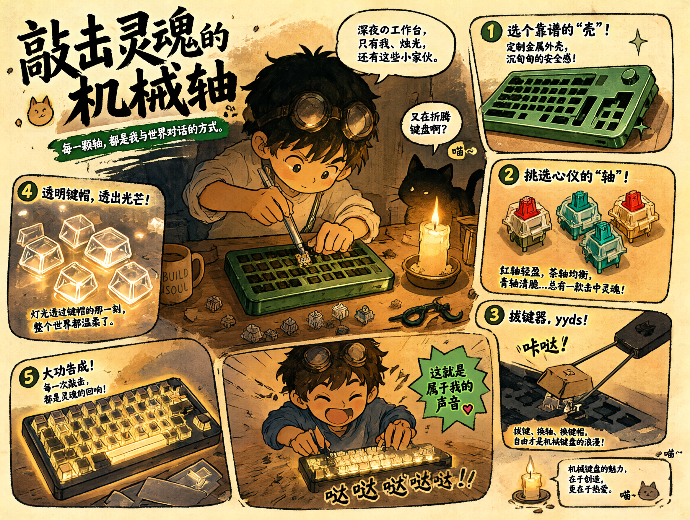</a>
      </td>
    </tr>
    <tr>
      <td valign="top">
        <details>
          <summary><b>Localized Text Replacement</b></summary>
          <pre><code>请将左下角深蓝色矩形信息栏内的展览时间与地址详情，从“JUNE 15 -
JULY 30, 2024
URBAN GALLERY
123 CREATIVE WAY
ARTSVILLE, USA”替换为“AUGUST 10 -
SEPTEMBER 28, 2024
METRO MUSEUM
456 DESIGN ROAD
CREATIVITY CITY, UK”，保持原有的白色与粉色字体样式及排版布局不变。</code></pre>
        </details>
      </td>
      <td align="center" valign="middle">
        <a href="./assets/showcases/editing_gallery/u15_official_case06_input01.webp">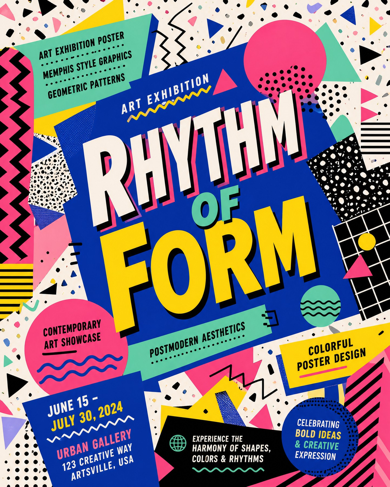</a>
      </td>
      <td align="center" valign="middle">
        <a href="./assets/showcases/editing_gallery/u15_official_case06_result.webp">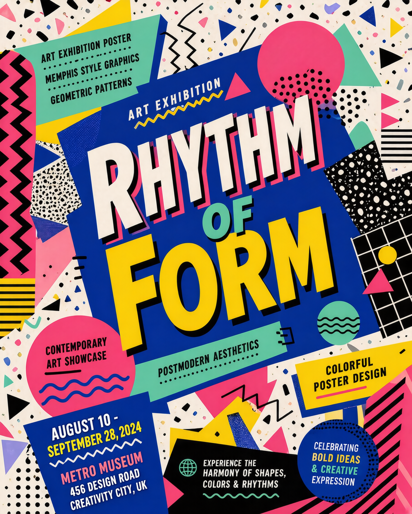</a>
      </td>
    </tr>
  </tbody>
</table>
