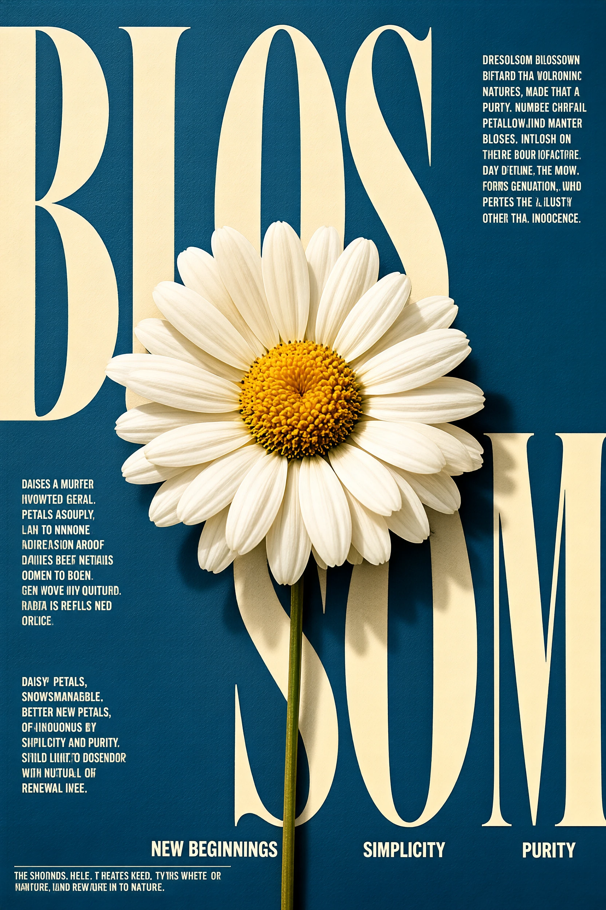
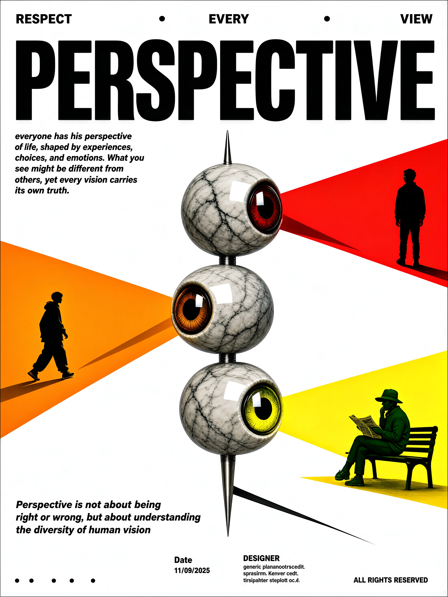
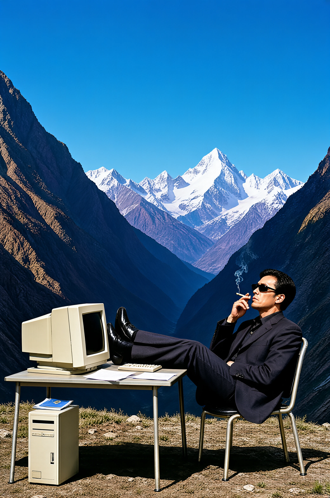

# SenseNova-U1.5 Cookbook

<p align="center">
  <a href="./u1.5_best_practices.md">English</a> | <strong>简体中文</strong>
</p>

本指南首先介绍 SenseNova-U1.5 的推理方法，然后介绍强烈推荐的 Image PE 流程，将所有文生图需求转换为更贴近模型训练 Prompt 的格式；此外还提供参考图拆解和复杂编辑 Recipe。

## 快速开始

参考推理代码位于 [SenseNova-U1 GitHub 仓库](https://github.com/OpenSenseNova/SenseNova-U1)。

### 安装

```bash
git clone https://github.com/OpenSenseNova/SenseNova-U1.git
cd SenseNova-U1
uv sync
source .venv/bin/activate
```

上游环境当前使用 Python 3.11、PyTorch 2.8 和 CUDA 12.8。其他 CUDA 版本及可选的 FlashAttention 配置请参阅[安装指南](./installation_CN.md)。

### 文生图

```bash
python examples/t2i/inference.py \
  --model_path sensenova/SenseNova-U1.5-8B-MoT \
  --prompt "A cinematic mountain lake at sunrise, realistic photography." \
  --width 2048 --height 2048 \
  --device_map auto \
  --output output.png
```

### 图像编辑

```bash
python examples/editing/inference.py \
  --model_path sensenova/SenseNova-U1.5-8B-MoT \
  --image input.png \
  --prompt "Change the jacket to cobalt blue. Preserve the face, pose, background, lighting, and framing." \
  --output edited.png
```

更多推理选项、支持的分辨率及批量处理方法请参阅 [`examples/README_CN.md`](../examples/README_CN.md)。

## Recipes

建议将 Image PE 作为推理前的默认步骤，帮助模型更稳定地理解主体、构图、可见文案、空间关系和画布设置。Caption-to-Prompt 和 Editing PE 则分别用于参考图创作和图像编辑。

### Recipe 1：Image Prompt Enhancement

使用独立的 [Image PE 脚本](../src/sensenova_u1_5/image_pe.py) 将简短需求转换为紧凑的 Render JSON，同时保留必需主体、可见文案、数量、版式约束和排除项。该脚本可直接调用任意 OpenAI-compatible Responses API：

```bash
pip install openai
export PE_MODEL_API_KEY="your-api-key"
export PE_MODEL_API_BASE_URL="https://your-provider.example/v1"

python src/sensenova_u1_5/image_pe.py \
  --prompt "Create a vertical independent book-fair poster. Exact copy: 'PAPER TRAIL', '7 NOV', 'CENTRAL LIBRARY'. Add no other text." > enhanced_prompt.json
```

将生成的 JSON 直接传给文生图推理：

```bash
python examples/t2i/inference.py \
  --model_path sensenova/SenseNova-U1.5-8B-MoT \
  --prompt "$(cat enhanced_prompt.json)" \
  --width 1664 --height 2496 \
  --device_map auto \
  --output output.png
```

Prompt Enhancement 推荐使用 `gpt-5.6-terra`。GPT 模型还可以按需开启托管 Web Search，用于校验时效性或依赖外部来源的事实：

```bash
python src/sensenova_u1_5/image_pe.py \
  --prompt "Search the web to verify the west facade and reconstructed spire of Notre-Dame de Paris after its 2024 reopening. Create a portrait architecture-magazine cover titled 'NOTRE-DAME REBORN' with no other text." \
  --enable-gpt-search
```

效果对比：下表每组使用相同的 U1.5 模型和画布设置，展示使用 Image PE 前后的模型效果。

<table>
  <thead>
    <tr>
      <th width="34%">PE 前 Prompt</th>
      <th width="33%">PE 前模型效果</th>
      <th width="33%">PE 后模型效果</th>
    </tr>
  </thead>
  <tbody>
    <tr>
      <td valign="top">
        <details>
          <summary><b>独立书展海报</b></summary>
          <pre><code>Create a vertical independent book-fair poster. Exact copy: “PAPER TRAIL”, “7 NOV”, “CENTRAL LIBRARY”. Add no other text.</code></pre>
        </details>
      </td>
      <td align="center" valign="middle">
        <a href="./assets/showcases/image_pe/paper_trail_before_pe.webp"></a>
      </td>
      <td align="center" valign="middle">
        <a href="./assets/showcases/image_pe/paper_trail_after_pe.webp"></a>
      </td>
    </tr>
    <tr>
      <td valign="top">
        <details>
          <summary><b>巴黎圣母院建筑封面</b></summary>
          <pre><code>Search the web to verify the west facade and reconstructed spire of Notre-Dame de Paris after its 2024 reopening. Create a portrait architecture-magazine cover titled “NOTRE-DAME REBORN” with no other text.</code></pre>
        </details>
      </td>
      <td align="center" valign="middle">
        <a href="./assets/showcases/image_pe/notre_dame_before_pe.webp"></a>
      </td>
      <td align="center" valign="middle">
        <a href="./assets/showcases/image_pe/notre_dame_after_pe.webp"></a>
      </td>
    </tr>
  </tbody>
</table>

### Recipe 2：Caption-to-Prompt

**适合：** 复现或改编参考图的构图和视觉语言。

当抽象风格词不足以表达目标时，可使用 [Caption 脚本](../src/sensenova_u1_5/caption/caption.py) 将参考图的视觉决策提取为可编辑 Prompt：

```bash
pip install openai pillow
export OPENAI_API_KEY="your-api-key"

python src/sensenova_u1_5/caption/caption.py path/to/reference.jpg
python src/sensenova_u1_5/caption/caption.py path/to/reference.jpg > result.json
```

建议将生成的 Prompt 作为起点：保留有价值的版式或视觉语言，同时替换主题、文案、主体、配色或局部结构。仅使用来源、授权和许可协议允许相应用途的参考图。

### Recipe 3：Editing Prompt Enhancement

**适合：** 复杂编辑、多张输入图像或带有严格保留要求的任务。

Editing PE 只负责重写 Prompt，不会自身修改像素。需同时说明要求的变更与必须保持不变的内容。多图任务中，请按预期顺序提供图像，并说明每张图像的作用。

如需在不执行生成的情况下查看重写后的 Prompt：

```bash
export OPENAI_API_KEY="your-api-key"

python src/sensenova_u1_5/edit/edit_pe.py \
  path/to/input.png \
  "Change the sky to a sunset while preserving the subject, pose, and framing."
```

在图像编辑推理入口中使用 `--use-edit-pe` 启用。使用 `--print-edit-pe` 可对比原始与重写后的 Prompt，使用 `--edit-pe-model` 可选择重写模型。

以下示例对比了同一编辑任务在直接使用原始 Prompt 与启用 Editing PE 后的结果。

<table>
  <thead>
    <tr>
      <th width="33%" align="center">输入图片</th>
      <th width="33%" align="center">模型输出(无PE)</th>
      <th width="34%" align="center">模型输出(PE)</th>
    </tr>
  </thead>
  <tbody>
    <tr>
      <td align="center" valign="top">
        <a href="./assets/showcases/editing_pe/input_01.webp"></a>
      </td>
      <td align="center" valign="top">
        <a href="./assets/showcases/editing_pe/original_output_01.webp"></a>
      </td>
      <td align="center" valign="top">
        <a href="./assets/showcases/editing_pe/output_01.webp"></a>
      </td>
    </tr>
  </tbody>
</table>

## Gallery

以下展示部分示例。如有更多有趣案例，欢迎与我们交流分享。

### 文生图


<table>
  <thead>
    <tr>
      <th width="50%">Prompt</th>
      <th width="50%">输出图像</th>
    </tr>
  </thead>
  <tbody>
    <tr>
      <td width="50%" valign="top">
        <details>
          <summary><b>雏菊主题排版海报</b></summary>
          <pre><code>{'type': 'botanical editorial poster / floral typography poster', 'theme': 'a minimalist poster about a white daisy blossom, using oversized split typography and botanical symbolism text to express new beginnings, simplicity, and purity', 'language': 'English', 'canvas': {'aspect_ratio': '2:3', 'orientation': 'portrait', 'resolution_hint': 'high-resolution, high-detail', 'safe_margin': 'the main oversized title intentionally bleeds close to the left, top, and right edges; small editorial text blocks sit inside narrow margins; the flower head is safely centered with its stem extending to the bottom edge, slightly cropped at the very bottom'}, 'image_reading': {'first_impression': 'a large cream-white word composition on a muted blue background is interrupted by a real-looking white daisy placed over the letters, creating a clean botanical magazine-cover effect', 'core_visual_hook': "the single daisy blossom overlaps the enormous word 'BLOSSOM', with its pale petals visually merging with the cream typography behind it", 'narrative': 'the poster presents the daisy as a symbol rather than just a flower: calm, fresh, pure, and quietly optimistic, like an editorial page from a refined botanical publication'}, 'main_subject': {'subject': 'one white daisy-like flower with a yellow center and a long thin green stem', 'position': 'the flower head sits slightly below the horizontal center and slightly left of the vertical center; it occupies roughly the middle third of the poster width and overlaps the lower part of the top title and the upper part of the lower title', 'scale': 'the blossom is large enough to cover several oversized letters but still smaller than the typographic forms; the stem is very thin compared with both the flower head and the giant lettering', 'pose_or_action': 'the flower faces the viewer almost frontally, with a very slight natural tilt; the stem runs nearly vertical downward from the center of the blossom to the bottom edge', 'appearance': 'the blossom has many broad, rounded petals radiating from an irregular golden-yellow central disk; the petals are slightly uneven in length and overlap each other in layered rings', 'wardrobe_or_materials': 'natural organic flower material: soft off-white petals with faint beige shadows, fine radial veins, delicate translucency, and a textured yellow-orange pollen center; the stem is slim, olive green, and straight', 'distinctive_details': ['the petals are not pure flat white; they have warm ivory shading and semi-translucent areas where the blue background and cream letters subtly show through', 'the central disk is raised and irregular, with clustered yellow-orange pollen granules and a few darker brown details', 'a soft cast shadow falls from the flower onto the blue background and cream letters, especially to the lower right side of the petals', 'the flower visually covers the middle of the word, making parts of the lower letters feel hidden behind the blossom', 'the stem begins at the lower center of the flower and continues almost perfectly straight down, crossing the lower typography area']}, 'secondary_elements': [{'element': 'oversized top title letters', 'location': 'upper half of the poster, extending from the far left edge across most of the width', 'visual_role': 'dominant typographic structure; establishes the poster as a graphic design object before the viewer notices the editorial text', 'details': "large cream-colored condensed serif letters spelling the upper portion of 'BLOSSOM'; the visible top line reads like 'BLOS' with monumental vertical strokes, rounded counters, and high-contrast thick-thin forms; the letters are cropped close to the top and left edges and sit behind the flower"}, {'element': 'oversized lower title letters', 'location': 'lower half, mostly behind the flower and across the right side', 'visual_role': 'completes the split word composition and balances the heavy top typography', 'details': "cream-colored giant letters forming the lower part of the word 'BLOSSOM', with a large rounded 'O' shape near the center and a tall 'M' on the lower right; the flower head obscures the central area, while the stem runs down in front of the lower letters"}, {'element': 'right-side editorial text blocks', 'location': 'upper right corner and upper-right middle, aligned flush right within a narrow column', 'visual_role': 'adds magazine-like botanical explanation and creates a fine typographic contrast against the oversized title', 'details': 'two compact paragraphs in small all-caps white or very pale cream sans-serif text; each block is tightly leading, right aligned, and placed with generous spacing between them; content functions as short prose about daisies, blossom symbolism, nature, purity, and renewal rather than a large headline'}, {'element': 'left-side microcopy blocks', 'location': 'left margin, one block around the middle-left beside the flower, another below it in the lower-left quadrant', 'visual_role': 'balances the right-side text and adds an informational editorial rhythm', 'details': 'small all-caps pale text arranged in narrow ragged columns; the upper block sits just left of the flower head, while the lower block sits under it near the left edge; these blocks should read as concise botanical/symbolic descriptions of daisy petals, blossoming, innocence, and purity'}, {'element': 'bottom category labels', 'location': 'near the bottom, above the bottom margin, distributed from center-left to right', 'visual_role': 'turns the poster into a thematic index and anchors the composition horizontally', 'details': "three short uppercase labels in pale cream: 'NEW BEGINNINGS' near the lower center-left under the flower, 'SIMPLICITY' near the lower center-right, and 'PURITY' at the lower right; the first label is partly intersected visually by the stem"}, {'element': 'bottom fine-print line', 'location': 'very bottom left, close to the lower edge', 'visual_role': 'finishes the editorial poster with a small caption-like note and adds a final thin typographic baseline', 'details': 'a single or double-line strip of tiny pale all-caps text spanning a short distance from the left edge; it should function as poetic or botanical fine print about children, daisies, and nature, but does not need to be fully legible at normal viewing size'}, {'element': 'solid blue paper background', 'location': 'entire canvas', 'visual_role': 'provides calm contrast for the cream typography and white flower', 'details': 'muted medium blue with subtle paper grain, slight tonal unevenness, and gentle texture; not a flat digital blue'}], 'background_environment': {'setting': 'flat poster surface with a botanical object laid over or composited onto typographic design', 'foreground': 'the white daisy blossom and its thin stem, including its shadows, appear in front of the large cream letters', 'midground': "oversized cream serif typography forming the split word 'BLOSSOM'", 'background': 'muted blue textured paper field with small editorial text blocks placed along the sides and bottom', 'atmosphere': 'calm, refined, airy, clean, botanical, contemplative, and slightly nostalgic', 'spatial_depth': 'depth is shallow but clear: the flower casts shadows on the printed surface, separating the organic foreground from the flat typographic poster layer'}, 'composition_layout': {'overall_structure': 'a vertical poster built from two massive typographic zones: the upper half dominated by cropped cream letters and the lower half dominated by continuation letters, with the daisy centered across the seam between them', 'visual_hierarchy': 'viewer first reads the giant cream title shapes, then focuses on the daisy at the center, then notices the bottom keywords, and finally scans the small editorial microcopy columns on the left and right', 'balance': "heavy left-side top lettering is counterbalanced by the large lower-right 'M' and the right-aligned text blocks; the flower provides a central organic counterweight to the rigid typography", 'leading_lines': 'the vertical strokes of the giant letters and the straight flower stem guide the eye downward; the radial petals pull the eye inward to the yellow center; the small text columns create subtle side anchors', 'cropping': 'the title letters are intentionally cropped by the poster edges, especially at the top and left, while the flower head is fully visible; the stem reaches the bottom edge and appears slightly cropped', 'negative_space': 'blue negative space surrounds the right-side paragraphs, the left-side microcopy, and the gaps inside the enormous letterforms; this open blue space keeps the dense typography from feeling cluttered'}, 'style': {'overall': 'minimalist botanical editorial design with oversized serif typography and a realistic flower overlay', 'medium': 'graphic poster design combining photographic floral realism with flat typographic layout', 'art_direction': 'contemporary nature-themed magazine poster, restrained Swiss-editorial spacing mixed with elegant vintage serif display lettering', 'visual_tone': 'serene, fresh, pure, understated, poetic, and refined', 'references': ['botanical editorial poster', 'minimalist magazine cover typography', 'large-scale display serif layout', 'nature symbolism print design', 'soft photographic still-life over flat graphic background'], 'color_palette': ['muted dusty blue background', 'warm cream oversized letters', 'soft ivory white petals', 'golden yellow and orange flower center', 'olive green stem', 'pale off-white small text'], 'saturation': 'low to medium saturation; colors are calm and slightly desaturated except for the warm yellow center', 'contrast': 'strong value contrast between cream typography and blue background; softer tonal contrast within the flower petals; small text is subtle but visible', 'texture': ['fine paper grain across the blue background', 'smooth ink-like cream letter surfaces', 'delicate petal veins and translucent petal layers', 'granular pollen texture in the flower center', 'soft natural cast shadows']}, 'lighting': {'type': 'soft natural or studio light applied to a flat-lay poster and flower', 'direction': 'light comes from the upper left, creating shadows toward the lower right', 'quality': 'soft but directional, with gentle highlights on the petals and readable shadows beneath overlapping petal edges', 'shadows': 'thin, soft-edged shadows appear under the petals and around the flower center; the shadow is visible on both the blue field and the cream letters behind the flower', 'highlights': 'subtle highlights on the upper-left sides of the petals and on the raised yellow pollen cluster', 'color_temperature': 'slightly warm neutral, complementing the cream typography against the cooler blue ground'}, 'camera_or_rendering': {'viewpoint': 'straight-on overhead or perfectly frontal poster view', 'shot_type': 'full poster crop with a close graphic emphasis; not a room scene', 'lens_feel': 'standard lens feel with minimal distortion', 'depth_of_field': 'deep enough for the poster and flower head to remain sharp; tiny text may be fine but should still look intentionally printed', 'perspective': 'flat, orthographic-like poster perspective with no visible horizon or environmental depth', 'render_finish': 'clean high-resolution print design with realistic floral detail and subtle tactile paper texture'}, 'typography': {'only_if_text_exists': True, 'hierarchy': "largest hierarchy is the split word 'BLOSSOM' in enormous cream display serif letters; second hierarchy is the bottom keywords 'NEW BEGINNINGS', 'SIMPLICITY', and 'PURITY'; third hierarchy is the narrow editorial paragraphs along the left and right margins; the smallest hierarchy is a bottom fine-print line", 'font_style': 'main title uses an ultra-large condensed high-contrast serif display font with elegant curves and thick vertical strokes; secondary labels use clean uppercase sans-serif; microcopy uses very small uppercase sans-serif with tight leading', 'placement': 'main title fills the upper and lower fields, with letters cropped at edges; editorial text blocks sit in the upper-right, right-middle, middle-left, lower-left, and bottom-left; bottom keywords align along a shared baseline near the lower edge', 'color_and_treatment': 'all main typography is warm cream or off-white against blue; no outline; no drop shadow on text; the flower casts real shadows over the letters, making the type appear printed beneath it', 'readability': 'the main word and the three bottom keywords should be clear and deliberate; small paragraphs should look like plausible editorial copy and may be readable only at close inspection; do not generate random misspellings or nonsense microtext', 'visible_text': [{'text': 'BLOSSOM', 'location': 'split across the poster in oversized cropped letters, with the upper portion occupying the top half and the lower continuation behind the flower in the lower half', 'style': 'warm cream, huge condensed serif display type, cropped by the canvas edges'}, {'text': 'NEW BEGINNINGS', 'location': 'near the lower center-left, just above the bottom margin and under the flower head, partially crossed by the vertical stem', 'style': 'small uppercase sans-serif, pale cream'}, {'text': 'SIMPLICITY', 'location': 'lower center-right, aligned with the other bottom labels', 'style': 'small uppercase sans-serif, pale cream'}, {'text': 'PURITY', 'location': 'lower right, aligned with the other bottom labels', 'style': 'small uppercase sans-serif, pale cream'}], 'microcopy_strategy': 'right and left paragraph blocks should contain coherent botanical editorial text about daisies, blossom symbolism, purity, innocence, renewal, nature, petals, and emotional connection; keep the blocks visually dense, uppercase, and aligned as in the reference, but avoid illegible scrambled characters'}, 'generation_instructions': {'must_keep': ['portrait A-series poster format with muted blue textured background', 'one large white daisy centered slightly below midline, overlapping the typography', 'long thin green stem running vertically down to the bottom edge', "oversized warm cream serif title spelling 'BLOSSOM' split across upper and lower areas", 'flower petals must sit in front of the letters and cast soft shadows', 'small editorial text blocks on upper right, right middle, middle left, lower left, and very bottom left', 'three bottom labels: NEW BEGINNINGS, SIMPLICITY, PURITY', 'minimal color palette of blue, cream, ivory, yellow, and olive green'], 'should_avoid': ['do not add extra flowers, leaves, vase, hands, insects, or background scenery', 'do not make the background a sky, wall photo, or gradient-heavy backdrop; it should remain a flat blue printed surface', 'do not turn the flower into a sunflower or rose; keep daisy-like broad white petals and yellow center', 'do not let the title become small or centered like ordinary text; it must be huge, cropped, and architectural', 'do not replace the elegant serif title with a generic sans-serif title', 'do not create messy random text blocks or spelling errors in the main visible labels', 'do not over-saturate the blue or make the petals pure glowing white without texture', 'do not remove the soft cast shadow that separates flower from poster'], 'text_policy': "Reproduce the main title 'BLOSSOM' and the bottom labels 'NEW BEGINNINGS', 'SIMPLICITY', and 'PURITY' clearly. For the small paragraphs, generate coherent English editorial microcopy about daisy blossoms, renewal, innocence, simplicity, and purity; they should match the exact placement, scale, alignment, and density of the original poster but do not need to duplicate every sentence verbatim. Avoid garbled, misspelled, or meaningless small text."}, 'quality_tags': ['high-resolution poster', 'botanical typography', 'minimalist editorial layout', 'realistic daisy', 'paper texture', 'soft natural shadow', 'oversized serif type', 'clean graphic design'], 'negative_prompt': ['watermark', 'QR code', 'platform UI badge', 'account signature', 'logo', 'brand mark', 'garbled text', 'misspelled text', 'extra text', 'random letters', 'incorrect title', 'extra flowers', 'multiple stems', 'leaves', 'vase', 'hands', 'insects', 'sky background', 'photographic room background', 'overly bright neon colors', 'pure white textureless petals', 'flat flower with no shadow', 'blurred typography', 'low resolution', 'blurry', 'overcompressed', 'distorted petals', 'crooked poster perspective', 'generic sans-serif main title']}</code></pre>
        </details>
      </td>
      <td width="50%" align="center" valign="top">
        <a href="./assets/showcases/t2i_gallery/daisy_typography_poster.webp"></a>
      </td>
    </tr>
    <tr>
      <td width="50%" valign="top">
        <details>
          <summary><b>主题视觉海报</b></summary>
          <pre><code>{'type': 'conceptual editorial poster / typographic visual essay', 'theme': 'different human perspectives shown as three mechanical eyes projecting separate colored fields of vision toward different people', 'language': 'English', 'canvas': {'aspect_ratio': '3:4', 'orientation': 'portrait', 'resolution_hint': 'high-resolution', 'safe_margin': 'wide clean white margins on all sides; top navigation text sits close to the upper edge but remains comfortably inset; the large title occupies the upper-left quadrant; the central eye sculpture is placed slightly right of center with enough white space around the colored projection cones; bottom caption and footer information are aligned inside the lower margin'}, 'image_reading': {'first_impression': 'a stark white minimalist poster dominated by a huge black word PERSPECTIVE and a surreal vertical stack of glossy eyeball-like spheres emitting red, orange, and yellow triangular beams', 'core_visual_hook': 'three marble-textured reflective eyes mounted on one vertical spike, each looking in a different direction and projecting a colored perspective cone that contains a silhouetted human figure', 'narrative': 'the poster presents vision as subjective: each eye sees a different person and scene through a different color field, turning the abstract idea of perspective into a clean graphic diagram'}, 'main_subject': {'subject': 'a vertical sculptural object made of three stacked spherical eyeballs pierced by a thin metallic spike', 'position': 'center-right of the poster, beginning below the title area and extending down into the lower-middle section; it occupies roughly the central vertical third of the canvas', 'scale': 'larger than the human silhouettes and smaller than the title; the three spheres form the main visual mass while the colored beams stretch outward to fill the horizontal space', 'pose_or_action': 'each sphere faces a different direction: the top eye looks right, the middle eye looks left, and the bottom eye looks right; their gaze directions create three flat triangular projection zones', 'appearance': 'three glossy grey-white spheres resembling polished stone eyeballs, with dark circular irises embedded at the side facing each colored beam; black vein-like marble cracks wrap across their surfaces; bright rectangular specular highlights appear on the front-right of the spheres', 'wardrobe_or_materials': 'smooth reflective glass or polished ceramic finish with grey marble veining; irises are dark tinted glossy discs, one red-black, one amber-black, one yellow-black; the central spike is narrow, metallic, and slightly conical at the top and bottom', 'distinctive_details': ['top sphere has a sharp needle-like spike protruding upward from its top center', 'the spheres are aligned vertically with small dark connector gaps between them', 'middle sphere has an amber-brown iris on its left-facing side, partially overlapping the orange beam', 'bottom sphere has a yellow-green iris on its right-facing side, aligned with the yellow beam', 'a thin black angled base line extends from the lower spike toward the lower-right, like a minimal support shadow or stand']}, 'secondary_elements': [{'element': 'red perspective beam with standing figure', 'location': 'upper-right midsection, emerging from the top eye and widening toward the right edge', 'visual_role': 'represents one viewpoint and balances the orange beam on the opposite side', 'details': 'flat saturated red trapezoid/triangle, narrow at the eye and broad at the right; contains a small dark male-presenting silhouette near the far right, seen from behind or in profile, standing upright; a thin dark cast shadow stretches diagonally leftward across the red field'}, {'element': 'orange perspective beam with walking figure', 'location': 'left-middle section, emerging from the middle eye and widening toward the left edge', 'visual_role': 'creates strong diagonal movement and introduces an opposing viewpoint facing left', 'details': 'flat vivid orange beam shaped like a long wedge; a small dark figure walks leftward inside it, positioned closer to the left side; the figure wears loose streetwear-like clothing and casts a short shadow extending to the lower-right on the orange ground'}, {'element': 'yellow perspective beam with seated reader', 'location': 'lower-right section, emerging from the bottom eye and widening toward the right edge', 'visual_role': 'adds a calm narrative vignette and anchors the bottom-right composition', 'details': 'bright lemon-yellow triangular projection; contains a person seated on a bench, wearing a brimmed hat, reading a newspaper or folded booklet; the bench slats are visible as thin dark lines; the figure is dark green-black against the yellow field'}, {'element': 'top navigation words and dot separators', 'location': 'very top margin, spread horizontally from left to right', 'visual_role': 'sets a conceptual editorial tone before the main title', 'details': 'small uppercase black words placed far apart with small black circular dots between them; the rhythm reads like a minimal menu or slogan line'}, {'element': 'large title block', 'location': 'upper-left quadrant below the navigation line', 'visual_role': 'dominant typographic anchor and first reading point', 'details': 'massive bold black uppercase word, left aligned, occupying nearly half the poster width; tight letter spacing and heavy rounded sans-serif feel'}, {'element': 'introductory paragraph', 'location': "directly below the large title, aligned to the title's left edge", 'visual_role': 'explains the concept in a compact editorial note', 'details': 'small black italic text in several short lines; dense line spacing; visually subordinate to the title but clearly readable'}, {'element': 'bottom quote', 'location': 'lower-left area above the footer row', 'visual_role': 'summarizes the message and balances the empty white space under the central graphic', 'details': "small black italic sentence split into two lines; aligned with the title's left margin"}, {'element': 'footer information row', 'location': 'bottom margin, distributed across the width', 'visual_role': 'gives the poster a gallery/event or design-study layout', 'details': 'small black text blocks: date block near lower center, generic designer credit block slightly right of center, rights statement at far lower-right; small black circular registration-like dots appear along the bottom edge'}], 'background_environment': {'setting': 'pure white studio-like graphic space with no physical room, horizon, or texture', 'foreground': 'typographic elements and flat colored projection beams sit over the white ground; no frame or border', 'midground': 'the vertical eye sculpture overlaps the colored beams, acting as the central origin point for all projections', 'background': 'uninterrupted matte white background, allowing high contrast between black typography, glossy grey eyes, and saturated color fields', 'atmosphere': 'clean, intellectual, conceptual, slightly surreal, with a magazine-editorial design sensibility', 'spatial_depth': 'depth is created by the contrast between 3D glossy eyeballs and flat 2D colored geometric beams; small silhouettes inside the beams create miniature narrative spaces'}, 'composition_layout': {'overall_structure': 'asymmetrical poster layout: heavy typographic header in the upper-left, surreal vertical eye object slightly right of center, three diagonal color wedges radiating left and right, small footer information at the bottom', 'visual_hierarchy': 'viewer reads top navigation first, then the large title, then the explanatory paragraph, then the central eye sculpture, followed by the three colored viewpoint scenes, and finally the bottom quote and footer', 'balance': 'large black title mass on the upper-left is balanced by the red and yellow beams on the right; the orange beam counterweights the right projections; the vertical eye stack acts as the central hinge', 'leading_lines': 'the colored triangular beams function as strong directional arrows from the eyes toward the figures; the vertical spike draws the eye downward; the top navigation dots create a subtle horizontal rhythm', 'cropping': 'all major elements remain fully visible; colored beams approach but do not touch the canvas edges; figures are small and contained within their color fields', 'negative_space': 'large areas of empty white space surround the title, central object, and beams; this negative space reinforces the minimal poster aesthetic and keeps the concept clear'}, 'style': {'overall': 'minimalist conceptual poster with bold typography, surreal object rendering, and Bauhaus-inspired geometric color blocking', 'medium': 'mixed-media graphic design combining 3D-rendered object, flat vector shapes, and small photographic or stencil-like human silhouettes', 'art_direction': 'editorial design poster about perception, using a scientific-diagram-like arrangement but with playful surrealism', 'visual_tone': 'clever, assertive, thoughtful, modern, slightly experimental', 'references': ['Swiss-style poster layout', 'modernist editorial typography', 'conceptual graphic design', 'minimal geometric poster design', 'surreal 3D object composition'], 'color_palette': ['pure white background', 'deep black typography', 'glossy grey marble spheres', 'saturated signal red', 'vivid orange', 'bright lemon yellow', 'dark green-black silhouettes', 'small warm amber and yellow iris accents'], 'saturation': 'high saturation in the three projection beams, otherwise restrained monochrome palette', 'contrast': 'very high contrast between black text and white background; strong contrast between flat color wedges and the glossy grey eye sculpture; silhouettes appear almost black against intense color fields', 'texture': ['smooth glossy glass/ceramic reflections on the eyes', 'grey marble veining across the spheres', 'flat matte vector color fields', 'crisp ink-like black typography', 'small stencil or cutout texture on the human figures']}, 'lighting': {'type': 'clean studio lighting applied mainly to the 3D eye sculpture, with flat graphic lighting on the rest', 'direction': 'key light appears from the upper-right/front-right, creating bright rectangular highlights on the right side of each sphere', 'quality': 'soft but glossy studio reflections; no harsh environmental shadows on the white background', 'shadows': 'minimal shadows on the main object; human figures have simple dark cast shadows inside the color beams; the thin angled line below the bottom spike reads like a support shadow', 'highlights': 'bright white rectangular highlights on the spherical eyes, especially on the upper-right surfaces; glossy iris areas catch dark reflective highlights', 'color_temperature': 'neutral white light, with warm colored influence from orange, red, and yellow beams near the irises'}, 'camera_or_rendering': {'viewpoint': 'straight-on poster view, eye-level, no dramatic camera tilt', 'shot_type': 'full poster composition with central object and typography visible', 'lens_feel': 'standard lens feel for the overall poster; the eye object is rendered with mild 3D volume but not exaggerated perspective', 'depth_of_field': 'everything appears sharp and legible; no photographic blur', 'perspective': 'mostly flat orthographic graphic perspective; subtle 3D shading on the eyes provides volume', 'render_finish': 'clean high-resolution digital poster finish with crisp vector edges, sharp typography, and polished 3D-rendered spheres'}, 'typography': {'only_if_text_exists': True, 'hierarchy': 'top line uses tiny uppercase navigation words; main title is enormous and ultra-bold; explanatory paragraph is small italic body text; bottom quote is small italic text; footer uses tiny uppercase and mixed-case informational labels', 'font_style': 'heavy rounded sans-serif for the main title, compact clean sans-serif for navigation and footer, bold italic sans-serif or editorial italic for the paragraph and quote', 'placement': 'navigation across the top margin; title flush-left in the upper-left; paragraph immediately beneath title; quote at lower-left; date, generic designer credit, and rights statement aligned along the bottom row', 'color_and_treatment': 'all typography is solid black on white with no outline, shadow, gradient, or texture; title has dense weight and tight spacing; smaller italic text uses compact line breaks', 'readability': 'the main title and top slogan words must be perfectly legible; the paragraph and bottom quote should be readable but compact; footer labels may be very small but should remain clean; any tiny credit-like microtext should be treated as generic functional footer information rather than a real account or signature', 'visible_text': [{'text': 'RESPECT', 'location': 'top-left navigation area', 'style': 'small uppercase black sans-serif'}, {'text': 'EVERY', 'location': 'top-center navigation area', 'style': 'small uppercase black sans-serif'}, {'text': 'VIEW', 'location': 'top-right navigation area', 'style': 'small uppercase black sans-serif'}, {'text': 'PERSPECTIVE', 'location': 'upper-left main title', 'style': 'very large heavy black uppercase sans-serif'}, {'text': 'everyone has his perspective of life, shaped by experiences, choices, and emotions. What you see might be different from others, yet every vision carries its own truth.', 'location': 'small paragraph below the title', 'style': 'small black italic text, left aligned, compact line breaks'}, {'text': 'Perspective is not about being right or wrong, but about understanding the diversity of human vision', 'location': 'lower-left quote above footer', 'style': 'small bold italic black text split into two lines'}, {'text': 'Date', 'location': 'bottom row near center', 'style': 'tiny bold black footer label'}, {'text': '11/09/2025', 'location': 'directly below the Date label', 'style': 'tiny black numeric footer text'}, {'text': 'DESIGNER', 'location': 'bottom row slightly right of center', 'style': 'tiny bold uppercase black footer label; use a generic placeholder credit beneath, not a real name or account'}, {'text': 'ALL RIGHTS RESERVED', 'location': 'bottom-right footer', 'style': 'small uppercase black sans-serif'}]}, 'generation_instructions': {'must_keep': ['portrait 4:5 white poster with large black PERSPECTIVE title in the upper-left', 'three glossy grey marble eyeball spheres stacked vertically on a thin metallic spike', 'top eye projects a red triangular beam to the right containing a small standing figure near the far end', 'middle eye projects an orange triangular beam to the left containing a small walking figure', 'bottom eye projects a yellow triangular beam to the right containing a seated person reading on a bench', 'strong contrast between flat saturated color wedges and polished 3D eye object', 'small uppercase top navigation reading RESPECT, EVERY, VIEW with dot separators', 'compact italic explanatory paragraph below the title and small italic quote at the lower-left', 'minimal footer row with date and generic design/rights information, without any real personal signature or platform mark'], 'should_avoid': ['do not add extra eyes, extra beams, extra people, or additional background scenery', 'do not turn the colored beams into realistic light rays with fog; they should remain flat geometric poster shapes', 'do not replace the marble eyes with ordinary human eyes or cartoon eyes', 'do not center the title; it must stay upper-left and very large', 'do not make the background grey, textured, or crowded', 'do not make the human figures too large; they should remain miniature silhouettes within the colored fields', 'do not introduce brand logos, QR codes, platform badges, account names, signatures, or watermarks', 'do not reproduce any real designer account name in the footer'], 'text_policy': 'Accurately render the large title PERSPECTIVE, the top words RESPECT / EVERY / VIEW, the main paragraph, the lower quote, the date, and ALL RIGHTS RESERVED if text rendering is supported. Footer credit text beneath DESIGNER should be generic placeholder microtext, not a real personal name, account name, platform handle, or signature. Very small footer details may function as clean microtypographic texture, but must not become garbled or introduce extra unintended wording.'}, 'quality_tags': ['high-resolution', 'crisp typography', 'minimalist conceptual poster', 'surreal 3D object', 'flat vector color geometry', 'clean white negative space', 'editorial design', 'sharp details'], 'negative_prompt': ['watermark', 'QR code', 'platform UI badge', 'account signature', 'real brand logo', 'company logo', 'artist signature', 'garbled text', 'misspelled title', 'extra text', 'incorrect footer account name', 'extra eyes', 'missing colored beams', 'wrong beam colors', 'realistic foggy light rays', 'busy background', 'decorative border', 'low contrast typography', 'blurry text', 'low resolution', 'overcompressed', 'distorted human silhouettes', 'extra limbs', 'deformed fingers', 'bad anatomy', 'cartoon style', 'photorealistic street scene', 'cluttered collage']}</code></pre>
        </details>
      </td>
      <td width="50%" align="center" valign="top">
        <a href="./assets/showcases/t2i_gallery/perspective_poster.webp"></a>
      </td>
    </tr>
    <tr>
      <td width="50%" valign="top">
        <details>
          <summary><b>雪山户外办公超现实场景</b></summary>
          <pre><code>{'type': '超现实户外办公概念摄影', 'theme': '在高海拔雪山峡谷边缘进行荒诞而从容的办公室工作休憩，现代商务人与老式电脑被移置到壮阔自然中的反差感', 'language': 'none', 'canvas': {'aspect_ratio': '2:3', 'orientation': 'portrait', 'resolution_hint': 'high-resolution', 'safe_margin': '主体人物与桌椅位于画面下半部偏右，雪山群位于中上部中央，顶部保留大面积纯净蓝天；左右山体边缘接近画框但不被重要裁切，桌腿与椅腿完整可见，底部地面留有少量空间承接阴影'}, 'image_reading': {'first_impression': '一名穿西装的男子竟然坐在高山峡谷边的办公椅上，脚搭在小桌上抽烟，面前是一台复古台式电脑，背后是开阔的雪山和深谷，画面具有强烈的荒诞幽默和孤独感', 'core_visual_hook': '传统办公室场景被完整搬到雪山悬崖平台：老式CRT显示器、金属小桌、主机箱、商务男子与香烟，和远处宏大的雪峰形成极端尺度与语境对比', 'narrative': '像是一位都市白领逃离办公室后仍把工作设备带到世界尽头，在高山空气中以松弛姿态面对自然和工作压力；画面既像旅行广告的反讽，也像90年代互联网时代的超现实概念摄影'}, 'main_subject': {'subject': '穿深色商务西装的成年男子坐在简易金属椅上', 'position': '人物位于画面右下象限，身体从右侧椅背向左方延伸，头部在右侧中下部，双腿横向伸到桌面上，约占画面宽度的三分之一到接近一半', 'scale': '人物与桌椅在前景尺度最大，远处雪山巨大但因距离遥远显得在背景中层层退后；人物体量明显小于自然景观，却是前景叙事中心', 'pose_or_action': '男子身体后仰坐在椅子上，背靠椅背，双腿伸直交叠或并拢搭在桌面边缘；右手举着香烟靠近嘴边，姿态轻松、懒散、像在休息或沉思，头部略微上扬朝左侧远山方向', 'appearance': '成年男性，短黑发，侧脸轮廓清晰，佩戴深色太阳镜，面部表情被墨镜遮挡但整体显得冷静、漫不经心、自信；皮肤在强烈阳光下有高反差侧面亮斑', 'wardrobe_or_materials': '深黑或深藏蓝商务西装外套与长裤，内搭深色衬衫或领口阴影不明显的上装，黑色皮鞋；衣料呈哑光深色，腿部和袖口有硬朗褶皱，鞋面有轻微高光', 'distinctive_details': ['右手夹着一支细长白色香烟，香烟斜向上伸出，靠近嘴部', '太阳镜为窄矩形或椭圆深色镜片，反射强光但不显示具体环境', '人物双脚搭在桌面左侧，黑色皮鞋鞋底或鞋面朝向镜头，脚部成为连接人物与办公桌的动作焦点', '椅子为细金属管框架，浅色金属腿，座面和靠背呈深色，结构简洁像临时办公椅', '人物身体几乎与桌面形成一条斜向水平线，强化悠闲和反办公纪律感']}, 'secondary_elements': [{'element': '复古CRT台式显示器', 'location': '前景左下偏中，放在小桌左侧，屏幕朝向右侧人物，显示器背部和侧面更可见', 'visual_role': '明确建立办公室语境，并与雪山自然环境产生时代错位和空间错位', 'details': '显示器为浅灰白色厚重方形机身，屏幕为深黑色矩形，边框宽厚，顶部和侧面有硬边塑料质感；机身略向右转，放置稳固，体积笨重，带有90年代办公设备气质'}, {'element': '简易办公桌', 'location': '画面下方偏左到中央，桌面水平横跨前景，四条细金属腿落在粗糙地面上', 'visual_role': '承载电脑、纸张和人物双脚，是荒诞办公场景的核心平台', 'details': '桌面为浅色薄板或灰白金属板，边缘很薄，桌腿为细直金属管，结构轻巧；桌面上有几张白纸、一本文件夹或键盘状浅色物件，物品贴近显示器底座和桌面右侧，被人物腿部部分遮挡'}, {'element': '电脑主机箱', 'location': '桌子下方左中部，置于地面上，靠近桌腿内侧', 'visual_role': '补全复古台式电脑系统，增强旧式办公室的真实感', 'details': '浅灰白色矩形立式主机，正面有水平光驱槽和小按钮线条，顶部放着一张蓝色封面或蓝白文件纸；主机与显示器颜色一致，塑料外壳带轻微阴影'}, {'element': '桌面文件与键盘', 'location': '桌面中央及右侧，显示器前方和人物鞋下附近', 'visual_role': '增加办公细节，让场景不是单独摆放电脑而像临时工作台', 'details': '数张白色纸张摊放成不规则薄片，边缘受阳光照亮；可能有一块低矮浅色键盘或文件夹横放在显示器前，细节不应过度复杂，保持普通办公杂物感'}, {'element': '高山草土平台', 'location': '画面最下方前景，人物、桌椅和主机都站在其上', 'visual_role': '提供真实落脚点，同时暗示悬崖边或山脊平台的危险与开阔', 'details': '地面为干燥灰褐色土石混合，稀疏短草覆盖，散落小石块；表面不平整，有硬阳光形成的桌腿、椅腿和人物阴影，平台边缘向后突然落入深谷'}, {'element': '左右两侧深色山坡', 'location': '左侧从画面下半部向中部倾斜上升，右侧从下方和右边缘包夹形成V形峡谷', 'visual_role': '构成天然框景和透视通道，引导视线进入远处雪山', 'details': '山坡呈深蓝紫和褐绿色阴影，纹理为长条状沟壑、褶皱和山脊线；光照使部分斜面有暖褐色细纹，阴影面深沉接近蓝黑'}, {'element': '远处雪山群', 'location': '画面中上部中央到右上中部，位于峡谷尽头的地平线以上', 'visual_role': '作为宏大背景和视觉终点，营造高海拔、纯净、壮丽的环境', 'details': '多座尖锐雪峰层叠排列，中央偏右最高峰带有明亮白色雪顶，左侧也有较低雪脊；雪面在阳光下呈白色和淡蓝色，阴面带薰衣草蓝阴影，山体基部被大气透视淡化'}, {'element': '纯净蓝天', 'location': '画面上半部大面积区域，从顶部到雪山上方', 'visual_role': '提供巨大留白和宁静感，突出高海拔透明空气，也让下方荒诞办公场景更醒目', 'details': '天空无云，颜色从顶部较深饱和的蓝色向地平线附近逐渐变浅，干净平滑，没有飞鸟、飞机或文字'}], 'background_environment': {'setting': '高山峡谷观景平台或山脊边缘，远处是积雪山峰与深切山谷，前景却摆放一套临时办公室设备', 'foreground': '粗糙土石地面、稀疏草皮、小石块、金属桌椅、CRT显示器、主机箱、文件纸以及男子的坐姿和阴影', 'midground': '左右两侧陡峭暗色山坡形成峡谷，山脊线向远处收束，谷底隐没在蓝色阴影中', 'background': '层层叠叠的高山与雪峰，越远越淡，最远雪峰在蓝天底部形成亮白锯齿状天际线', 'atmosphere': '空气清澈、干燥、阳光强烈，带有高海拔的冷冽通透感；情绪上既壮阔宁静又带黑色幽默', 'spatial_depth': '通过前景办公物品的清晰硬边、中景山谷的深色V形透视、远景雪山的淡蓝大气透视和天空渐变建立很深的空间层次'}, 'composition_layout': {'overall_structure': '竖幅构图，上半部是大面积蓝天和远山，下半部是前景人物与办公桌；左右山坡形成巨大的V形峡谷框架，前景办公场景横向摆放在V形开口下方', 'visual_hierarchy': '观看顺序先被右下方穿西装抽烟男子和左下方老式电脑吸引，然后沿人物伸出的双腿和桌面横线看向显示器，再被左右山坡的斜线引向中央远处雪峰，最后回到大片蓝天产生空旷感', 'balance': '画面右下人物黑色体块较重，左下CRT显示器和主机箱以浅灰色几何体平衡重量；上半部天空留白极大，视觉上压低人造物的位置，让人显得渺小', 'leading_lines': '桌面水平线连接电脑与人物双脚；椅腿、桌腿形成细竖线；两侧山坡的斜向山脊线共同汇聚到远处雪山中心，形成强烈纵深引导', 'cropping': '人物椅子完整落在画面右下，桌子和主机完整保留；左侧山体边缘被自然裁切，右侧山坡边缘被画框截断；雪山群未被顶部裁切，天空占据足够空间', 'negative_space': '天空是最主要留白，占画面接近上半部分，干净无元素，用来放大孤立感和荒诞感；远山上方无文字、无装饰'}, 'style': {'overall': '写实摄影基础上的超现实概念场景，具有轻微复古广告摄影和讽刺艺术摄影气质', 'medium': '摄影感强的写实图像，可理解为实景合成或高真实度概念摄影', 'art_direction': '将日常办公用品以近乎纪实的方式放置在极端自然景观中，不采用夸张特效，而用真实光线和比例制造荒诞；整体像90年代商务文化与户外旅行风景的冲突', 'visual_tone': '冷静、孤独、荒谬、从容、辽阔，带一点黑色幽默和逃离都市的反讽', 'references': ['超现实概念摄影', '复古商务广告摄影', '高山风景摄影', '荒诞现实主义视觉', '90年代办公设备美学'], 'color_palette': ['高饱和晴空蓝', '远山淡钴蓝', '雪峰冷白', '阴影蓝紫', '山坡深褐绿', '前景土灰褐', '电脑外壳暖灰白', '西装近黑深蓝'], 'saturation': '天空蓝色饱和度较高，山体阴影偏冷且浓重；前景办公设备和地面饱和度较低，形成自然蓝色与人造灰黑色的对比', 'contrast': '强烈日照带来高对比，人物西装和山谷阴影很深，雪峰与电脑外壳明亮；远景因大气透视降低局部对比', 'texture': ['CRT显示器和主机的旧塑料外壳硬质哑光纹理', '金属桌腿和椅腿的细管反光', '西装布料的深色褶皱和轻微羊毛感', '黑色皮鞋的小面积光泽', '干燥土石地面的粗糙颗粒', '山坡沟壑的岩土褶皱纹理', '雪峰表面的冰雪亮面与蓝色阴面']}, 'lighting': {'type': '强烈自然日光', 'direction': '阳光从画面左上方或偏前左侧照射，照亮显示器左侧、桌面和雪峰上部，同时在人物与桌椅右下方投下阴影', 'quality': '高海拔晴天硬光，边缘清晰，空气通透；远处山脉受大气散射显得柔和', 'shadows': '前景地面有清晰的桌腿、主机、椅腿和人物阴影，阴影向右下或画面下方延伸；人物西装内部阴影深黑，右侧山坡大面积处于冷色暗部', 'highlights': '雪峰顶部最亮，呈冷白高光；CRT外壳上缘和侧面有明亮反射；桌面纸张和金属边缘有小面积亮点；人物太阳镜和皮鞋有细小硬高光', 'color_temperature': '整体偏冷，天空和阴影为蓝色主导；前景土壤和部分山坡有少量暖褐色中和，日光本身清澈中性偏冷'}, 'camera_or_rendering': {'viewpoint': '接近平视或略低于人物头部的山脊平台视角，镜头面向峡谷和远处雪山', 'shot_type': '环境人像式广角远景，人物全身与桌椅完整入画，同时保留大范围山景', 'lens_feel': '中等广角风景镜头感，前景物体有轻微透视但不夸张，远山保持宏大尺度', 'depth_of_field': '深景深，前景人物和办公设备清晰，远山也保持可辨轮廓，仅因距离有大气柔化', 'perspective': '桌面边缘与山谷斜坡形成明显透视；前景人造物在画面底部真实落地，远处山谷向中央收束，空间纵深很强', 'render_finish': '真实摄影质感，清晰但不过度锐化，保留自然色彩渐变和强光阴影；不要做成插画、卡通或过度电影特效'}, 'typography': {'only_if_text_exists': False, 'hierarchy': '画面中没有文字标题、副标题或排版信息', 'font_style': 'none', 'placement': 'none', 'color_and_treatment': 'none', 'readability': '不应添加任何可读文字、标识、日期、品牌或界面元素', 'visible_text': []}, 'generation_instructions': {'must_keep': ['竖幅2:3画面，上半部大面积无云蓝天，下半部为高山峡谷前景办公场景', '右下方一名穿深色西装、戴太阳镜的成年男子坐在简易金属椅上，身体后仰，双腿搭在桌面上', '男子右手夹一支香烟靠近嘴边，姿态必须从容懒散而不是正在打字或站立', '左下到中下位置必须有浅灰白复古CRT显示器，黑色屏幕朝向人物', '桌子下方必须有浅灰白电脑主机箱，和显示器形成完整的旧式台式电脑组合', '桌面必须有少量白纸或办公文件，保持简洁真实，不要变成现代笔记本电脑工作站', '背景必须是深谷两侧山坡形成V形框景，远处中央有明亮雪山群和蓝色大气透视', '强烈自然硬光、清晰地面阴影和高海拔冷蓝色调必须保留', '画面荒诞点在于办公室用品被搬到雪山边缘，不要加入室内墙壁、城市建筑或现代办公隔断'], 'should_avoid': ['不要把复古CRT电脑替换成现代平板显示器、笔记本电脑或手机', '不要让男子坐姿变成正式办公、站立、攀登或面对镜头摆拍', '不要给画面添加品牌标识、电脑商标、服装logo、屏幕界面文字或水印', '不要把背景生成成普通公园、沙漠、海边或城市天台，必须是高山峡谷和雪峰', '不要让桌椅悬空或透视错乱，四条桌腿和椅腿应合理接触粗糙地面', '不要让人物肢体畸形，尤其是搭在桌上的双腿、夹烟的手指和椅子接触关系要自然', '不要添加多人、动物、帐篷、登山装备、车辆或大量现代设备，保持孤立的办公荒诞感', '不要过度梦幻化、低饱和雾化或赛博朋克化，画面应保持真实晴天风景摄影感'], 'text_policy': '本图无可见文字。生成时不要添加标题、标语、品牌、屏幕字符、文件小字或任何装饰性排版；电脑屏幕保持纯黑或深色空白，纸张可有极淡不可读线条但不应形成可辨识文字。'}, 'quality_tags': ['高清写实', '超现实概念摄影', '高山风景', '复古办公设备', '强烈自然光', '深景深', '荒诞幽默', '90年代商务感', '蓝色高海拔空气', '细节清晰'], 'negative_prompt': ['watermark', 'QR code', 'platform UI badge', 'account signature', 'logo', 'brand name', 'trademark', 'garbled text', 'misspelled text', 'extra text', 'screen text', 'modern laptop', 'smartphone', 'flat panel monitor', 'office interior', 'city skyline', 'extra people', 'animals', 'tent', 'car', 'floating furniture', 'wrong perspective', 'extra limbs', 'deformed fingers', 'distorted hands', 'bad anatomy', 'broken chair legs', 'unstable table legs', 'low resolution', 'blurry', 'overcompressed', 'cartoon style', 'anime style', 'heavy fog', 'night scene', 'rainy weather', 'cyberpunk neon']}</code></pre>
        </details>
      </td>
      <td width="50%" align="center" valign="top">
        <a href="./assets/showcases/t2i_gallery/mountain_office_surreal.webp"></a>
      </td>
    </tr>
  </tbody>
</table>

### 图像编辑


<table>
  <thead>
    <tr>
      <th width="34%">Prompt</th>
      <th width="33%">输入图像</th>
      <th width="33%">输出图像</th>
    </tr>
  </thead>
  <tbody>
    <tr>
      <td valign="top">
        <details>
          <summary><b>多图主体与场景融合</b></summary>
          <pre><code>请将第一张图中的橘猫完美融合到第三张图咖啡馆落地窗边的场景中，并且让它坐在第二张图中的复古金属玩具车上。具体要求如下：
【角色与道具融合】：提取第一张图中橘猫的标志性面部特征（微胖的脸、绿色的眼睛）以及胸前那块倒三角形状的浓密白色毛发，使其姿态调整为骑在第二张图的金属玩具车上——橘猫的两只前爪需要搭在玩具车的电镀车把上，身体后半部稳稳坐在棕色皮革座椅上，猫咪的肉垫与金属车把、大腿毛发与车鞍边缘要产生自然的挤压、贴合与物理遮挡，绝对不能有生硬的贴纸感。
【空间透视调整】：将第二张图中原本为正面的玩具车，调整为符合第三张图地面透视的四分之三侧面角度，并等比例缩小放置在靠近玻璃窗的木地板上。
【物理光影与材质适配】：严格采用第三张图中斜向射入的金色午后阳光作为主光源。橘猫的背部、耳朵边缘和蓬松的毛发边缘必须被勾勒出一圈温暖闪耀的金色轮廓光（逆光效果）；第二张图中的墨绿色金属烤漆车身、金属轮毂和电镀把手需要产生真实的日光高光反射，并映射出窗外的微弱街景；整辆玩具车（包含车上的橘猫）必须在右侧的木地板上投下符合光源方向、带有真实软边过渡的深色阴影。</code></pre>
        </details>
      </td>
      <td align="center" valign="middle">
        <a href="./assets/showcases/editing_gallery/u15_official_case01_input01.webp"></a>
        <a href="./assets/showcases/editing_gallery/u15_official_case01_input02.webp"></a>
        <br>
        <a href="./assets/showcases/editing_gallery/u15_official_case01_input03.webp"></a>
      </td>
      <td align="center" valign="middle">
        <a href="./assets/showcases/editing_gallery/u15_official_case01_result.webp"></a>
      </td>
    </tr>
    <tr>
      <td valign="top">
        <details>
          <summary><b>多参考图美食海报排版</b></summary>
          <pre><code>请将Image-1中的巧克力蛋糕卷、Image-2中的黄金炸豆腐、Image-3中的豆腐汤、Image-4中的南瓜饼和Image-5中的千层糕拼贴组合，制作一张精致、温馨的暖色调美食分享海报。
海报背景采用米白色棉麻质感，带有柔和的阴影。画面左上角摆放Image-1的巧克力蛋糕卷，右上角摆放Image-2的黄金炸豆腐，正中间摆放Image-3的豆腐汤，左下角摆放Image-4的南瓜饼，右下角摆放整齐切块的Image-5千层糕。每道菜品旁使用虚线和精致的标签框，分别标注名称："巧克力蛋糕卷"、"黄金炸豆腐"、"豆腐汤"、"南瓜饼"、"千层糕"。
海报顶部中央设计艺术手写体大标题"美食分享"，下方配副标题"好味道 好心情 好生活"。顶部右侧添加一张淡黄色便签纸，写有手写体文字"用心制作 美味相伴 幸福食光"。左下角添加艺术字体文案"美食治愈一切 生活值得热爱"。底部排列三个小图标，下方分别对应文字"用心食材"、"营养美味"、"快乐分享"。整体风格温暖、干净、富有生活气息。</code></pre>
        </details>
      </td>
      <td align="center" valign="middle">
        <a href="./assets/showcases/editing_gallery/u15_official_case02_input01.webp"></a>
        <a href="./assets/showcases/editing_gallery/u15_official_case02_input02.webp"></a>
        <br>
        <a href="./assets/showcases/editing_gallery/u15_official_case02_input03.webp"></a>
        <a href="./assets/showcases/editing_gallery/u15_official_case02_input04.webp"></a>
        <br>
        <a href="./assets/showcases/editing_gallery/u15_official_case02_input05.webp"></a>
      </td>
      <td align="center" valign="middle">
        <a href="./assets/showcases/editing_gallery/u15_official_case02_result.webp"></a>
      </td>
    </tr>
    <tr>
      <td valign="top">
        <details>
          <summary><b>多参考图城市壁画重构</b></summary>
          <pre><code>Transform Image 1 into a cohesive urban mural poster composition while preserving its vertical collage layout, gridded concrete texture, line-art city style, and foreground silhouette figures. Remove the blue "Artwork" text block completely and fill that area with matching mural elements and street details so there is no empty gap.
Integrate the elevated train, street crossing, pedestrians, and tall city buildings from Image 2 into the background of Image 1. Place the elevated train across the mid-to-lower background, behind the foreground figures, and blend it with the existing skyline using the same illustrated mural texture and black outline style. Adapt the buildings from Image 2 into the upper and middle background so they merge naturally with the existing urban architecture.
Add the painter from Image 3 on the right side of the composition. Keep his black cap, dark paint-splattered jacket, side/back-facing pose, and raised arm holding a paint roller. Show him actively painting a large geometric mural on a wall on the right side, using bold abstract shapes, diagonal blocks, circles, and arches inspired by Image 3. Make the painter fit the poster scale and style, with crisp black outlines and textured flat colors.
Shift the entire color palette from red and blue to teal, ochre/gold, black, white, and gray. Replace existing red and blue accents with teal and ochre/gold while keeping strong black-and-white contrast. Update the visible text colors as follows: keep the text "Urban Mural" in the upper-right area, using black for "Urban" and teal for "Mural"; keep the text "City Skyline" in its sign panel, using black and teal; keep the text "Minimalist Lines" in the lower sign panel, using black for "Minimalist" and teal for "Lines". Preserve the exact wording and capitalization of "Urban Mural", "City Skyline", and "Minimalist Lines".
Keep the foreground silhouette figures from Image 1, including their poses, profiles, backpacks, and walking direction, but integrate them naturally into the updated street environment with consistent shadows, scale, and layering. Maintain the overall urban mural aesthetic with concrete wall texture, fine architectural linework, geometric patterns, leaves, halftone dots, and collage-like poster composition.</code></pre>
        </details>
      </td>
      <td align="center" valign="middle">
        <a href="./assets/showcases/editing_gallery/u15_official_case03_input01.webp"></a>
        <a href="./assets/showcases/editing_gallery/u15_official_case03_input02.webp"></a>
        <br>
        <a href="./assets/showcases/editing_gallery/u15_official_case03_input03.webp"></a>
      </td>
      <td align="center" valign="middle">
        <a href="./assets/showcases/editing_gallery/u15_official_case03_result.webp"></a>
      </td>
    </tr>
    <tr>
      <td valign="top">
        <details>
          <summary><b>参考版式主题迁移</b></summary>
          <pre><code>以输入参考图作为视觉风格与版式的直接参考，生成一张全新主题画面；必须实际依据参考图，而不是仅依据文字化风格描述重新设计。沿用参考图左侧大标题区的排版层级与底部深色信息栏的三列分割关系，按照参考图从左到右的模块数量与节奏组织底部信息。画面主体展示天文台场景：巨大的天文望远镜圆顶与金属支架结构占据中景右侧（对应原图起重机与货船位置），前景排列着几辆载有精密观测仪器的车辆（对应原图集装箱运输车），背景为连绵山脉与布满星辰的夜空（对应原图山峦与天空）。所有文字使用英文。需实际渲染的文字包括：左上角主标题 "OBSERVATORY PUBLIC OPEN DAY"；主标题下方副标题 "Stargazing Experience", "Scientific Exploration", "Cosmic Discovery"；底部左侧栏目标题 "OPEN DAY PERIOD:" 及日期 "JUNE 15, 2026 – JUNE 16, 2026" 和日历图标旁文字 "JUNE 15, 2026 OPENING DAY"；底部中间栏目标题 "LOCATION:" 及地址 "MOUNTAIN TOP OBSERVATORY", "STAR CITY, HIGHLAND" 和定位图标旁文字 "DOME A MAIN HALL"；底部右侧栏目标题 "KEY HIGHLIGHTS:" 及三个列表项 "TELESCOPE OBSERVATION &amp; GUIDED TOUR", "ASTROPHYSICS LECTURES &amp; WORKSHOPS", "NIGHT SKY PHOTOGRAPHY"。沿用参考图的色彩分布与纹理质感来表现天文设备与星空环境。</code></pre>
        </details>
      </td>
      <td align="center" valign="middle">
        <a href="./assets/showcases/editing_gallery/u15_official_case04_input01.webp"></a>
      </td>
      <td align="center" valign="middle">
        <a href="./assets/showcases/editing_gallery/u15_official_case04_result.webp"></a>
      </td>
    </tr>
    <tr>
      <td valign="top">
        <details>
          <summary><b>草图到复古漫画渲染</b></summary>
          <pre><code>将这张手绘草图渲染为一幅复古暖色调的手绘漫画风格插图，背景呈现米黄色纸张质感，整体光影温馨柔和，重点突出烛光下的专注氛围。保持原草图的版式构图：中心为主场景，周围环绕五个带编号的分镜面板。
文字与排版要求：
1. 左上角主标题：使用巨大的毛笔字体书写“敲击灵魂的机械轴”。
2. 标题下方标签：添加一个绿色标签，内含文字“每一颗轴，都是我与世界对话的方式。”。
3. 中心画面对话框：
- 少年上方气泡：“深夜の工作台，只有我、烛光，还有这些小家伙。”
- 旁边黑猫气泡：“又在折腾键盘啊？喵~”
4. 分镜面板①（右上角）：
- 标题：“① 选个靠谱的‘壳’！”
- 配文：“定制金属外壳，沉甸甸的安全感！”
5. 分镜面板②（右侧中间）：
- 标题：“② 挑选心仪的‘轴’！”
- 配文：“红轴轻盈，茶轴均衡，青轴清脆...总有一款击中灵魂！”
6. 分镜面板③（右下角）：
- 标题：“③ 拔键器，yyds！”
- 拟声词：“咔哒！”
- 配文：“拔键、换轴、换键帽，自由才是机械键盘的浪漫！”
7. 分镜面板④（左侧中间）：
- 标题：“④ 透明键帽，透出光芒！”
- 配文：“灯光透过键帽的那一刻，整个世界都温柔了。”
8. 分镜面板⑤（左下角）：
- 标题：“⑤ 大功告成！”
- 配文：“每一次敲击，都是灵魂的回响！”
9. 底部中间动态特写：
- 绿色爆炸框文字：“这就是属于我的声音！♡”
- 底部拟声词：“哒哒哒哒哒!!”
10. 右下角角落：
- 小猫气泡：“机械键盘的魅力，在于创造，更在于热爱。喵~”
画面细节与视觉特征：
- 中心主场景：描绘一位戴着护目镜的少年，在烛光下神情专注地用螺丝刀组装机械键盘。桌面上放置印有“BUILD SOUL”字样的马克杯，以及散落的机械轴体零件。光线主要来自桌上的蜡烛，营造温暖、静谧的深夜工作氛围。
- 面板①：展示一个质感厚重的绿色金属键盘外壳，体现金属光泽。
- 面板②：清晰展示四种不同颜色的机械轴体（红、茶、青等），色彩区分明显。
- 面板③：特写镜头，展示拔键器正在取下键帽的动作，强调工具的使用细节。
- 面板④：展示一堆具有反光质感的透明键帽，表现晶莹剔透的效果。
- 面板⑤：展示组装完成的键盘，发出温暖的背光，按键排列整齐。
- 底部特写：少年兴奋敲击键盘的动态瞬间，表情生动快乐，配合震动线表现敲击的力度与节奏。
- 右下角角落：一只小猫安静地看着蜡烛，神态慵懒可爱。
- 整体风格：保留手绘线条的笔触感，色彩以暖黄、棕色、橙色为主调，辅以绿色点缀，模拟复古漫画印刷效果，噪点适中，细节丰富。</code></pre>
        </details>
      </td>
      <td align="center" valign="middle">
        <a href="./assets/showcases/editing_gallery/u15_official_case05_input01.webp"></a>
      </td>
      <td align="center" valign="middle">
        <a href="./assets/showcases/editing_gallery/u15_official_case05_result.webp"></a>
      </td>
    </tr>
    <tr>
      <td valign="top">
        <details>
          <summary><b>局部文字替换</b></summary>
          <pre><code>请将左下角深蓝色矩形信息栏内的展览时间与地址详情，从“JUNE 15 -
JULY 30, 2024
URBAN GALLERY
123 CREATIVE WAY
ARTSVILLE, USA”替换为“AUGUST 10 -
SEPTEMBER 28, 2024
METRO MUSEUM
456 DESIGN ROAD
CREATIVITY CITY, UK”，保持原有的白色与粉色字体样式及排版布局不变。</code></pre>
        </details>
      </td>
      <td align="center" valign="middle">
        <a href="./assets/showcases/editing_gallery/u15_official_case06_input01.webp"></a>
      </td>
      <td align="center" valign="middle">
        <a href="./assets/showcases/editing_gallery/u15_official_case06_result.webp"></a>
      </td>
    </tr>
  </tbody>
</table>
