# SenseNova-U1.5-8B-MoT (Preview)

<p align="center">
  <strong>English</strong> | <a href="./u1.5_preview_CN.md">简体中文</a>
</p>

<p align="center">
  <a href="https://arxiv.org/abs/2605.12500"></a>
  <a href="https://github.com/OpenSenseNova/SenseNova-U1"></a>
  <a href="https://huggingface.co/collections/sensenova/sensenova-u15"></a>
  <a href="https://huggingface.co/blog/sensenova/neo-unify"></a>
  <a href="https://unify.light-ai.top/"></a>
</p>

> **NOTE:** SenseNova-U1.5 (preview) offers an early look at our latest progress in image generation and editing. Notably, a more capable and refined production version will be officially released soon.

## 🌟 Overview

<p align="center">
  
</p>

**SenseNova-U1.5 (Preview)** is a natively unified multimodal model built on
[NEO-unify](https://huggingface.co/blog/sensenova/neo-unify), featuring new patch encoding and decoding layers. We further expand and refine the text-to-image training corpus, while extensively filtering and synthesizing editing data for both single-image and multi-image reference settings. Hence, it shows a notable leap in native image generation and editing:

* **Native 4K generation with remarkable efficiency**, preserving both global coherence and fine-grained detail at high resolution.
* **Striking improvements in texture, material, lighting, and realism**, producing richer and more visually convincing images.
* **Substantially stronger Chinese and English text rendering**, together with more reliable composition of dense and complex layouts.
* **A major step forward in image editing**, with stronger instruction following, subject-identity preservation, and structural consistency.
* **Fine-grained, region-controllable editing** through masks, bounding boxes, and visual markers.


## 📣 Updated News

- `[2026.07.31]` Released **SenseNova-U1.5-8B-MoT (Preview)**, featuring native 4K generation, finer textures, complex layouts, and stronger editing capability. We also open-sourced the pre-training [launcher](../training/shell/train_u1/U1.5_8B.sh) and [configuration](../training/configs/sensenovavl_qwen3_gen/sensenovau1_5_8b_mot_pt.py).

<details>
<summary>Click to expand the SenseNova U1 updated history</summary>

- `[2026.07.16]` Released [SenseNova-U1-8B-MoT-Infographic-V3 📊](https://huggingface.co/sensenova/SenseNova-U1-8B-MoT-Infographic-V3). The new version supports both infographic generation and editing. While retaining its infographic generation capabilities, it substantially improves local text, local content, global style, and global layout editing, including precise text correction in dense text. For model details and benchmark results, see [✨ U1 Infographic Model Series](https://github.com/OpenSenseNova/SenseNova-U1/blob/main/docs/u1_infographic_model.md).

- `[2026.06.29]` Released [SenseNova-U1-8B-MoT-Infographic-V2 📊](https://huggingface.co/sensenova/SenseNova-U1-8B-MoT-Infographic-V2). This version improves dense small-text rendering with sharper character edges, strengthens layout generation for complex and information-dense graphics, improves overall visual quality and coherence, and fixes the black-background issue. For model details and visual examples, see [✨ U1 Infographic Model Series](https://github.com/OpenSenseNova/SenseNova-U1/blob/main/docs/u1_infographic_model.md).

- `[2026.06.12]` Released [SenseNova-U1-8B-MoT-Infographic-LoRA-8step-V1.0](https://huggingface.co/sensenova/SenseNova-U1-8B-MoT-LoRAs/blob/main/SenseNova-U1-8B-MoT-Infographic-LoRA-8step-V1.0.safetensors) for fast infographic generation. See the [inference examples](https://github.com/OpenSenseNova/SenseNova-U1/blob/main/docs/base_vs_distill.md#run-base-and-distilled-model).

- `[2026.06.11]` Released [SenseNova-U1-8B-MoT-Interleaved 📖](https://huggingface.co/sensenova/SenseNova-U1-8B-MoT-Interleaved), optimized specifically for interleaved text-image generation. It substantially improves narrative coherence, character and style consistency, and text-image alignment across multi-page content such as picture books, storybooks, slide decks, and illustrated tutorials.

- `[2026.05.21]` Released the full-parameter fine-tuning [training code](https://github.com/OpenSenseNova/SenseNova-U1/blob/main/training/README.md) for SenseNova U1.

- `[2026.05.15]` Released [SenseNova-U1-8B-MoT-Infographic 📊](https://huggingface.co/sensenova/SenseNova-U1-8B-MoT-Infographic), improving infographic generation. For model details, see [U1 Infographic Model Series](https://github.com/OpenSenseNova/SenseNova-U1/blob/main/docs/u1_infographic_model.md); for 100 generation examples, see [✨ Infographic Showcases](https://github.com/OpenSenseNova/SenseNova-U1/blob/main/docs/u1_infographic_showcases.md).

- `[2026.05.10]` Released the [🔥 SenseNova U1 Technical Report 🔥](https://github.com/OpenSenseNova/SenseNova-U1/blob/main/docs/pdf/SenseNOVA_U1.pdf) and open-sourced the [SenseNova-U1-A3B-MoT-SFT](https://huggingface.co/sensenova/SenseNova-U1-A3B-MoT-SFT) and [SenseNova-U1-A3B-MoT](https://huggingface.co/sensenova/SenseNova-U1-A3B-MoT) model weights.

- `[2026.05.08]` Added **GGUF quantized-weight support** and a **layered-loading VRAM mode** for inference on a single GPU with limited memory. See the [low-VRAM inference guide](https://github.com/OpenSenseNova/SenseNova-U1/blob/main/README.md#-low-vram-inference-gguf--vram-mode). GGUF weights for `SenseNova-U1-8B-MoT-Merger` are available at [🤗 smthem/SenseNova-U1-8B-MoT-Merger-gguf](https://huggingface.co/smthem/SenseNova-U1-8B-MoT-Merger-gguf). We thank [@smthem](https://github.com/smthem) for contributing the quantized weights to the community.

- `[2026.05.06]` Released [SenseNova-U1-8B-MoT-LoRA-8step-V1.0](https://huggingface.co/sensenova/SenseNova-U1-8B-MoT-LoRAs/blob/main/SenseNova-U1-8B-MoT-LoRA-8step-V1.0.safetensors). See the [inference examples](https://github.com/OpenSenseNova/SenseNova-U1/blob/main/docs/base_vs_distill.md#run-base-and-distilled-model).

- `[2026.04.30]` Released the 8-step inference preview [SenseNova-U1-8B-MoT-8step-preview](https://huggingface.co/sensenova/SenseNova-U1-8B-MoT-8step-preview). In most cases, its image-generation quality is close to that of the base model. See the [comparison and known issues](https://github.com/OpenSenseNova/SenseNova-U1/blob/main/docs/base_vs_distill.md). At runtime, follow the [inference scripts](https://github.com/OpenSenseNova/SenseNova-U1/blob/main/examples/README.md) and use `--cfg_scale 1.0 --num_steps 8`.

- `[2026.04.27]` First released the [SenseNova-U1-8B-MoT-SFT](https://huggingface.co/sensenova/SenseNova-U1-8B-MoT-SFT) and [SenseNova-U1-8B-MoT](https://huggingface.co/sensenova/SenseNova-U1-8B-MoT) model weights.

- `[2026.04.27]` First released the SenseNova U1 [inference code](https://github.com/OpenSenseNova/SenseNova-U1/blob/main/examples/README.md).

</details>


## 🔬 What U1.5 Improves

#### From Patchwise Prediction to Patch-Joint Reconstruction

SenseNova-U1's original MLP head reconstructs each RGB patch independently. At high resolutions, this can expose token boundaries as grid patterns, seams, or texture discontinuities. SenseNova-U1.5 instead adopts progressive spatial reconstruction via [ConvDecoder](https://github.com/OpenSenseNova/SenseNova-U1/blob/main/src/sensenova_u1/models/neo_unify/modeling_fm_modules.py): visual tokens are reshaped into a two-dimensional feature grid and upsampled through multiple Pixel Shuffle stages, with intermediate `3×3` convolutions enabling neighboring patches to interact and merge into a more continuous image.

*Qualitative results show that this design substantially suppresses grid-like artifacts throughout pre-training. It also improves robustness during downstream adaptation, reducing the likelihood that similar artifacts re-emerge when fine-tuning on new domains.*

#### From Instruction Following to Visual Preservation

SenseNova-U1 relied primarily on publicly available image-editing datasets, many of which contained noisy supervision, low-quality samples, and visible compositing or retouching artifacts. For SenseNova-U1.5, we extensively clean, filter, and synthesize the editing corpus, while improving Chinese–English balance and expanding coverage of both single-image and multi-image reference settings.

*Quantitative results show that the encoder-free NEO-unify architecture achieves strong instruction following together with subject-identity and structural preservation using only a single sequence of reference-image tokens. This results in stronger editing performance and substantially higher inference efficiency, further validating the effectiveness of native unified multimodal modeling.*


#### From Format Exposure to Cross-Task Generalization

The generation and editing corpora used to train SenseNova-U1.5 contain only a small number of simple JSON-formatted prompts, rather than long, hierarchical, or highly structured instructions. Besides, more complex JSON-like formats appear only in the understanding training data corpora, with substantially different content, structures and task objectives.

*Despite this gap, it generalizes well to long and structured instructions in image generation and editing. This suggests that native unified multimodal modeling can combine capabilities learned from understanding and generation within a unified model, enabling structured comprehension and visual planning to transfer across tasks without dedicated training on fixed prompt templates.*


## ✨ What U1.5 Achieves

### 🖼️ Text-to-Image

<table>
  <thead>
    <tr>
      <th rowspan="2" align="center">Model</th>
      <th colspan="2"><div align="center">Quality</div></th>
      <th colspan="2"><div align="center">Aesthetics</div></th>
      <th colspan="2"><div align="center">Alignment</div></th>
      <th colspan="2"><div align="center">Real-world Fidelity</div></th>
      <th colspan="2"><div align="center">Creative Generation</div></th>
      <th colspan="2"><div align="center">Overall</div></th>
    </tr>
    <tr>
      <th><div align="center">EN&nbsp;↑</div></th>
      <th><div align="center">ZH&nbsp;↑</div></th>
      <th><div align="center">EN&nbsp;↑</div></th>
      <th><div align="center">ZH&nbsp;↑</div></th>
      <th><div align="center">EN&nbsp;↑</div></th>
      <th><div align="center">ZH&nbsp;↑</div></th>
      <th><div align="center">EN&nbsp;↑</div></th>
      <th><div align="center">ZH&nbsp;↑</div></th>
      <th><div align="center">EN&nbsp;↑</div></th>
      <th><div align="center">ZH&nbsp;↑</div></th>
      <th><div align="center">EN&nbsp;↑</div></th>
      <th><div align="center">ZH&nbsp;↑</div></th>
    </tr>
  </thead>
  <tbody>
    <tr>
      <td>GLM Image</td>
      <td align="center">49.86</td><td align="center">49.26</td>
      <td align="center">49.98</td><td align="center">50.64</td>
      <td align="center">47.49</td><td align="center">47.90</td>
      <td align="center">44.25</td><td align="center">44.69</td>
      <td align="center">44.67</td><td align="center">45.23</td>
      <td align="center">47.86</td><td align="center">48.19</td>
    </tr>
    <tr>
      <td>Qwen Image</td>
      <td align="center">48.45</td><td align="center">48.44</td>
      <td align="center">51.18</td><td align="center">52.25</td>
      <td align="center">50.04</td><td align="center">50.72</td>
      <td align="center">43.45</td><td align="center">43.16</td>
      <td align="center">45.37</td><td align="center">47.30</td>
      <td align="center">48.48</td><td align="center">49.23</td>
    </tr>
    <tr>
      <td>HunyuanImage 3.0</td>
      <td align="center">50.76</td><td align="center">50.35</td>
      <td align="center">54.66</td><td align="center">53.57</td>
      <td align="center">53.16</td><td align="center">52.00</td>
      <td align="center">45.33</td><td align="center">44.31</td>
      <td align="center">48.33</td><td align="center">49.12</td>
      <td align="center">51.35</td><td align="center">50.81</td>
    </tr>
    <tr>
      <td>Qwen Image 2512</td>
      <td align="center">51.84</td><td align="center">51.76</td>
      <td align="center">54.40</td><td align="center">54.74</td>
      <td align="center">51.44</td><td align="center">52.72</td>
      <td align="center">47.80</td><td align="center">47.00</td>
      <td align="center">47.75</td><td align="center">50.19</td>
      <td align="center">51.32</td><td align="center">52.06</td>
    </tr>
    <tr>
      <td>GPT Image 1</td>
      <td align="center">52.50</td><td align="center">52.34</td>
      <td align="center">55.77</td><td align="center">55.09</td>
      <td align="center">55.35</td><td align="center">56.28</td>
      <td align="center">48.25</td><td align="center">48.14</td>
      <td align="center">57.29</td><td align="center">55.78</td>
      <td align="center">54.24</td><td align="center">54.07</td>
    </tr>
    <tr>
      <td>Qwen Image 2*</td>
      <td align="center">53.60</td><td align="center">53.09</td>
      <td align="center">57.51</td><td align="center">56.30</td>
      <td align="center">56.48</td><td align="center">57.48</td>
      <td align="center">52.17</td><td align="center">51.74</td>
      <td align="center">57.40</td><td align="center">59.01</td>
      <td align="center">55.69</td><td align="center">55.63</td>
    </tr>
    <tr>
      <td>GPT Image 2</td>
      <td align="center">59.09</td><td align="center">58.65</td>
      <td align="center">68.48</td><td align="center">67.53</td>
      <td align="center">65.78</td><td align="center">65.85</td>
      <td align="center">59.40</td><td align="center">57.38</td>
      <td align="center">75.34</td><td align="center">75.23</td>
      <td align="center">65.23</td><td align="center">64.69</td>
    </tr>
    <tr>
      <td><b>U1</b></td>
      <td align="center"><b>47.30</b></td><td align="center"><b>45.79</b></td>
      <td align="center"><b>50.30</b></td><td align="center"><b>47.07</b></td>
      <td align="center"><b>50.58</b></td><td align="center"><b>47.78</b></td>
      <td align="center"><b>43.13</b></td><td align="center"><b>42.53</b></td>
      <td align="center"><b>46.15</b></td><td align="center"><b>43.88</b></td>
      <td align="center"><b>48.28</b></td><td align="center"><b>45.99</b></td>
    </tr>
    <tr>
      <td><b>U1.5-Preview</b></td>
      <td align="center"><b>49.14</b></td><td align="center"><b>49.19</b></td>
      <td align="center"><b>52.02</b></td><td align="center"><b>51.87</b></td>
      <td align="center"><b>52.46</b></td><td align="center"><b>52.61</b></td>
      <td align="center"><b>45.22</b></td><td align="center"><b>45.11</b></td>
      <td align="center"><b>47.23</b></td><td align="center"><b>48.80</b></td>
      <td align="center"><b>49.93</b></td><td align="center"><b>50.25</b></td>
    </tr>
    <tr>
      <td><b>U1.5-Preview&dagger;</b></td>
      <td align="center"><b>50.21</b></td><td align="center"><b>50.01</b></td>
      <td align="center"><b>57.26</b></td><td align="center"><b>56.44</b></td>
      <td align="center"><b>58.52</b></td><td align="center"><b>59.28</b></td>
      <td align="center"><b>48.26</b></td><td align="center"><b>48.24</b></td>
      <td align="center"><b>60.43</b></td><td align="center"><b>60.95</b></td>
      <td align="center"><b>55.17</b></td><td align="center"><b>55.22</b></td>
    </tr>
  </tbody>
</table>

> Note: Qwen Image 2* denotes our evaluation results; U1.5-Preview&dagger; denotes results using prompt enhance (PE).

### ✏️ Image Editing

<table>
  <thead>
    <tr>
      <th rowspan="2" align="center">Model</th>
      <th>
        <div align="center"><b>ImgEdit-Bench</b></div>
      </th>
      <th colspan="2">
        <div align="center"><b>GEdit-Bench</b></div>
      </th>
      <th colspan="4">
        <div align="center"><b>WeEdit</b></div>
      </th>
    </tr>
    <tr>
      <th><div align="center">Overall&nbsp;↑</div></th>
      <th><div align="center">EN G<sub>O</sub>&nbsp;↑</div></th>
      <th><div align="center">CN G<sub>O</sub>&nbsp;↑</div></th>
      <th><div align="center">IA&nbsp;↑</div></th>
      <th><div align="center">TC&nbsp;↑</div></th>
      <th><div align="center">BP&nbsp;↑</div></th>
      <th><div align="center">Average&nbsp;↑</div></th>
    </tr>
  </thead>
  <tbody>
    <tr>
      <td>Qwen-Image-Edit-2511</td>
      <td align="center">4.51</td>
      <td align="center">7.877</td>
      <td align="center">7.819</td>
      <td align="center">3.180</td>
      <td align="center">3.930</td>
      <td align="center">4.630</td>
      <td align="center">3.913</td>
    </tr>
    <tr>
      <td>Qwen-Image-2</td>
      <td align="center">4.28</td>
      <td align="center">8.369</td>
      <td align="center">8.348</td>
      <td align="center">5.044</td>
      <td align="center">6.079</td>
      <td align="center">5.680</td>
      <td align="center">5.601</td>
    </tr>
    <tr>
      <td>FireRed-Image-Edit</td>
      <td align="center">4.56</td>
      <td align="center">7.943</td>
      <td align="center">7.887</td>
      <td align="center">4.150</td>
      <td align="center">6.330</td>
      <td align="center">7.140</td>
      <td align="center">5.873</td>
    </tr>
    <tr>
      <td>LongCat-Image-Edit</td>
      <td align="center">4.45</td>
      <td align="center">7.748</td>
      <td align="center">7.731</td>
      <td align="center">3.390</td>
      <td align="center">5.590</td>
      <td align="center">6.710</td>
      <td align="center">5.230</td>
    </tr>
    <tr>
      <td>HY-Image-3-Instruct</td>
      <td align="center">—</td>
      <td align="center">—</td>
      <td align="center">—</td>
      <td align="center">4.160</td>
      <td align="center">5.990</td>
      <td align="center">7.030</td>
      <td align="center">5.727</td>
    </tr>
    <tr>
      <td>Nano-Banana</td>
      <td align="center">4.29</td>
      <td align="center">7.291</td>
      <td align="center">7.399</td>
      <td align="center">3.920</td>
      <td align="center">7.140</td>
      <td align="center">7.800</td>
      <td align="center">6.287</td>
    </tr>
    <tr>
      <td>Nano-Banana-Pro</td>
      <td align="center">4.37</td>
      <td align="center">7.738</td>
      <td align="center">7.799</td>
      <td align="center">8.580</td>
      <td align="center">9.100</td>
      <td align="center">8.850</td>
      <td align="center">8.843</td>
    </tr>
    <tr>
      <td>GPT-Image-1.5</td>
      <td align="center">—</td>
      <td align="center">—</td>
      <td align="center">—</td>
      <td align="center">6.520</td>
      <td align="center">7.780</td>
      <td align="center">6.150</td>
      <td align="center">6.817</td>
    </tr>
    <tr>
      <td><b>U1</b></td>
      <td align="center"><b>3.90</b></td>
      <td align="center"><b>7.470</b></td>
      <td align="center"><b>7.420</b></td>
      <td align="center"><b>5.729</b></td>
      <td align="center"><b>6.604</b></td>
      <td align="center"><b>7.157</b></td>
      <td align="center"><b>6.497</b></td>
    </tr>
    <tr>
      <td><b>U1.5-Preview</b></td>
      <td align="center"><b>4.37</b></td>
      <td align="center"><b>8.172</b></td>
      <td align="center"><b>8.051</b></td>
      <td align="center"><b>6.532</b></td>
      <td align="center"><b>7.271</b></td>
      <td align="center"><b>6.752</b></td>
      <td align="center"><b>6.852</b></td>
    </tr>
  </tbody>
</table>

## 🎨 Showcases

### 🖼️ Text-to-Image Showcase

The following examples cover several types of text-to-image tasks. Click a title
in the left column to expand the complete original prompt.

<table>
  <thead>
    <tr>
      <th width="40%">Prompt</th>
      <th width="60%">SenseNova-U1.5 (Preview)</th>
    </tr>
  </thead>
  <tbody>
    <tr>
      <td valign="top">
        <details>
          <summary><b>Vintage soda advertisement</b></summary>
          <pre><code>Create a vertical vintage commercial cola advertisement poster for a brand named "RETRO-COLA," with an aspect ratio of approximately 2:3. Blend the visual language of 1960s-1970s American soda advertising, vintage pool-party photography, old magazine printing, and modern commercial fashion advertising. The image must feel photographic, vibrant, nostalgic, and lifestyle-oriented. It must not look like an illustration, cartoon, comic, or obvious 3D render.

Set the scene at an outdoor terrace or pool party on a summer night. The background is a deep indigo night sky with a few warm yellow bokeh lights and a softly blurred city or party environment in the distance. A large vintage parasol opens across the top of the image. Its canopy has broad alternating stripes of creamy yellow and caramel orange, with realistic fabric folds, fiber texture, and fringe around the edge. The parasol occupies the upper part of the image but must not cover the main text.

At center-right is a young woman, the main character of the poster. She has thick, voluminous short dark-brown curls and wears gold hoop earrings, a delicate necklace, and a bracelet. Her skin has a realistic, finely detailed warm-brown tone. She laughs naturally and openly, conveying the relaxed, infectious energy of a summer-night party. The moment should feel candid rather than stiffly posed.

She wears a fitted vintage one-piece swimsuit or strappy playsuit in a yellow-and-cream check pattern, with gathered vintage detailing at the chest and clearly visible shoulder straps. The outfit follows the body naturally without exaggeration. She sits in a stable, clearly readable three-quarter frontal pose inside a large yellow metal ice bucket filled with transparent ice cubes. Her entire upper body is visible, with a clear head, neck, shoulders, arms, and torso. Her back is naturally upright, her shoulders relaxed and at plausible heights, and her rib cage and waist turn slightly toward the camera. Human proportions must be realistic.

Her limb structure must be clear, simple, and stable. Show only the protagonist's own pair of hands—no third hand, extra arm, or another person's hand entering from outside the frame. Her right hand holds a glass cola bottle naturally near her chest. The right upper arm stays close to her body, the elbow bends naturally, and the forearm direction is clear. The right hand must show exactly five complete fingers: the thumb on one side of the bottle and the other four fingers wrapped naturally around it. Finger length, joints, and bending direction must be realistic, without fused fingers, intersections, distortion, or obstruction of the main label text. Her left hand rests naturally on the rim of the yellow ice bucket, with a relaxed palm and five slightly bent, clearly separated fingers. The hand should make realistic contact with the rim and cast a subtle contact shadow. It must not be hidden behind the body or merge with the ice, clothing, or leg. The arms must not cross, and the hands must not cover the face or overlap each other.

Keep the legs equally simple and stable. Show only one naturally bent, raised leg, with one clearly visible knee and part of the thigh. Place the knee slightly right of center with a natural shape and plausible connection to the torso. Hide the other leg completely inside the bucket and ice; do not show a second knee, foot, lower leg, or duplicated limb. The bucket rim should clearly occlude the body below the waist in a natural way. Avoid crossed legs, complex lotus poses, twisted hips, or impossible sitting positions.

The cola bottle in her right hand must have realistic product construction: transparent dark-brown glass, a slender neck, a metal cap, plausible glass thickness, and realistic refraction. It contains a dark-brown carbonated drink with a natural liquid level and a few fine bubbles. Condensation droplets cover the outside. A red-brown paper label clearly displays the brand name:
"RETRO-COLA"
in a bold cream-white vintage serif. The label must conform to the curved bottle surface without floating, warping, repeating, or garbled text.

At the bottom center is a large vintage yellow metal ice bucket with realistic condensation, minor wear, and metallic reflections. It is filled with irregular transparent ice cubes that show natural cracks, meltwater, and highlights. Large red-brown brand text is printed on the front:
"DRINK"
"RETRO-COLA"
Set "RETRO-COLA" in a curved vintage serif with a few starburst ornaments. The text must be crisp and follow the perspective of the bucket surface.

Place one RETRO-COLA glass bottle close to the camera in each lower foreground corner. Use both bottles as shallow-depth-of-field foreground elements, slightly cropped by the frame and softly blurred, while keeping the dark glass, red-brown labels, and cream-white brand text recognizable. Apart from these two foreground product bottles, do not add extra human arms or a reaching hand in the lower-left corner.

Use roughly the left 40 percent of the image for five lines of oversized yellow English display text:
"VINTAGE"
"CARBONATED"
"DREAMS!"
"UNCAP"
"THE PAST."
Stack the lines vertically in a tall, condensed, extra-bold sans serif with a slightly handmade print character, colored mustard yellow. Left-align all five lines with tight leading and strong visual impact. Place them in the dark-blue night-sky area to the left of the woman. Do not cover her face or overlap the cola-bottle label. Every line must be clearly readable.

At the top center, place a smaller black heading:
"THE RETRO FIZZ®"
At the top left, place three lines of small yellow text:
"FUTURE"
"RETRO"
"FLAVOR"
At the top right, place two lines of small yellow text:
"RETRO-COLA"
"LIFE 2026"
Use a bold condensed sans serif for all small top text. Keep it compact, clear, and visually restrained so it does not compete with the main subject.

Light the scene with warm direct party flash or warm commercial lighting mixed with the ambient night scene. Illuminate the woman, glass bottles, ice, and yellow bucket warmly and clearly. Skin, hair, glass, and ice highlights should be realistic. Keep the background a deep-indigo night scene with sparse warm bokeh. Add a restrained amount of vintage film grain, subtle ink noise, and old-magazine print texture without sacrificing clarity in the face, hands, product packaging, or typography.

Use a palette dominated by deep indigo, mustard yellow, caramel orange, warm brown, cream white, and cola red-brown. The finished image should look like a genuinely photographed vintage soda-brand advertisement suitable for a beverage launch, summer party campaign, e-commerce key visual, or social-media marketing.

Critical constraints:
The protagonist has only one pair of hands; the right hand holds the bottle and the left hand rests on the bucket rim. Show only one knee; hide the other leg completely inside the bucket. Do not generate extra arms, extra fingers, duplicate knees, a twisted sitting pose, or fused limbs.</code></pre>
        </details>
      </td>
      <td valign="top" align="center">
        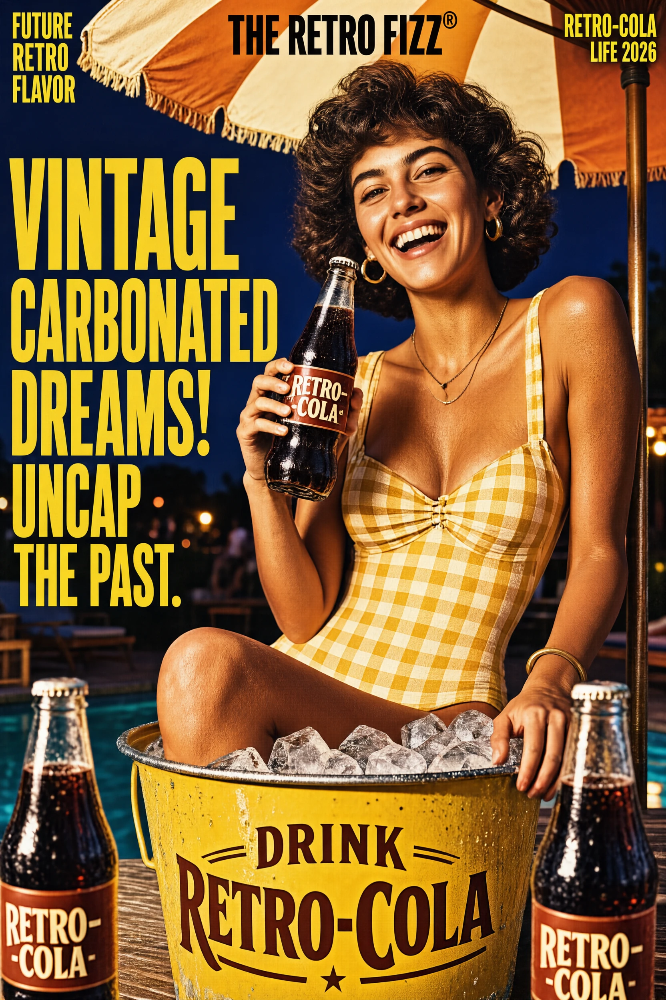
      </td>
    </tr>
    <tr>
      <td valign="top">
        <details>
          <summary><b>Marine turtle educational infographic</b></summary>
          <pre><code>{
  "type": "circular life-cycle educational infographic poster",
  "theme": "MARINE TURTLES of the MALDIVES - Life Cycle and Threats",
  "language": "English",
  "priority_emphasis": [
    "TOP PRIORITY: all text crisp, correctly spelled, plain letters and numbers only - no strange symbols or garbled characters",
    "core structure: a circular five-stage life cycle arranged clockwise around a central dark-teal oval label, with curved arrows connecting the stages",
    "style: soft watercolor natural-history illustration inside each stage circle, combined with clean flat icons and elegant serif typography",
    "calm coastal palette: soft ocean teals and blues on a very light blue-white background, one warm sand-beige accent band"
  ],
  "canvas": {
    "aspect_ratio": "2:3",
    "orientation": "vertical poster",
    "resolution_hint": "high resolution, refined print-quality detail",
    "background": "very light blue-white with a subtle watercolor wash texture"
  },
  "style": {
    "overall": "elegant marine conservation poster - watercolor illustration meets clean infographic design",
    "visual_tone": "calm, natural, scientific, gentle",
    "art_direction": "each life stage is a circular watercolor vignette with soft edges; around each vignette a pale-teal arc segmented into small flat threat icons; bold curved teal arrows link the stages clockwise; dotted lines connect stages to the center",
    "color_palette": [
      "deep ocean teal (headings, arrows, icons)",
      "soft aqua and powder blue (arcs and fills)",
      "muted seafoam green",
      "warm sand beige (bottom accent band)",
      "very light blue-white background"
    ],
    "saturation": "low to medium, watercolor softness, no bright colors",
    "typeface": "classic serif in dark teal - large elegant serif for the title with an italic word, medium serif for stage names and section headers, clean sans-serif regular for body bullets",
    "references": ["natural history watercolor plates", "marine conservation posters", "editorial life-cycle diagrams"]
  },
  "layout": {
    "header": {
      "title": "MARINE TURTLES of the MALDIVES - large dark-teal serif, the words of the in elegant italic",
      "subtitle": "Life Cycle and Threats - medium serif flanked by small decorative dashes"
    },
    "central_hub": "a solid dark-teal oval in the middle of the cycle with white italic serif text: Life Cycle and Threats",
    "life_cycle_ring": {
      "arrangement": "five stages arranged clockwise: stage 1 top center, stage 2 right, stage 3 lower right, stage 4 lower left, stage 5 left; bold curved teal arrows between consecutive stages; thin dotted lines from each stage toward the central oval",
      "stage_design": "each stage has a numbered dark-teal circle badge on top, a round watercolor illustration, a serif stage name below, and a pale-teal arc of 4-5 small flat threat icons hugging the outer side of the circle (crab, bird, fish, thermometer, net, plastic bottle, no-poaching sign, excavator, boat as appropriate)",
      "stages": [
        {"number": "1", "name": "Eggs and Nest", "illustration": "watercolor female turtle on warm sand laying a clutch of white eggs among beach grass", "side_text": "left column bullets: Females return to natal Maldivian beaches to nest. Clutch approx 80-120 eggs; incubation approx 45-70 days in the warm sand.", "right_text": "right column bullets: Bycatch in fishing gear and ghost-net entanglement. Plastic ingestion, poaching, coastal development and boat strikes."},
        {"number": "2", "name": "Hatchlings", "illustration": "watercolor night beach scene with a tiny hatchling scrambling toward moonlit waves", "side_text": "bullets: Hatchlings emerge at night and scramble to the sea toward the brightest horizon. Survival to adulthood is estimated at only approx 1 in 1,000."},
        {"number": "3", "name": "The Lost Years", "illustration": "watercolor juvenile turtle drifting among Sargassum seaweed and small fish in open blue water", "side_text": "bullets: Juveniles drift on open-ocean currents and Sargassum for years. This long pelagic phase is known as the lost years."},
        {"number": "4", "name": "Sub-adult on Reefs", "illustration": "watercolor young turtle swimming over coral reef and seagrass", "side_text": "bullets: Young turtles recruit to Maldivian coral reefs and seagrass beds. They feed and grow toward maturity in coastal foraging grounds."},
        {"number": "5", "name": "Adult and Migration", "illustration": "watercolor mature turtle swimming through open water with light rays", "side_text": "bullets: Mature adults migrate between foraging and breeding grounds. Sexual maturity is reached late - often 20-30 years."}
      ]
    },
    "species_status_row": {
      "left": "a watercolor hawksbill turtle illustration beside header Maldivian Species with bullets: Five of the seven sea-turtle species occur in Maldivian waters. Green and Hawksbill turtles are the most commonly seen.",
      "right": "a dark-teal shield icon with a white turtle silhouette beside header Conservation Status with bullets: Hawksbill Critically Endangered. Green Endangered (IUCN Red List). A second watercolor green turtle illustration at the far right."
    },
    "threat_bands": {
      "natural": "a full-width pale-teal rounded band titled NATURAL THREATS with four icon-text pairs separated by dotted dividers: crab icon - Predation of eggs and hatchlings by crabs, birds and fish; virus icon - Disease; coral icon - Coral and seagrass loss; storm cloud icon - Storms erode nesting beaches.",
      "human": "below it a full-width warm sand-beige rounded band titled HUMAN THREATS with five icon-text pairs: fishing net - Bycatch in fishing gear and ghost-net entanglement; plastic bottles - Plastic ingestion; turtle with hand - Poaching; excavator - Coastal development; boat - Boat strikes."
    }
  },
  "composition_rules": [
    "the five-stage ring is the dominant structure, evenly spaced around the central oval",
    "watercolor vignettes share a consistent illustration style and scale",
    "threat-icon arcs hug each stage circle on its outer side without touching neighboring elements",
    "side text columns sit outside the ring, aligned left or right, never overlapping the cycle",
    "curved arrows are bold and smooth, clearly showing clockwise flow",
    "the two threat bands stretch the full width at the bottom with even icon spacing",
    "generous breathing room, nothing touches the poster edges"
  ],
  "quality_tags": [
    "watercolor natural-history illustration",
    "circular life-cycle diagram",
    "marine conservation poster",
    "soft coastal palette",
    "elegant serif typography",
    "clean flat icon system",
    "crisp accurate text",
    "high detail"
  ],
  "negative_prompt": [
    "garbled text",
    "misspelled words",
    "strange symbols",
    "blurry small labels",
    "bright neon colors",
    "oversaturated palette",
    "photorealistic turtles",
    "3D render look",
    "cartoon childish style",
    "cluttered overlapping elements",
    "broken cycle arrows",
    "wrong number of stages",
    "watermark",
    "low resolution"
  ]
}</code></pre>
        </details>
      </td>
      <td valign="top" align="center">
        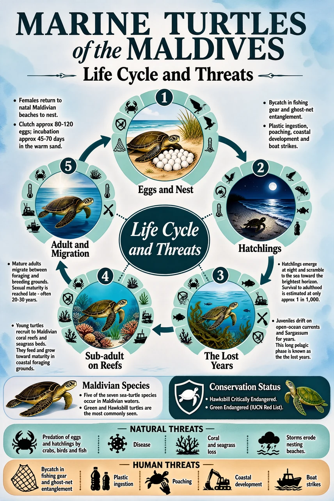
      </td>
    </tr>
    <tr>
      <td valign="top">
        <details>
          <summary><b>Wukang Road travel journal</b></summary>
          <pre><code>{
  "type": "Xiaohongshu-style watercolor CityWalk guide in a travel-journal layout",
  "theme": "武康路 — 上海最出片的一条马路 CITYWALK 漫游",
  "language": "Simplified Chinese with a few English accents",
  "priority_emphasis": [
    "TOP PRIORITY: all Chinese text must be crisp, correct, and free of typos; use ordinary punctuation only, with no strange characters; handwritten titles should show natural brushwork while remaining legible",
    "core style: watercolor hand-drawn illustration plus collage travel-journal design—aged kraft-paper background, stickers, sticky notes, ticket stubs, tape, handwritten annotations, heart doodles, and a strong Xiaohongshu recommendation aesthetic",
    "the image should feel rich and lively without becoming cluttered; use a gentle, healing warm palette, like a carefully crafted page from a travel journal"
  ],
  "canvas": {
    "aspect_ratio": "1:1",
    "orientation": "square",
    "resolution_hint": "high resolution, delicate watercolor texture, rich collage depth",
    "background": "aged warm-beige kraft or journal paper with subtle paper grain and weathering"
  },
  "style": {
    "overall": "hand-painted watercolor plus collage journal plus Xiaohongshu guide layout",
    "visual_tone": "artistic, soothing, gentle, recommendation-oriented, lively, and refined",
    "art_direction": "render architecture and street scenes in soft watercolor with translucent washes and fine outlines; layer elements as stickers, sticky notes, ticket stubs, and pieces of tape; add handwritten notes, dotted routes, hearts, and arrow doodles; use sticker labels to organize open areas",
    "color_palette": ["aged beige paper", "watercolor brick red for the Wukang Building", "soft green for plane trees", "warm brown and latte tones", "pink, yellow, and blue accents for sticker labels"],
    "saturation": "low to medium saturation, soft warm tones, transparent watercolor",
    "typeface": "large black brush-handwritten main title with a multicolor outline glow; handwritten subheads; clear small body text",
    "references": ["Xiaohongshu travel journals", "watercolor city illustration", "collage-style guide graphics"]
  },
  "layout": {
    "main_title": "武康路 — oversized black brush handwriting in the upper-left corner with hand-drawn pink, yellow, and blue outline glows and a sticker-like feel",
    "subtitle": "上海最出片的一条马路 | CITYWALK漫游 — small handwritten text below the title",
    "hero_visual": "a watercolor illustration of the Wukang Building on the middle-right—the Normandy Apartments, a historic brick-red ship-shaped corner building; in front, seen from behind, a woman in a straw hat and beige long dress crosses a zebra crossing while holding coffee and wearing a small shoulder bag; watercolor plane trees provide shade nearby",
    "collage_elements": [
      "upper-left sticky-note checklist: 网红面包店 / 转角遇到爱 / 老上海风情, each checked",
      "an aged postage stamp with a plane-leaf motif and a piece of tape in the upper-right",
      "a coffee ticket stub on the left reading CAFE de WUKANG 咖啡时光 COFFEE TICKET, paired with a small watercolor latte",
      "two small watercolor scenes at mid-left: a corner café captioned 转角遇见浪漫 and an old villa balcony captioned 藏着老上海的故事",
      "right-side annotations: 武康大楼（诺曼底公寓）上海地标必打卡机位; 法国梧桐 夏日浓荫大道 氛围感拉满",
      "a blue street sign on the right reading 武康路 Wukang Rd. 393/381",
      "small hand-drawn hearts, arrows, and camera icons"
    ],
    "route_map": "a hand-painted watercolor CITYWALK route map in the lower-left titled 武康路CITYWALK路线图; a pink dotted line connects numbered stops: START 武康大楼(诺曼底公寓) → 2 老洋房群(历史建筑巡礼) → 网红面包店(人气烘焙) → 3 街角咖啡馆(拍照打卡) → 5 复古路牌(打卡留念) → GO! citywalk; add small watercolor buildings and roadside trees along the route",
    "bottom_tags": "three colorful sticker hashtags: #武康路 #上海citywalk #出片圣地",
    "tips_box": "a lower-right sticky note titled 漫步TiPS with checked items: 穿着舒适的鞋子 / 带上相机-手机 / 慢下来感受生活"
  },
  "composition_rules": [
    "make the Wukang Building the visual anchor on the right, use the woman seen from behind to guide the eye, and anchor the route map in the lower-left",
    "layer collage elements with varied offsets and ample breathing room; keep the page lively without letting elements merge into clutter",
    "make the handwritten title the most prominent element and keep each small label clearly separated",
    "unify the image with a warm watercolor palette so it reads as one complete journal page"
  ],
  "quality_tags": ["watercolor travel-journal style", "collage recommendation guide", "brush-handwritten title", "route map", "warm and soothing", "crisp text", "Xiaohongshu style", "high-definition detail"],
  "negative_prompt": ["garbled Chinese", "typos", "strange characters", "text blurred into a mass", "messy overlapping elements", "harsh saturated colors", "3D-rendered look", "photorealism", "cold rigid flat vectors", "too much empty space", "watermark", "low resolution"]
}</code></pre>
        </details>
      </td>
      <td valign="top" align="center">
        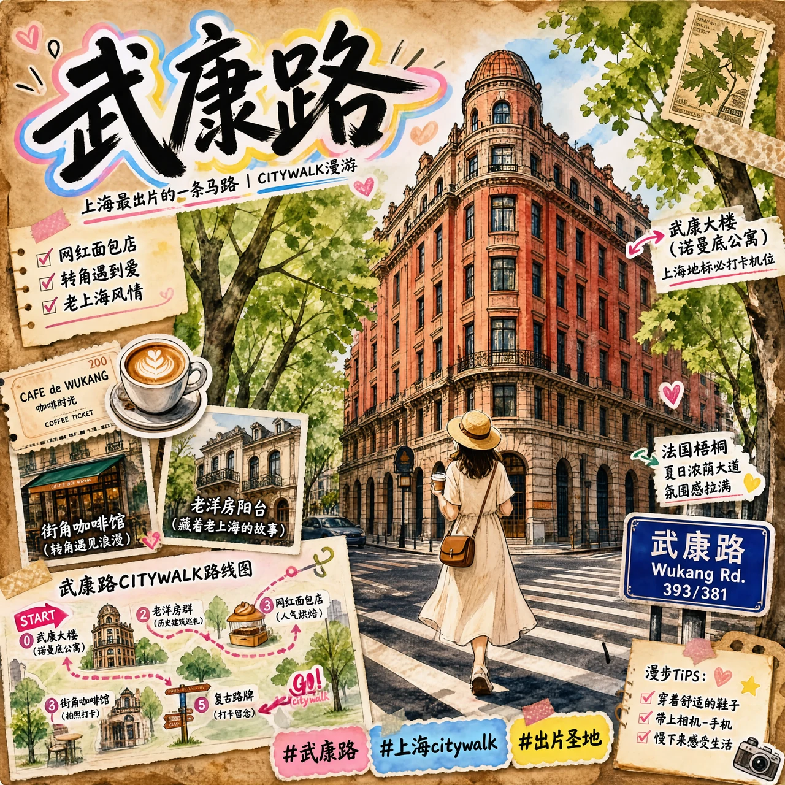
      </td>
    </tr>
    <tr>
      <td valign="top">
        <details>
          <summary><b>Silver-halide photography technical diagram</b></summary>
          <pre><code>{
  "type": "precision line-art engineering educational infographic",
  "theme": "银盐摄影 — 一束光如何通过化学反应变成一张永久保存的照片",
  "language": "Simplified Chinese with a few English years and technical terms",
  "priority_emphasis": [
    "TOP PRIORITY—MANDATORY: never place a row of label or legend capsule buttons at the bottom or anywhere else; never draw style or quality terms such as 现代工程线描, 等距爆炸拆解, 明亮暖米底, 文字工整, or 高清细节 as visible content. The image may contain only the title, timeline, exploded camera hero diagram, and body copy for each knowledge module, with no extra tag strip",
    "TOP PRIORITY: all Chinese text must be crisp, correct, and free of typos; use ordinary punctuation only and no strange characters",
    "COLOR—LOW SATURATION: keep the image restrained and low-saturation. Use warm orange only as a tiny accent for the single incident light ray; render every other leader line, arrow, and annotation in neutral black or dark gray. Use a clean pale off-white background rather than yellowish cream, so the image feels fresh rather than overly warm",
    "TYPE WEIGHT—LIGHT TO MEDIUM: use medium-light text weights. Set the title in a clean medium-weight sans serif, never extra-bold; use regular sans serif for module headings and light sans serif or Song-style serif for body copy; avoid heavy stacks of ultra-bold type"
  ],
  "canvas": {
    "aspect_ratio": "16:9",
    "orientation": "landscape",
    "resolution_hint": "high resolution, engineering-drawing precision, crisp text",
    "background": "clean, bright, pale off-white paper leaning white rather than yellow, with subtle paper grain and an airy appearance"
  },
  "style": {
    "overall": "modern engineering line-art field guide meets infographic layout, clean and restrained",
    "visual_tone": "precise, professional, clean, bright, and lightweight",
    "art_direction": "use primarily thin, even black or dark-gray pen lines; keep linework clean and decisive. Use warm orange only for the single incident light ray and keep everything else neutral. Include cross-sectional layer diagrams, an isometric exploded view, fine leader annotations, numbered circles, and modules separated by thin rules or small headings",
    "color_palette": ["pale off-white background leaning white rather than yellow", "black and dark-gray line art as the primary color", "a minimal warm-orange accent used only for the incident light ray", "light-gray fills"],
    "saturation": "low saturation, dominated by neutral black and gray with a minimal warm-orange accent; clean rather than overly warm",
    "typeface": "clean medium-weight sans serif title, regular sans serif module headings, light sans serif or Song-style serif body text",
    "references": ["modern educational line-art infographics", "clean lightweight engineering exploded views", "clear technical diagrams"]
  },
  "layout": {
    "main_title": "银盐摄影 — large medium-weight sans serif in the upper-left, clean and not overly bold; below it, the small subtitle 一束光如何通过化学反应变成一张永久保存的照片",
    "top_timeline": "银盐摄影发展历程 — a horizontal timeline with six nodes and small line-art camera illustrations: 达盖尔银版摄影 1839, 卡罗式摄影 1841, 胶卷时代 1888, 黑白胶片普及, 彩色胶片 1935, 现代艺术银盐摄影",
    "central_hero": "an isometric exploded line drawing of a film camera in clean fine lines. Arrange parts along the optical path and annotate them with numbered leader lines: ① 相机主体, ② 镜头组, ③ 快门, ④ 胶片仓, ⑤ 银盐胶片, ⑥ 卷片轴, ⑦ 取景器. A single warm-orange ray enters through the lens, labeled 光线入射; this is the only orange element in the entire image. Beneath it, include circular magnified cross sections labeled 银盐乳剂层 and 卤化银晶体结构, the latter shown as a ball-and-stick crystal lattice",
    "left_modules": [
      "银盐为什么能记录影像: photons absorbed by silver-halide crystals excite electrons into the conduction band; electrons captured at sensitivity specks combine with silver ions to form metallic-silver particles—the latent image; a crystal becomes developable when roughly four or more silver atoms gather",
      "银盐乳剂结构: a layered cross section labeled 保护层 / 银盐乳剂层 / 片基",
      "为什么底片是反的: heavily exposed areas become dark; lightly exposed areas remain more transparent; tonal relationships are inverted; include a small negative-film diagram",
      "银盐摄影流程: a horizontal eight-step process with a small line icon for each step: ① 装入胶卷 → ② 曝光 → ③ 显影 → ④ 定影 → ⑤ 水洗 → ⑥ 干燥 → ⑦ 放大冲印 → ⑧ 获得照片"
    ],
    "right_modules": [
      "显影发生了什么: developer acts on the latent image; crystals are reduced to metallic silver; the image gradually appears; include a three-frame crystal-change diagram",
      "为什么需要定影: remove unexposed silver halide; retain only metallic particles; make the negative no longer light-sensitive; include a three-frame diagram",
      "为什么胶片会有颗粒感: larger crystals produce coarser grain and smaller crystals produce finer grain; include a grayscale grain-gradient strip",
      "银盐摄影与数码摄影: 化学感光 ↔ 电子感光, 胶片记录 ↔ CMOS记录, 暗房冲洗 ↔ 即时成像",
      "银盐摄影的魅力: four circular line-art icons labeled 真实颗粒 / 丰富影调 / 独特色彩 / 不可复制的仪式感"
    ]
  },
  "composition_rules": [
    "make the central exploded camera diagram the visual focus, with the optical path running through it",
    "arrange surrounding modules neatly along the edges, each with a small heading and numbered dot",
    "keep leader lines thin, crisp, uncrossed, and accurately matched to their numbers and text",
    "use line art as the primary language, with warm orange only for the incident light ray and neutral black or gray everywhere else",
    "provide ample whitespace and unify the image with a pale off-white background that feels clean rather than warm or greasy",
    "keep typography light to medium in weight and avoid a heavy appearance",
    "never place an unnecessary capsule-tag strip at the bottom or anywhere else"
  ],
  "quality_tags_internal_reference_do_not_draw": ["modern engineering line art", "clean fine lines", "low-saturation freshness", "light-to-medium type weight", "tidy typography", "high-definition detail"],
  "negative_prompt": [
    "capsule-tag strip at the bottom or anywhere else",
    "style or quality terms drawn as icon buttons or labels",
    "orange used throughout the image",
    "too many warm-orange accents",
    "harsh high-saturation colors",
    "overly yellow or warm background",
    "ultra-bold heavy type",
    "stacks of thick black text",
    "aged yellowed dark appearance",
    "heavy copperplate engraving",
    "garbled text",
    "typos",
    "strange characters",
    "text blurred into a mass",
    "crossed or tangled leader lines",
    "3D-rendered look",
    "photorealism",
    "watermark",
    "low resolution"
  ]
}</code></pre>
        </details>
      </td>
      <td valign="top" align="center">
        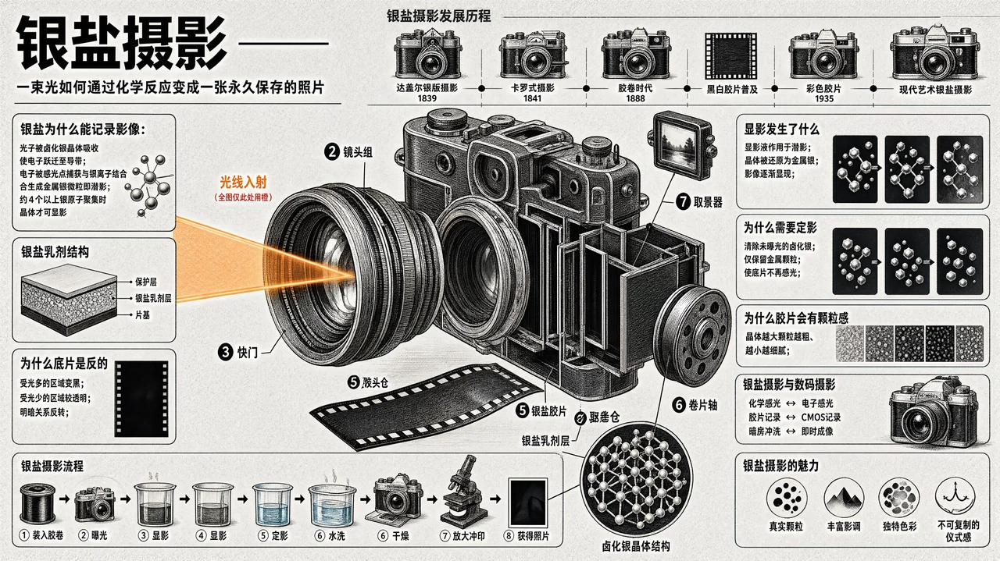
      </td>
    </tr>
    <tr>
      <td valign="top">
        <details>
          <summary><b>High-dynamic-range snowboarding photography</b></summary>
          <pre><code>Create a square extreme-sports photograph. A steep snow slope cuts diagonally from the lower left to the upper right, creating a strongly dynamic composition. Place a snowboarder slightly left of center, silhouetted in black by the sun directly behind them, with a huge spray of bright powder erupting in their wake. The background is a rich, deep-blue clear sky, and backlit snow crystals sparkle like a dense field of tiny stars. Add a vivid band of rainbow lens refraction in the lower-right, creating a striking color contrast with the cool snow scene. The overall image should have the high-speed, frigid, free, and awe-inspiring quality of an outdoor sports poster.</code></pre>
        </details>
      </td>
      <td valign="top" align="center">
        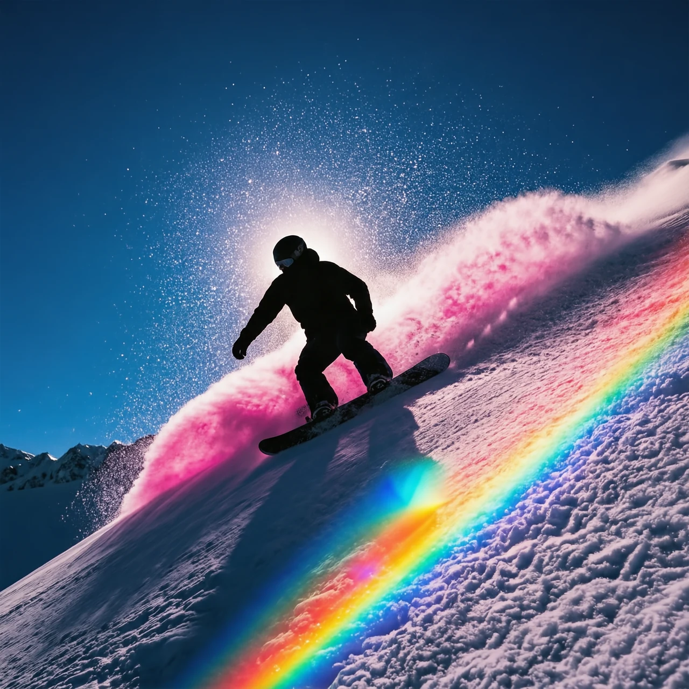
      </td>
    </tr>
  </tbody>
</table>

### ✏️ Image Editing Showcase

Click a prompt to expand the full text. Click an image to view it at its original
resolution.

<table>
  <thead>
    <tr>
      <th width="34%">Prompt</th>
      <th width="33%">Input Image</th>
      <th width="33%">Output Image</th>
    </tr>
  </thead>
  <tbody>
    <tr>
      <td valign="top">
        <details>
          <summary><b>Postal mail journey infographic</b></summary>
          <p>Create an infographic titled "The Journey of Postal Mail" using the watercolor illustration style of the reference image. The background should resemble textured paper with soft watercolor clouds, stars, and leafy plants in the corners.</p>
          <p>Layout a winding beige path connecting four numbered milestones, starting with a wooden "START" arrow on the left and ending with a "DESTINATION" arrow on the bottom right.</p>
          <ol>
            <li><b>Milestone 1 (Collection):</b> Place a purple circle marker with "1" and a wooden sign saying "Drop-off". Illustrate a sender placing a letter into a blue street mailbox or a post office counter. Add a text box titled "1. Collection" with a purple banner reading "First Step of the Journey". List details: "Action: Mailing", "Location: Local Post Box", "Handler: Postal Carrier".</li>
            <li><b>Milestone 2 (Processing):</b> Place a blue circle marker with "2" and a sign saying "Sorting". Illustrate a mail sorting facility with conveyor belts and workers. Add a text box titled "2. Sorting Center" with a blue banner reading "Automated Distribution". List details: "Action: Sorting", "Location: Distribution Center", "Method: Zip Code".</li>
            <li><b>Milestone 3 (Transport):</b> Place a green circle marker with "3" and a sign saying "Transit". Illustrate a mail truck driving on a highway or a cargo plane in the sky. Add a text box titled "3. Transportation" with a green banner reading "Cross-Country Travel". List details: "Action: Transport", "Location: Highway/Air", "Method: Truck/Plane".</li>
            <li><b>Milestone 4 (Delivery):</b> Place a red circle marker with "4" and a sign saying "Delivery". Illustrate a mail carrier delivering a package to a house doorstep. Add a text box titled "4. Final Delivery" with a red banner reading "Arrival at Destination". List details: "Action: Delivery", "Location: Recipient Home", "Handler: Mail Carrier".</li>
          </ol>
          <p>Use a dark blue brush-script font for the main title "The Journey of Postal Mail" at the top center. Ensure text boxes have rounded corners, colored borders matching their respective milestone markers, and small icons next to the list items (e.g., a location pin, a clock, a person icon).</p>
        </details>
      </td>
      <td align="center" valign="middle">
        <a href="./assets/showcases/editing/case1_postal_mail.webp">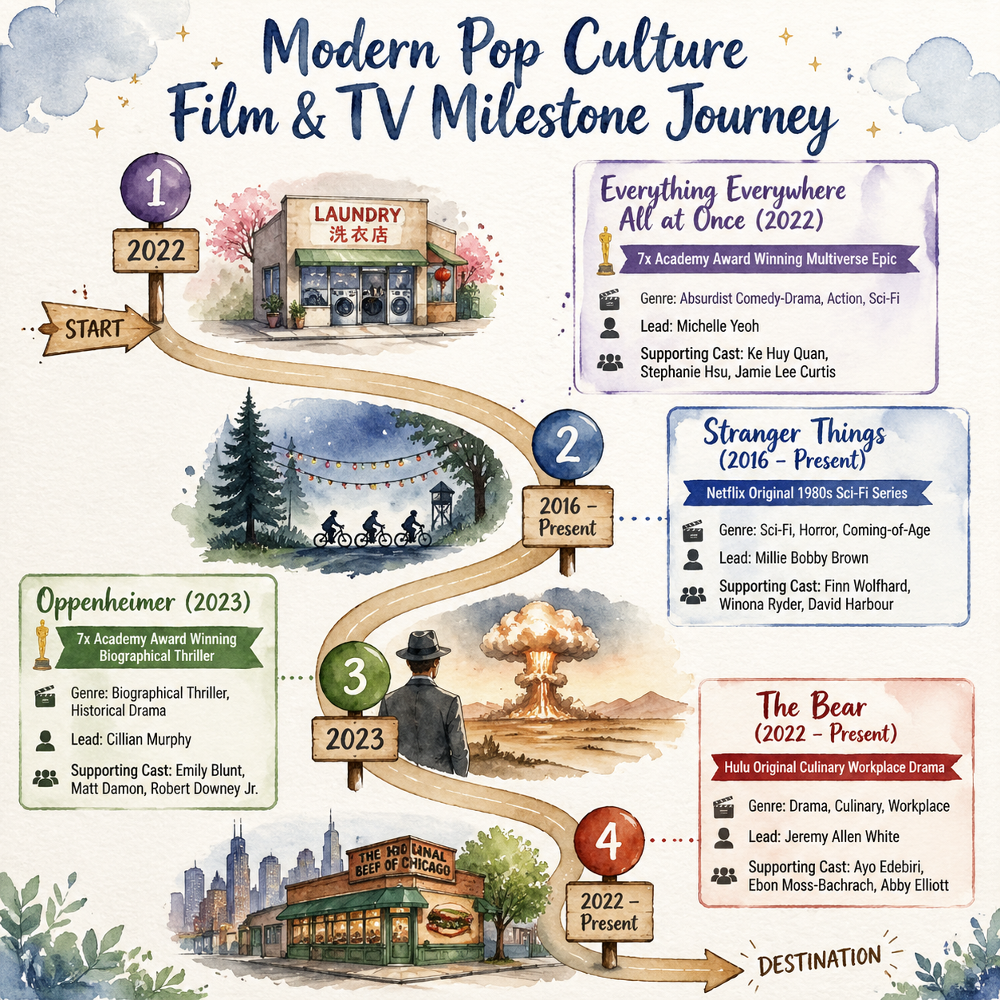</a>
      </td>
      <td align="center" valign="middle">
        <a href="./assets/showcases/editing_gallery/0001_2048x2048.webp">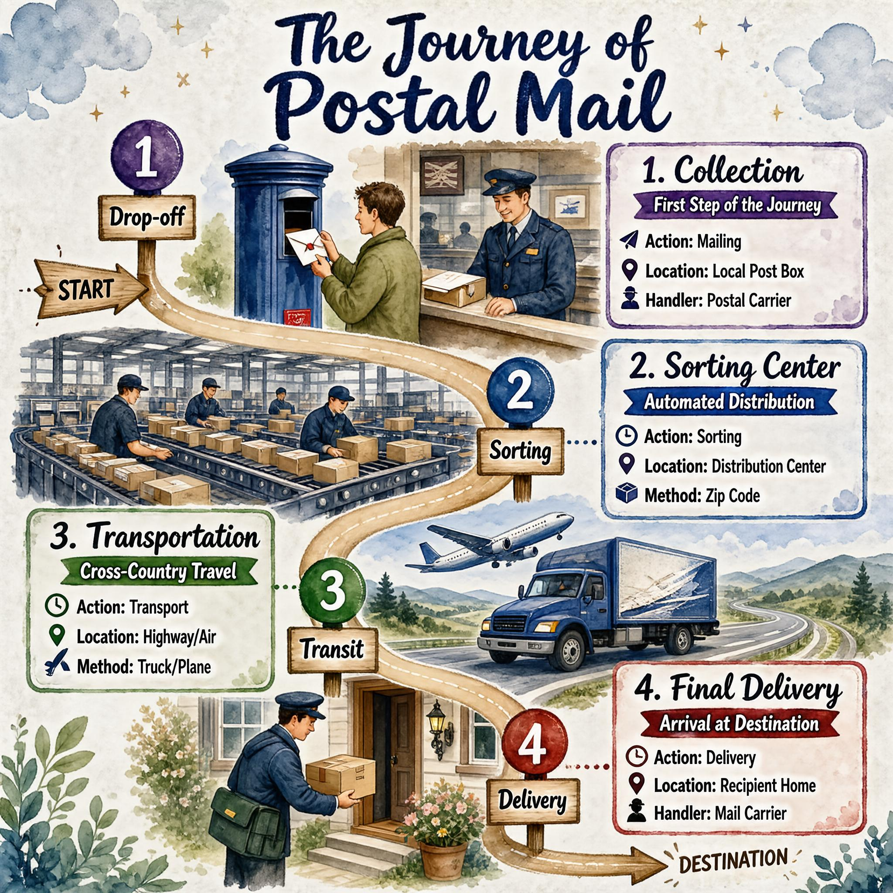</a>
      </td>
    </tr>
    <tr>
      <td valign="top">
        <details>
          <summary><b>Korean two-flavor fried-chicken recipe illustration</b></summary>
          <p>Transform the image into a hand-drawn recipe illustration on beige grid notebook paper with black spiral binding along the left edge.</p>
          <p><b>Top section:</b></p>
          <ul>
            <li>Use the large title “韩式双拼炸鸡” and the subtitle “外酥里嫩，快乐加倍的周末美食”.</li>
            <li>Place a large finished-dish image from Image 2 in the upper-right: a metal mesh basket containing both plain fried chicken and fried chicken coated in red sauce and sprinkled with sesame seeds, accompanied by a glass of cola with ice and a small dish of pickled radish.</li>
            <li>On the left, draw a cute pink cartoon pig holding a red chili pepper. Next to it, add a beige information box reading: 难度：★★★★☆，耗时：60分钟，口味：咸甜酥脆.</li>
          </ul>
          <p><b>Main step section in a two-row, three-column layout:</b></p>
          <ol>
            <li><b>步骤1 食材准备:</b> Draw chicken legs, flour, eggs, Korean chili paste, and the other ingredients. Add the text: “鸡腿500g、面粉、淀粉、鸡蛋、牛奶、蒜末、韩式辣酱、蜂蜜”.</li>
            <li><b>步骤2 腌制入味:</b> Draw chicken legs and seasoning in a bowl. Add the text: “鸡腿划刀，加入牛奶、蒜末、盐、黑胡椒，腌制30分钟”.</li>
            <li><b>步骤3 裹粉挂糊:</b> Draw the chicken-coating process. Add the text: “依次裹上淀粉、蛋液、混合粉（面粉:淀粉=1:1），捏出鳞片状”.</li>
            <li><b>步骤4 第一次油炸:</b> Draw chicken frying in a pot of oil. Add the text: “油温160度，下入鸡腿中小火炸6分钟至熟透，捞出”.</li>
            <li><b>步骤5 第二次复炸:</b> Draw the chicken being fried a second time. Add the text: “油温升至200度，复炸2分钟至金黄酥脆，捞出备用”.</li>
            <li><b>步骤6 裹酱装盘:</b> Draw a metal basket with half the chicken coated in red sweet-and-spicy sauce and sprinkled with white sesame seeds, while the other half remains plain. Add the text: “一半保持原味，另一半裹上甜辣酱（辣酱+蜂蜜+蒜末），撒芝麻，搭配可乐”.</li>
          </ol>
          <p><b>Bottom section:</b></p>
          <ul>
            <li>Add a “小贴士” box at the bottom with the text: “复炸是酥脆的关键！甜辣酱比例可根据口味调整。”</li>
            <li>Draw a cartoon pig giving a thumbs-up in the lower-right.</li>
          </ul>
          <p><b>Overall requirements:</b></p>
          <ul>
            <li>All visible copy must be crisp Chinese set in a handwritten style.</li>
            <li>Preserve the warm hand-drawn palette of Image 1, with soft lines and rich colors.</li>
          </ul>
        </details>
      </td>
      <td align="center" valign="middle">
        <a href="./assets/showcases/editing/case2_recipe_style_reference.webp">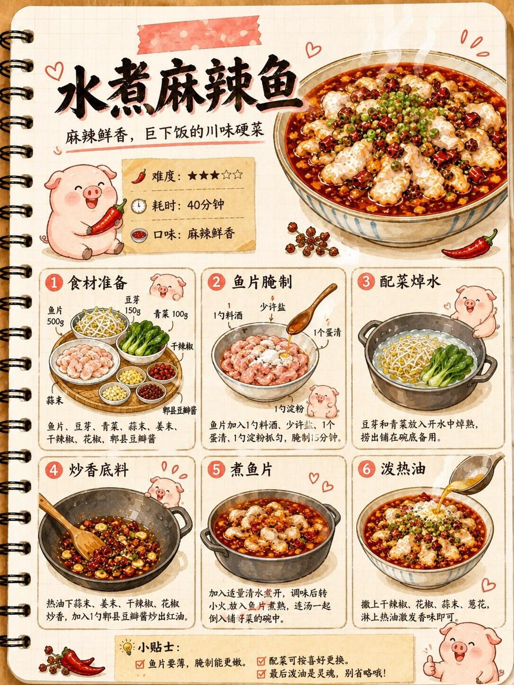</a>
        <a href="./assets/showcases/editing/case2_fried_chicken_reference.webp">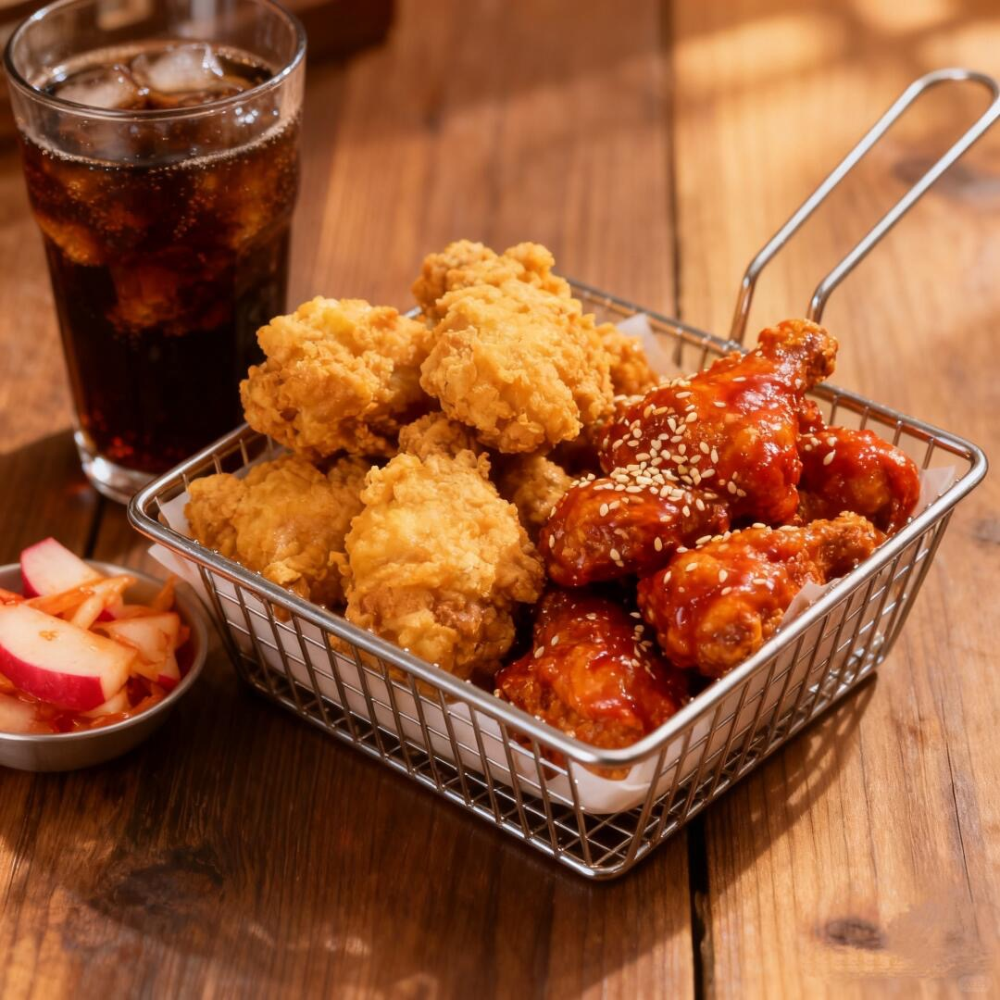</a>
      </td>
      <td align="center" valign="middle">
        <a href="./assets/showcases/editing_gallery/0002_1760x2336.webp">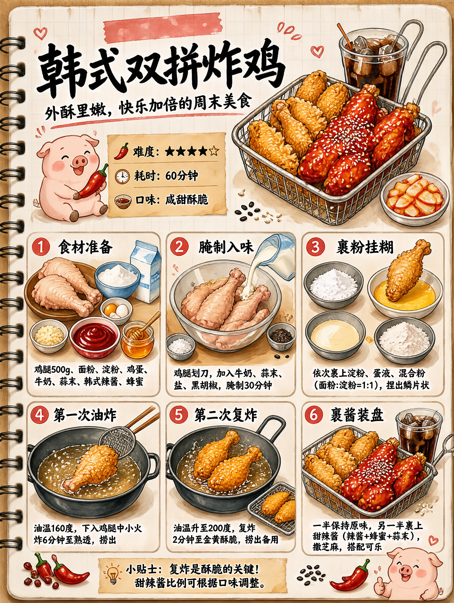</a>
      </td>
    </tr>
    <tr>
      <td valign="top">
        <details>
          <summary><b>Kids' summer tank-top cover</b></summary>
          <p>Use the provided photo as the main subject reference: keep the young boy’s identity, cheerful smile, short black hair, raised flexing arm pose, and white cotton tank top. Create a Xiaohongshu cover design promoting kids’ cool summer cotton tank tops.</p>
          <p>Design a vertical social-media cover with a bright, lively cartoon illustration style. Transform the photo into a clean, cute illustrated look while preserving the boy’s recognizable pose and outfit. Use a fresh summer palette with sky blue, white, lemon yellow, and light mint green. Add cute summer elements around him, such as small smiling suns, clouds, ice cubes, water splashes, tiny stars, and playful breeze lines. Keep the composition energetic and kid-friendly.</p>
          <p>Place the boy as the central visual focus, slightly enlarged, with the raised fist near the upper-left area and the stretched tank top fabric visible at the lower-right. Use a simple illustrated summer background with soft gradients and rounded shapes.</p>
          <p>Add the main title text "Summer Coolness" in large, bold, rounded cartoon lettering near the top center. Use bright blue or turquoise letters with a white outline and subtle shadow so it stands out clearly. Add smaller supporting text "Kids Cotton Tank Tops" below the title in a clean rounded font. Add a small badge or sticker near the side that says "Soft · Breathable · Cool" in readable text.</p>
          <p>Make the final image look like a polished Xiaohongshu product cover: cute, clean, colorful, eye-catching, and suitable for promoting children’s summer clothing. Preserve the boy’s friendly expression and natural proportions. Avoid changing him into an adult, avoid adding unrelated products, and keep all text clear and correctly spelled.</p>
        </details>
      </td>
      <td align="center" valign="middle">
        <a href="./assets/showcases/editing/case3_kids_tank_top.webp">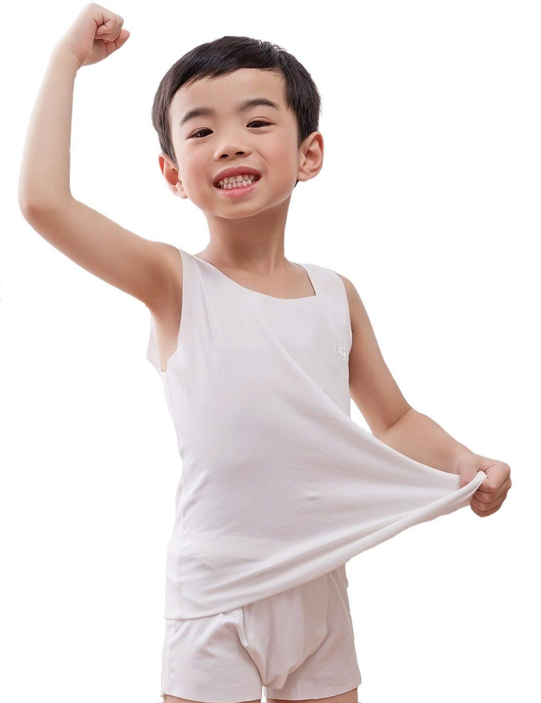</a>
      </td>
      <td align="center" valign="middle">
        <a href="./assets/showcases/editing_gallery/0003_1792x2304.webp">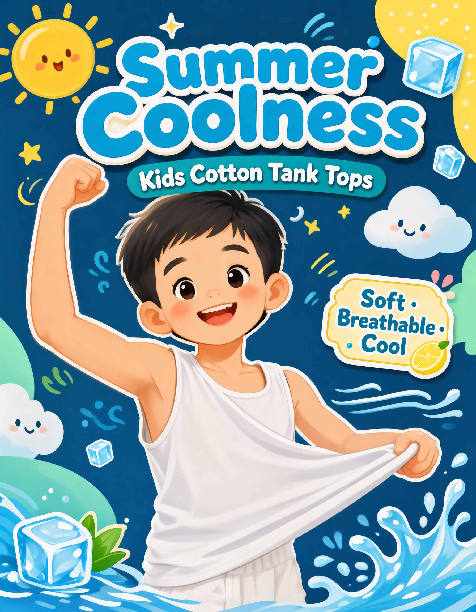</a>
      </td>
    </tr>
    <tr>
      <td valign="top">
        <details>
          <summary><b>Sodium-ion battery poster title replacement</b></summary>
          <p>Replace the large blue title on the left with “固定式储能用钠离子电池”. Preserve the original poster’s vintage print texture, deep-blue condensed display type, stroke proportions, letter spacing, line spacing, and vertical layout footprint. Break the Chinese title across lines within the original title area while retaining the strong vertical rhythm. Leave all other text, charts, icons, dates, illustrations, colors, textures, and layout unchanged.</p>
        </details>
      </td>
      <td align="center" valign="middle">
        <a href="./assets/showcases/editing/case4_sodium_ion_battery_title.webp">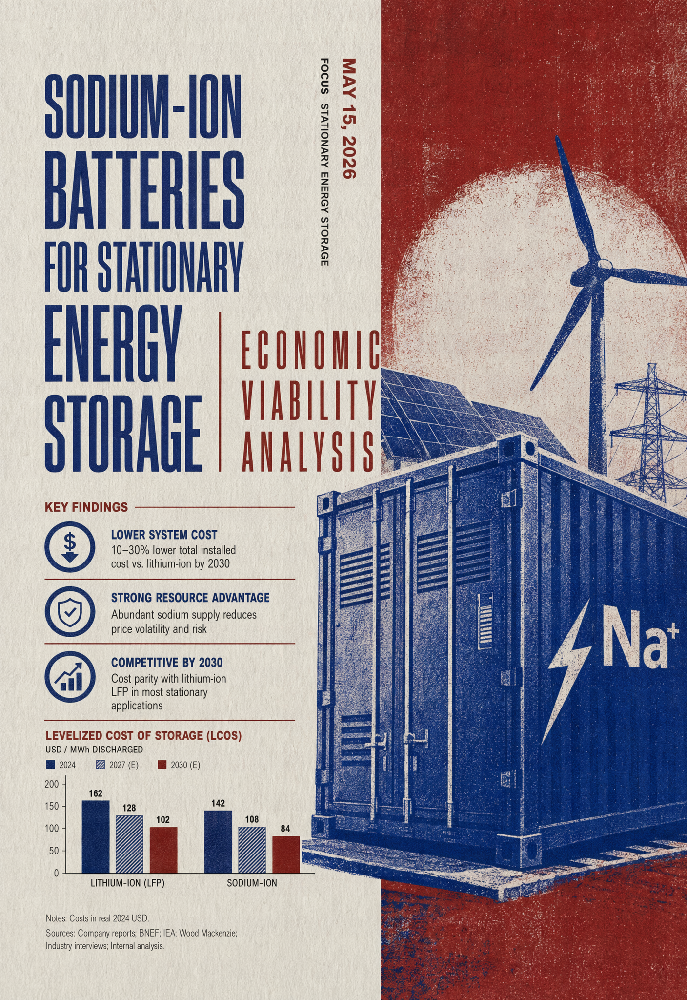</a>
      </td>
      <td align="center" valign="middle">
        <a href="./assets/showcases/editing_gallery/0004_1696x2432.webp">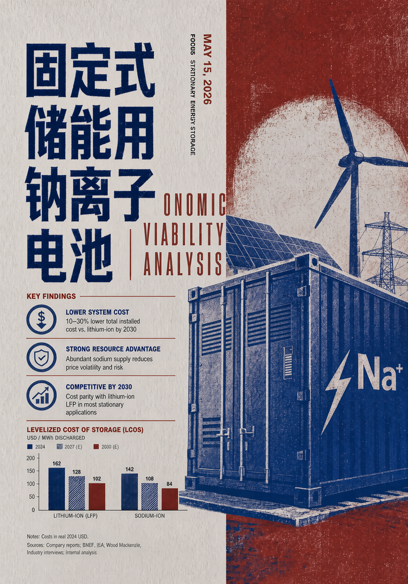</a>
      </td>
    </tr>
    <tr>
      <td valign="top">
        <details>
          <summary><b>Localized Chinese character edit in ocean waves</b></summary>
          <p>Perform a localized typographic-shape edit on the base image. Replace only the giant Chinese character “迎” formed at the center by the curling paths of ocean waves and a white boat with the character “命”; the target character must be clearly recognizable as “命”. Preserve the original top-down ocean view, turquoise water, white foam, moving boat, birds, handwritten English text at the top, white Chinese text at the bottom, overall composition, and aspect ratio. The new character “命” must still be formed naturally from churning white waves, foamy water patterns, and the boat’s wake. Match the original texture at the foam edges and retain realistic ocean motion; do not make it look like flat typography or a pasted graphic. Use the original white boat’s vertical course as the final vertical stroke of “命”. Preserve the boat’s position, perspective, scale, lighting, and material appearance as closely as possible, adjusting only the surrounding foam and water patterns so they naturally become part of the character structure. Outside the target region where “迎” changes to “命”, keep all other text, ocean texture, the number and positions of birds, the boat’s appearance, color, lighting, negative space, and overall travel-poster style unchanged. Avoid garbled or extra text, an incorrect character, duplicate boats, a deformed hull, abrupt foam, inconsistent style, or large-scale background repainting.</p>
        </details>
      </td>
      <td align="center" valign="middle">
        <a href="./assets/showcases/editing/case5_ocean_wave_character_edit.webp">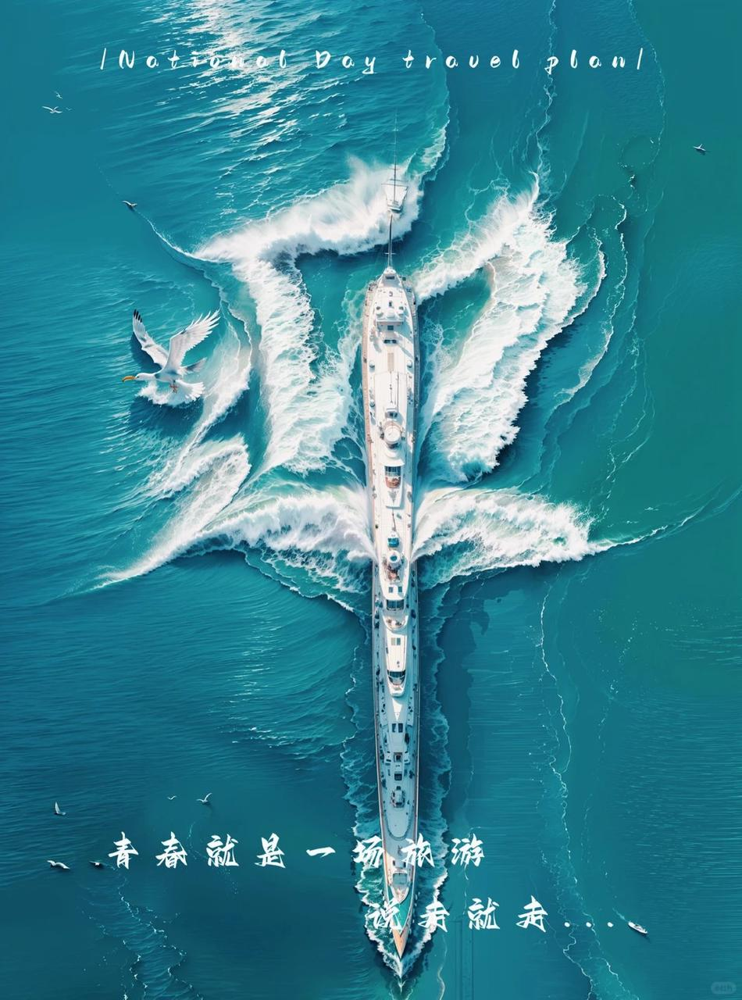</a>
      </td>
      <td align="center" valign="middle">
        <a href="./assets/showcases/editing_gallery/0005_1760x2368.webp">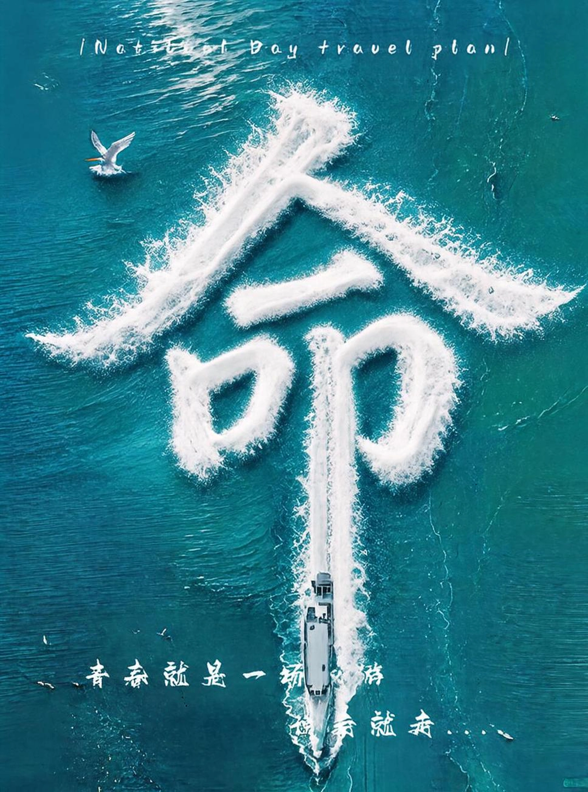</a>
      </td>
    </tr>
    <tr>
      <td valign="top">
        <details>
          <summary><b>Event date and time replacement</b></summary>
          <p>Replace the text “05月06日 10:00-17:00” inside the red box with “06月18日 09:00-18:00”. Preserve the original green color, bold style, and two-line layout—the date on the first line and the time on the second—and remove the red box.</p>
        </details>
      </td>
      <td align="center" valign="middle">
        <a href="./assets/showcases/editing/case6_event_date_replacement.webp">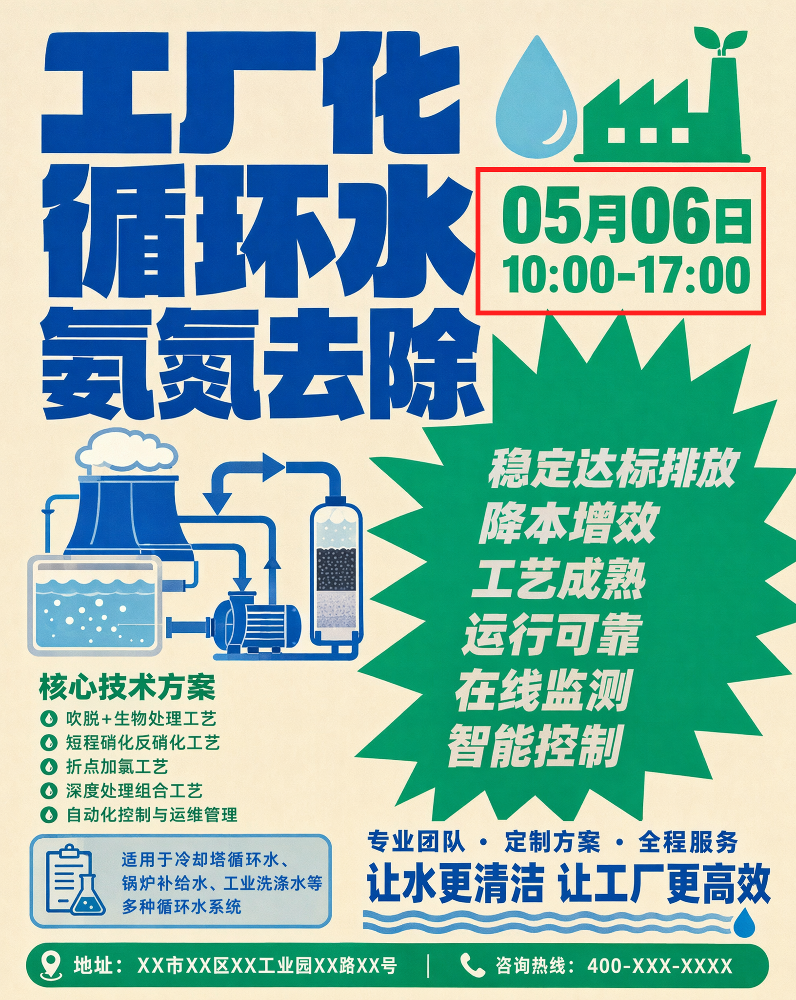</a>
      </td>
      <td align="center" valign="middle">
        <a href="./assets/showcases/editing_gallery/0006_1824x2272.webp"></a>
      </td>
    </tr>
  </tbody>
</table>

## ⚠️ Known Limitations

We aim to present SenseNova-U1.5 (Preview) with clear expectations. Its current limitations include:

* **Unintended text generation** from short or underspecified prompts.
* **Errors in dense or lengthy text**, especially for small characters and mixed Chinese-English content.
* **Incomplete adherence to complex layouts**, including exact counts, alignment, and hierarchical structure.
* **Instability in small faces, hands, limbs, and fine-grained object details.**
* **Drift in complex edits**, particularly across broad, multi-turn, or multi-reference instructions.

To help users better reach the model’s current capability ceiling, we provide two optional open-source practices.


## 🧰 Best Practices [Strong Recommendation]

For tasks with a clear subject and few constraints, a direct natural-language
prompt is sufficient. The two paths below are mainly intended for tasks where
the design information is incomplete or where users want to re-create a mature
visual solution from a reference. They are optional workflows external to the
model and should not be conflated with the raw model's capabilities.

### Path A: SenseNova Image PE Skill

Use this path when the input is only a short creative brief. The Skill turns
the brief into a compact Render JSON prompt while preserving required subjects,
visible copy, counts, layout constraints, and exclusions.

#### Installation

From the repository root, copy the Skill to the agent skills directory:

```bash
SKILL_DIR="$HOME/.agents/skills/sensenova-u1-5-prompt-enhancement"
mkdir -p "$SKILL_DIR"
cp src/sensenova_u1.5/prompt-enhancement-skill/SKILL.md "$SKILL_DIR/"
cp -R src/sensenova_u1.5/prompt-enhancement-skill/agents \
  src/sensenova_u1.5/prompt-enhancement-skill/references \
  "$SKILL_DIR/"
```

#### Usage Example

A Skill is a set of task instructions and references for an Agent, not a
standalone program. After installation, invoke
`sensenova-u1-5-prompt-enhancement` using your Agent's Skill mechanism and
submit the request below. The Agent follows `SKILL.md` and the material in
`references/` to turn the brief into Render JSON. Invocation syntax varies by
Agent. `$SKILL_DIR` is only the shell variable used by the installation command
for the target directory.

```text
Convert the brief below into one compact Render JSON object. Save only the JSON
object, without Markdown fences, to enhanced_prompt.json.

Brief:
Design a 3:4 portrait autumn lakeside wedding invitation with embossed paper
and delicate botanical linework. Use only this copy: "OUR DAY / AUTUMN WEDDING
/ 10.18 / LAKESIDE GARDEN".
```

Use the checked-in Render JSON to generate an image with SenseNova-U1.5:

```bash
MODEL_PATH="sensenova/SenseNova-U1.5-8B-MoT-Preview"

python examples/t2i/inference.py \
  --model_path "$MODEL_PATH" \
  --prompt "$(cat src/sensenova_u1_5/prompt-enhancement-skill/examples/u1_5_pe_skill_wedding_prompt.json)" \
  --width 1760 \
  --height 2368 \
  --cfg_scale 4.0 \
  --cfg_norm global \
  --timestep_shift 3.0 \
  --num_steps 50 \
  --seed 1730675618 \
  --device_map auto \
  --output output.png
```

### Path B: Reference-Image Retrieval + Caption-to-Prompt

When abstract style terms are not enough to describe a design target accurately,
a more direct approach is to first retrieve a reference image with a high degree
of design completeness, then use our Caption script to convert the visual
decisions in that reference into an editable prompt:

```text
Creative objective
  └─► Retrieve and select a reference image
      └─► SenseNova Caption Script
          └─► Composition / hierarchy / palette / typography / materials / lighting / constraints
              └─► Replace the theme, content, copy, subject, or local structure
                  └─► Re-create or reinterpret with SenseNova-U1.5 
```

The key to this path is not simply copying a reference image, but decomposing
*why the design works* into an executable description for the model. The Caption
script attempts to extract the layout grid, visual focus, typographic hierarchy,
color palette, materials, camera, lighting, and negative constraints. Users can
then preserve the design language while replacing the theme, copy, subject, or
local structure. When using external reference images, ensure that their source,
authorization, and use comply with the applicable licenses.

Caption script: [src/sensenova_u1_5/caption/caption.py](../src/sensenova_u1_5/caption/caption.py)

```bash
pip install openai pillow
export OPENAI_API_KEY="your-api-key"

# Output a structured JSON prompt and a natural-language prompt
python src/sensenova_u1_5/caption/caption.py path/to/reference.jpg

# Save the result for subsequent changes to the theme, copy, subject, or local structure
python src/sensenova_u1_5/caption/caption.py path/to/reference.jpg > result.json
```

The following example uses the Caption script to produce a structured
description, [result.json](../src/sensenova_u1_5/caption/result.json), from the original
reference image. It then uses that description for image reconstruction and for
localized text and object edits.

<table>
  <thead>
    <tr>
      <th width="25%" align="center">Origin</th>
      <th width="25%" align="center">Reversed</th>
      <th width="25%" align="center">V0</th>
      <th width="25%" align="center">V1</th>
    </tr>
  </thead>
  <tbody>
    <tr>
      <td align="center" valign="top">
        <a href="../src/sensenova_u1_5/caption/img/origin.png">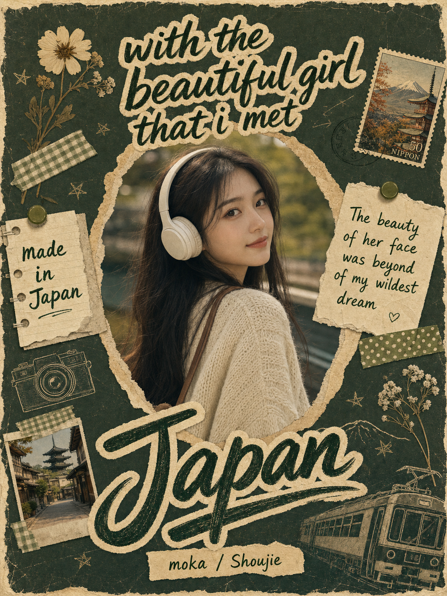</a>
      </td>
      <td align="center" valign="top">
        <a href="../src/sensenova_u1_5/caption/img/reversed.png">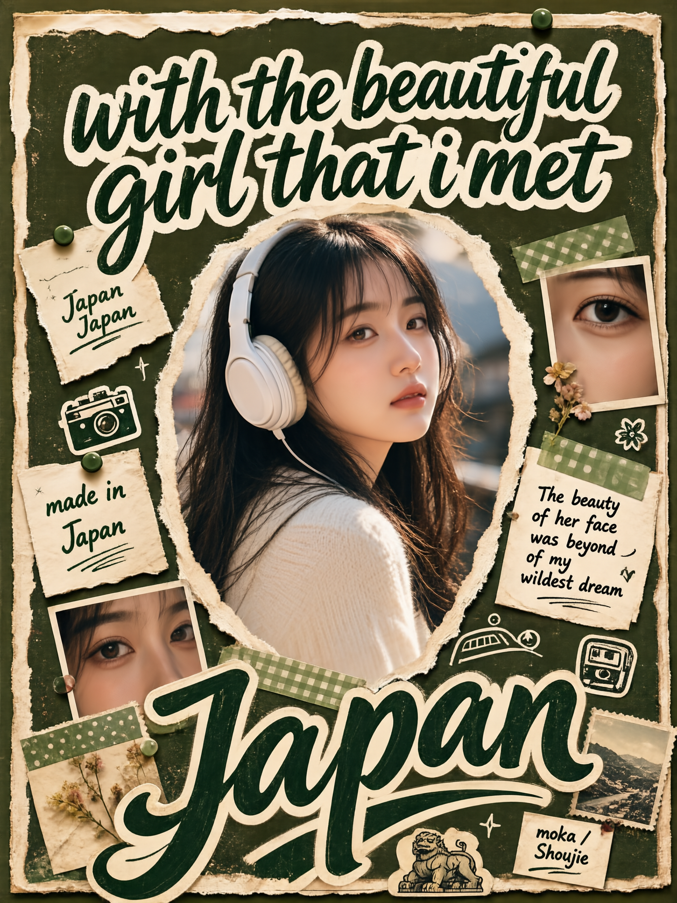</a>
      </td>
      <td align="center" valign="top">
        <a href="../src/sensenova_u1_5/caption/img/reversed_red.png">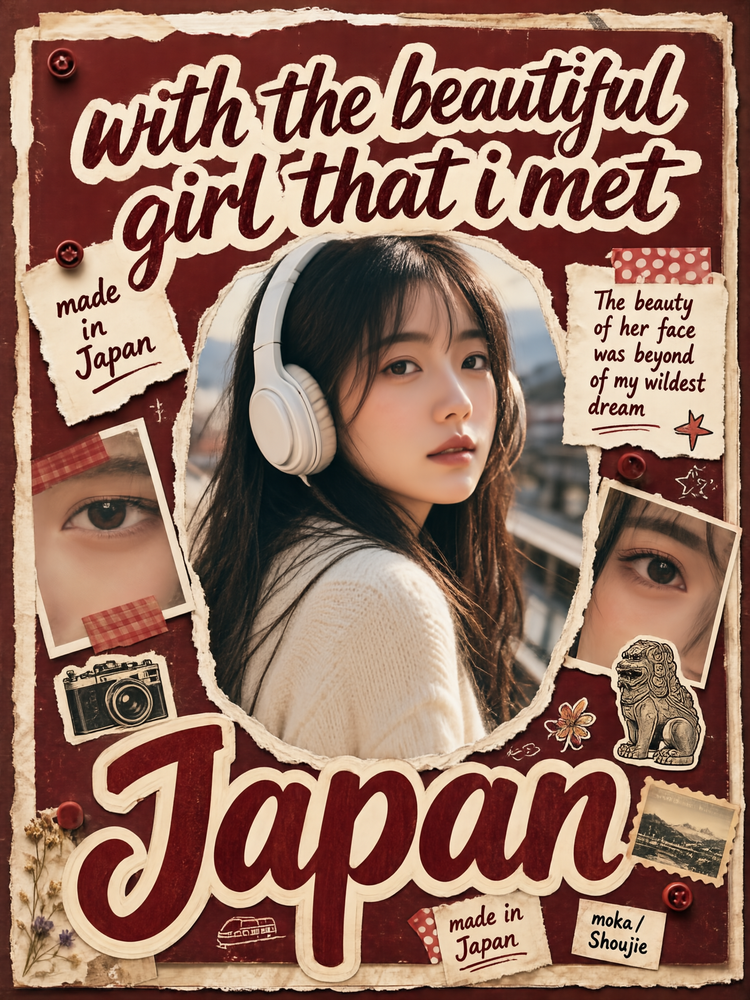</a>
      </td>
      <td align="center" valign="top">
        <a href="../src/sensenova_u1_5/caption/img/reversed_beijing.png">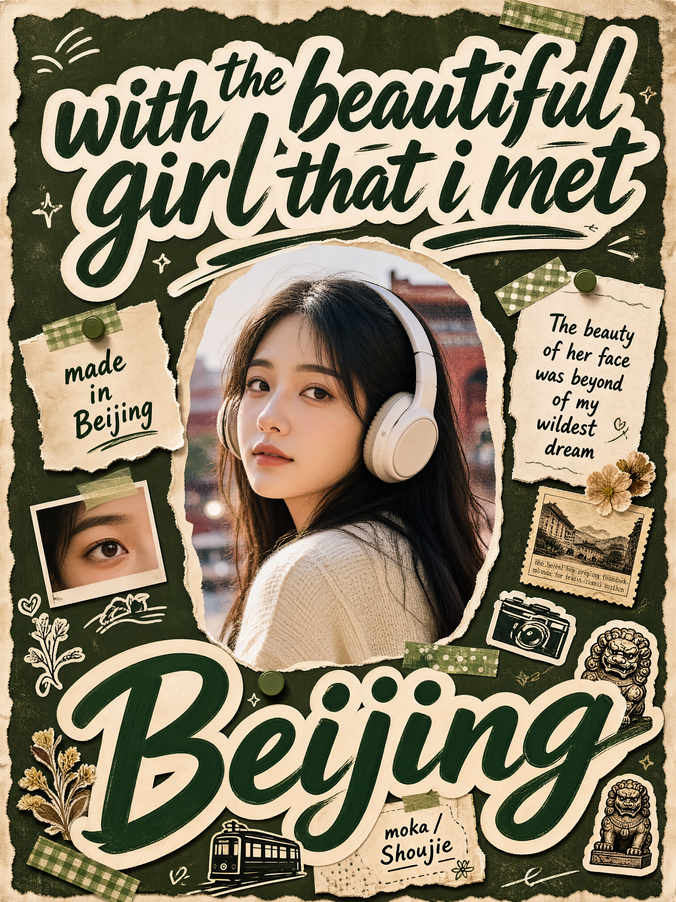</a>
      </td>
    </tr>
  </tbody>
</table>

### How to Choose

| Scenario | Recommended Approach |
| --- | --- |
| Clear subject with few constraints | Use a direct natural-language prompt |
| Only a short creative brief is available, but a complete design plan should be filled in automatically | SenseNova Image PE Skill |
| An ideal composition or visual language has already been found and should be re-created, rethemed, or modified | Reference-image retrieval + Caption-to-Prompt |

### Editing PE

Editing PE is a prompt-preprocessing step for image editing and
reference-guided generation. It sends the ordered input image(s) together with
the original instruction to a multimodal prompt rewriter, which preserves the
user's language and core intent while making the request more explicit for the
image model. Depending on the task, it can clarify the edit target and location,
assign roles to multiple reference images, extract a reference's visual
language, specify exact text and layout, and state which subjects or regions
must remain unchanged. The rewritten prompt is then passed to SenseNova-U1.5 for image
generation; Editing PE does not modify pixels itself.

The standalone implementation is available at
[`src/sensenova_u1_5/edit/edit_pe.py`](../src/sensenova_u1_5/edit/edit_pe.py).
To inspect the rewritten prompt without starting image generation:

```bash
export OPENAI_API_KEY="your-api-key"
# Optional:
# export OPENAI_MODEL="gpt-5.5"
# export OPENAI_BASE_URL="https://your-openai-compatible-endpoint/v1"

python src/sensenova_u1_5/edit/edit_pe.py \
  path/to/input.png \
  "把天空改成晚霞"
```

The command prints the rewritten prompt to standard output. Multiple input
images can be listed in order before the original prompt.

In [`examples/editing/inference.py`](../examples/editing/inference.py), Editing
PE is enabled by default and requires `OPENAI_API_KEY`. Use `--print-edit-pe`
to inspect the original and rewritten prompts, `--edit-pe-model` to select the
rewriter model, or `--no-use-edit-pe` to bypass enhancement when the prompt is
already sufficiently detailed. For multi-image tasks, provide the images in the
intended order and describe each image's role in the original instruction.

The following example shows how a short style-reference request is expanded
into a detailed, model-facing instruction, and compares the outputs before and
after enhancement.

<table>
  <thead>
    <tr>
      <th width="20%" align="center">Input Image</th>
      <th width="20%" align="center">Original Prompt</th>
      <th width="20%" align="center">Original Prompt Output</th>
      <th width="20%" align="center">PE-Enhanced Prompt</th>
      <th width="20%" align="center">PE-Enhanced Prompt Output</th>
    </tr>
  </thead>
  <tbody>
    <tr>
      <td align="center" valign="top">
        <a href="./assets/showcases/editing_gallery/case1_ancient_roof_infographic.webp">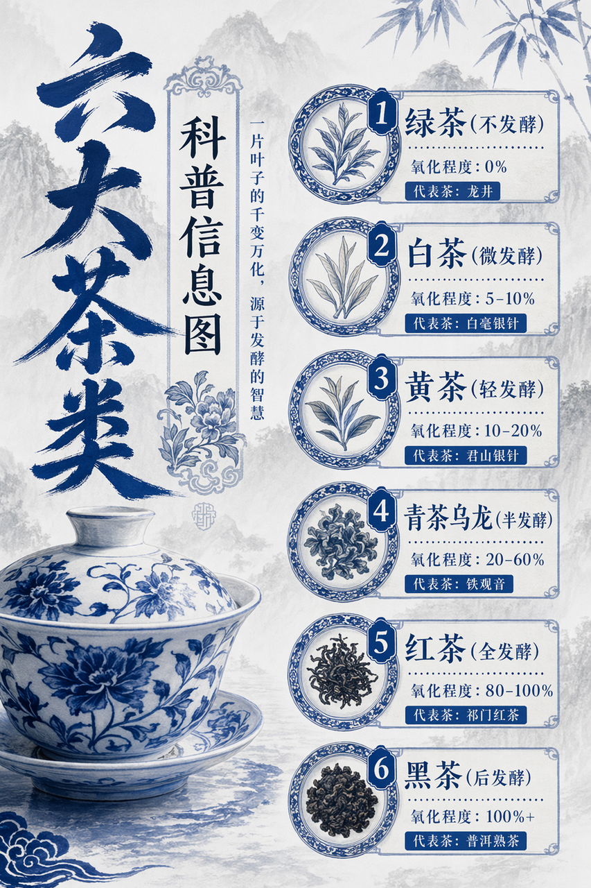</a>
      </td>
      <td valign="top">
        <p>参考这张图的青花水墨视觉语言，生成一张中国古建筑屋顶形制图鉴。</p>
      </td>
      <td align="center" valign="top">
        <a href="./assets/showcases/editing_gallery/case1_edit_roof_no_pe_demo.webp">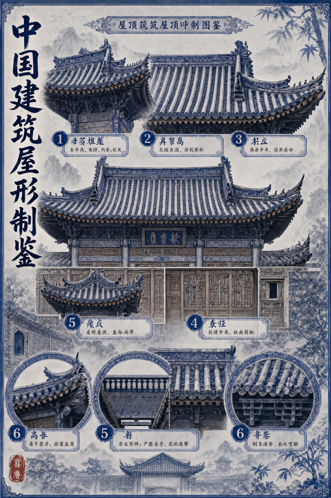</a>
      </td>
      <td valign="top">
        <details>
          <summary><b>View full PE-enhanced prompt</b></summary>
          <p>参考输入图的青花瓷与水墨视觉语言，生成一张竖版《中国古建筑屋顶形制图鉴》信息海报。整体使用白色宣纸背景、淡灰水墨山水远景、青花蓝单色主调、细腻瓷纹边框、传统卷草纹与云纹装饰，版式层级、圆形插图框、编号徽章、虚线分隔和说明卡片风格与参考图一致，但内容改为中国古建筑屋顶形制。</p>
          <p>左侧设置大号竖排书法标题文字“屋顶形制”，使用深青蓝粗笔触。标题旁加入竖排副标题“飞檐斗拱之间，承载千年营造智慧”。左下角绘制一座青花瓷质感的古建筑屋脊与飞檐局部，带有花纹装饰和水墨阴影，替代参考图中的茶碗。背景保留淡雅山水、竹叶、云纹和留白感。</p>
          <p>右侧从上到下排列 6 个屋顶形制条目，每个条目包含一个圆形青花瓷边框插图，里面用蓝灰线描绘对应屋顶轮廓；右侧连接一张青花边框信息卡。每张卡片包含编号、屋顶名称、简短特征和代表建筑，文字清晰可读，全部使用深青蓝色。</p>
          <p>6 个条目的文字内容如下：</p>
          <ol>
            <li>“庑殿顶”<br>“等级：最高”<br>“特征：四坡五脊，庄重宏阔”<br>“代表：太和殿”</li>
            <li>“歇山顶”<br>“等级：高”<br>“特征：九脊结合，山花分明”<br>“代表：故宫保和殿”</li>
            <li>“悬山顶”<br>“等级：中”<br>“特征：两坡出山墙，屋檩外挑”<br>“代表：民居祠堂”</li>
            <li>“硬山顶”<br>“等级：常见”<br>“特征：两坡封山墙，朴素稳重”<br>“代表：北方民居”</li>
            <li>“攒尖顶”<br>“等级：亭阁常用”<br>“特征：多坡汇于一点，形制挺拔”<br>“代表：天坛祈年殿”</li>
            <li>“卷棚顶”<br>“等级：园林常用”<br>“特征：无正脊，曲线柔和”<br>“代表：园林廊亭”</li>
          </ol>
          <p>保持整张海报为精致青花水墨插画风，避免现代图标和鲜艳颜色。构图清爽、对齐整齐、装饰细节丰富但不影响文字阅读。</p>
        </details>
      </td>
      <td align="center" valign="top">
        <a href="./assets/showcases/editing_gallery/case1_edit_roof_pe_demo.webp">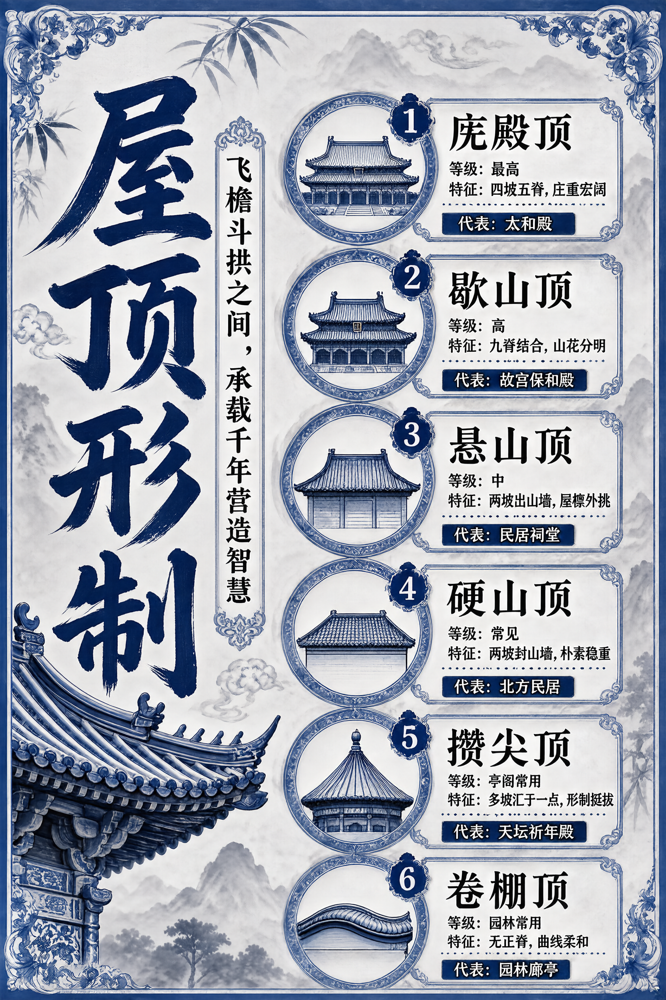</a>
      </td>
    </tr>
  </tbody>
</table>

## 🚀 Quick Start

The reference inference implementation is available in the
[SenseNova-U1 GitHub repository](https://github.com/OpenSenseNova/SenseNova-U1).

### Installation

```bash
git clone https://github.com/OpenSenseNova/SenseNova-U1.git
cd SenseNova-U1
uv sync
source .venv/bin/activate
```

The upstream environment currently uses Python 3.11, PyTorch 2.8, and CUDA 12.8.
For other CUDA versions and optional FlashAttention configurations, see the
[installation guide](https://github.com/OpenSenseNova/SenseNova-U1/blob/main/docs/installation.md).

### 🖼️ Text-to-Image

```bash
python examples/t2i/inference.py \
  --model_path sensenova/SenseNova-U1.5-8B-MoT-Preview \
  --prompt "A cinematic mountain lake at sunrise, realistic photography." \
  --width 2048 --height 2048 \
  --device_map auto \
  --output output.png
```

### ✏️ Image Editing

```bash
python examples/editing/inference.py \
  --model_path sensenova/SenseNova-U1.5-8B-MoT-Preview \
  --image input.png \
  --prompt "Change the jacket to cobalt blue. Preserve the face, pose, background, lighting, and framing." \
  --no-use-edit-pe \
  --device_map auto \
  --output edited.png
```

To use Image PE to generate a more detailed model-facing editing prompt:

```bash
python examples/editing/inference.py \
  --model_path sensenova/SenseNova-U1.5-8B-MoT-Preview \
  --prompt "参考这张图的青花水墨视觉语言，生成一张中国古建筑屋顶形制图鉴。" \
  --image docs/assets/showcases/editing_gallery/case1_ancient_roof_infographic.webp \
  --output edited_with_pe.png \
  --use-edit-pe
```

The reference configuration for SenseNova-U1.5 is `cfg_scale=4.0`,
`timestep_shift=3.0`, and `num_steps=50`.

### Training

The SenseNova-U1.5 generation pre-training code is available in the
[training directory](../training/README.md). After configuring the model,
tokenizer, and data paths, launch the provided pixel-head PT recipe with:

```bash
cd training
bash shell/train_u1/U1.5_8B.sh
```

The environment-driven PT configuration is
[`sensenovau1_5_8b_mot_pt.py`](../training/configs/sensenovavl_qwen3_gen/sensenovau1_5_8b_mot_pt.py).

## Citation

If this project is helpful for your research, please consider star ⭐ and citation 📝 :

```bibtex
@article{sensenova2026sensenovau1,
  title   = {SenseNova-U1: Unifying Multimodal Understanding and Generation with NEO-unify Architecture},
  author  = {Diao, Haiwen and Wu, Penghao and Deng, Hanming and Wang, Jiahao and Bai, Shihao and Wu, Silei and Fan, Weichen and Ye, Wenjie and Tong, Wenwen and Fan, Xiangyu and others},
  journal = {arXiv preprint arXiv:2605.12500},
  year    = {2026}
}
```
