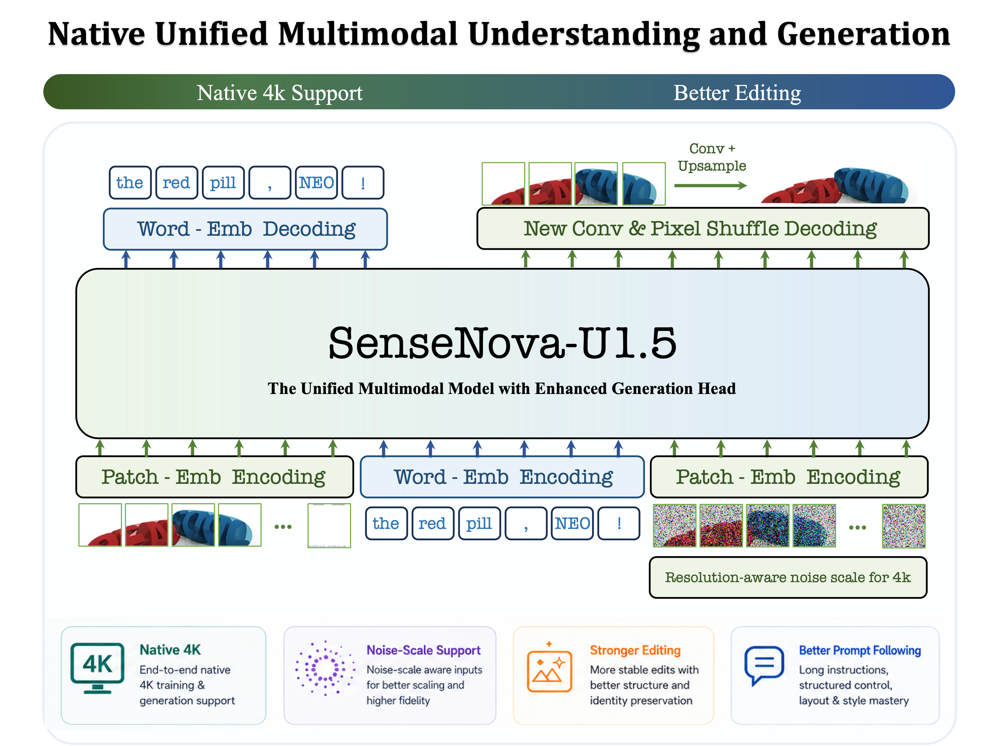
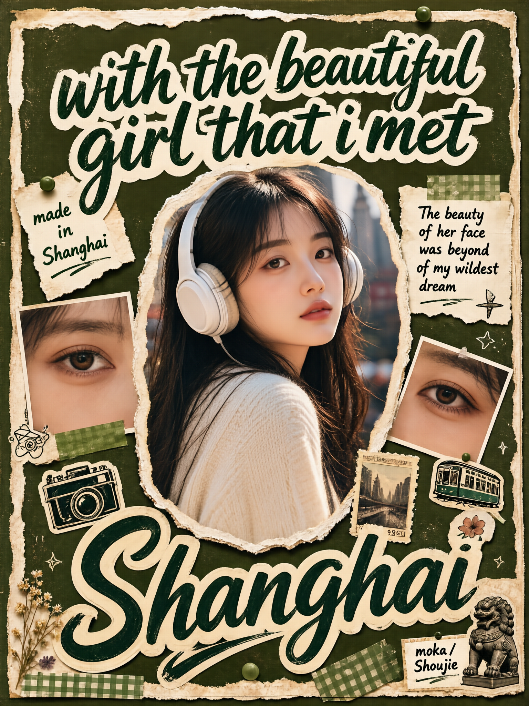

# SenseNova-U1.5-8B-MoT-Preview

<p align="center">
  <a href="./u1.5_preview.md">English</a> | <strong>简体中文</strong>
</p>

<p align="center">
  <a href="https://arxiv.org/abs/2605.12500"></a>
  <a href="https://github.com/OpenSenseNova/SenseNova-U1"></a>
  <a href="https://huggingface.co/collections/sensenova/sensenova-u1"></a>
  <a href="https://huggingface.co/blog/sensenova/neo-unify"></a>
  <a href="https://unify.light-ai.top/"></a>
</p>

> **Preview 版本。** SenseNova U1.5是一个展示图像生成与图像编辑进展的早期技术预览。当前模型仍有明确的能力边界。

## 📣 Updated News

- `[2026.07.29]` 发布 **SenseNova-U1.5-8B-MoT-Preview**。本次预览重点升级原生 4K 图像生成、局部纹理与真实质感和复杂版式生成，以及图像编辑中的主体与非编辑区域保持能力。同时开源对应的 U1.5 生成预训练[启动脚本](../training/shell/train_u1/U1.5_8B.sh)与[配置文件](../training/configs/sensenovavl_qwen3_gen/sensenovau1_5_8b_mot_pt.py)。

<details>
<summary>点击展开 SenseNova U1 历史更新</summary>

- `[2026.07.16]` 发布 [SenseNova-U1-8B-MoT-Infographic-V3 📊](https://huggingface.co/sensenova/SenseNova-U1-8B-MoT-Infographic-V3)。新版本同时支持信息图的生成和编辑，在保留信息图生成能力的基础上，重点增强局部文字、局部内容、全局风格和全局布局等信息图编辑能力，可支持在密集文本中精确修复文字。更多模型细节及基准测试结果请参阅 [✨ U1 Infographic Model Series](https://github.com/OpenSenseNova/SenseNova-U1/blob/main/docs/u1_infographic_model_CN.md)。

- `[2026.06.29]` 发布 [SenseNova-U1-8B-MoT-Infographic-V2 📊](https://huggingface.co/sensenova/SenseNova-U1-8B-MoT-Infographic-V2)。新版信息图模型提升了密集小字渲染能力，文字边缘更加锐利清晰；增强了复杂密集图的排版能力，并提升整体画面的美观度和协调性，同时修复背景变黑问题。模型细节及可视化效果请参阅 [✨ U1 Infographic Model Series](https://github.com/OpenSenseNova/SenseNova-U1/blob/main/docs/u1_infographic_model_CN.md)。

- `[2026.06.12]` 发布 [SenseNova-U1-8B-MoT-Infographic-LoRA-8step-V1.0](https://huggingface.co/sensenova/SenseNova-U1-8B-MoT-LoRAs/blob/main/SenseNova-U1-8B-MoT-Infographic-LoRA-8step-V1.0.safetensors)，用于快速生成信息图。请参阅[推理示例](https://github.com/OpenSenseNova/SenseNova-U1/blob/main/docs/base_vs_distill.md#run-base-and-distilled-model)。

- `[2026.06.11]` 发布 [SenseNova-U1-8B-MoT-Interleaved 📖](https://huggingface.co/sensenova/SenseNova-U1-8B-MoT-Interleaved)，专门针对图文交错生成进行优化，在绘本、故事书、多页 PPT、图文教程等多页内容上的叙事连贯性、角色与风格一致性以及图文对齐等方面得到显著提升。

- `[2026.05.21]` 发布 SenseNova U1 的全参数微调[训练代码](https://github.com/OpenSenseNova/SenseNova-U1/blob/main/training/README.md)。

- `[2026.05.15]` 发布 [SenseNova-U1-8B-MoT-Infographic 📊](https://huggingface.co/sensenova/SenseNova-U1-8B-MoT-Infographic)，提升信息图生成能力。模型细节请参阅 [U1 Infographic Model Series](https://github.com/OpenSenseNova/SenseNova-U1/blob/main/docs/u1_infographic_model_CN.md)，100 个生成案例请参阅 [✨ Infographic Showcases](https://github.com/OpenSenseNova/SenseNova-U1/blob/main/docs/u1_infographic_showcases.md)。

- `[2026.05.10]` 发布 [🔥 SenseNova U1 技术报告 🔥](https://github.com/OpenSenseNova/SenseNova-U1/blob/main/docs/pdf/SenseNOVA_U1.pdf)，并开源 [SenseNova-U1-A3B-MoT-SFT](https://huggingface.co/sensenova/SenseNova-U1-A3B-MoT-SFT) 与 [SenseNova-U1-A3B-MoT](https://huggingface.co/sensenova/SenseNova-U1-A3B-MoT) 模型权重。

- `[2026.05.08]` 新增 **GGUF 量化权重支持**与**分层加载 VRAM 模式**，便于在单卡低显存环境下推理，详见[低显存推理说明](https://github.com/OpenSenseNova/SenseNova-U1/blob/main/README_CN.md#-低显存推理gguf--vram-模式)。`SenseNova-U1-8B-MoT-Merger` 的 GGUF 权重已上传至 [🤗 smthem/SenseNova-U1-8B-MoT-Merger-gguf](https://huggingface.co/smthem/SenseNova-U1-8B-MoT-Merger-gguf)，感谢 [@smthem](https://github.com/smthem) 为社区贡献量化权重。

- `[2026.05.06]` 发布 [SenseNova-U1-8B-MoT-LoRA-8step-V1.0](https://huggingface.co/sensenova/SenseNova-U1-8B-MoT-LoRAs/blob/main/SenseNova-U1-8B-MoT-LoRA-8step-V1.0.safetensors)。请参阅[推理示例](https://github.com/OpenSenseNova/SenseNova-U1/blob/main/docs/base_vs_distill.md#run-base-and-distilled-model)。

- `[2026.04.30]` 发布 8 步推理模型预览版 [SenseNova-U1-8B-MoT-8step-preview](https://huggingface.co/sensenova/SenseNova-U1-8B-MoT-8step-preview)。在大多数情况下，该模型的图像生成质量与基础模型接近，详见[效果对比和已知问题](https://github.com/OpenSenseNova/SenseNova-U1/blob/main/docs/base_vs_distill.md)。运行时请参考[推理脚本](https://github.com/OpenSenseNova/SenseNova-U1/blob/main/examples/README.md)，并使用 `--cfg_scale 1.0 --num_steps 8`。

- `[2026.04.27]` 首发 [SenseNova-U1-8B-MoT-SFT](https://huggingface.co/sensenova/SenseNova-U1-8B-MoT-SFT) 与 [SenseNova-U1-8B-MoT](https://huggingface.co/sensenova/SenseNova-U1-8B-MoT) 模型权重。

- `[2026.04.27]` 首发 SenseNova U1 [推理代码](https://github.com/OpenSenseNova/SenseNova-U1/blob/main/examples/README_CN.md)。

</details>

<p align="center">
  
</p>

## 🌟 概述

**SenseNova U1.5 Preview** 是基于
[NEO-unify](https://huggingface.co/blog/sensenova/neo-unify) 架构构建的原生统一
多模态模型。U1 验证了在单一模型中联合建模语言、视觉语义与像素生成的可行性；U1.5 则更关注一个具体问题：**统一架构已经能够生成图像之后，怎样让像素重建更连续、分辨率继续扩展，并让图像编辑更可控。**

因此，U1.5 并不是一次简单的参数量或数据规模升级。本次 Preview 从 U1 的实际输出中识别问题，再针对生成与编辑链路进行系统性迭代：

- 重新设计 Pixel Shuffle 生成头，在逐级恢复空间分辨率的过程中显式增加相邻
  patch 之间的特征交互；
- 将训练分辨率进一步扩展到原生 4K，提升高分辨率下的局部细节与真实质感；
- 重新组织编辑数据和训练任务，强化主体身份、空间结构与非编辑区域的保持；
- 在没有针对固定格式化 Prompt 进行专项训练的情况下，观察到模型能够泛化执行长篇、层次化和结构化的视觉指令。

## 🔬 从现象到架构：为什么重做生成头

### 我们在 U1 中观察到了什么

U1已经能够在视觉 token 之间建模全局关系，但旧生成头在最后一步采用逐 token 的 MLP 投影：每个 token 独立预测其对应的 RGB 像素块。以当前`patch_size=16`、`downsample_ratio=0.5` 的配置为例，每个输出 token 对应约
`32×32` 像素。虽然全局语义已经在主干中发生交互，但在最后的像素重建阶段，相邻 patch 之间没有显式的局部空间混合。我们观察到，这种 token 网格可能直接投影到最终图像，表现为细微的网格感、区域拼接痕迹或跨 patch 的纹理断裂；当分辨率继续提高时，
这些现象会更容易被放大。

### U1.5 的 Insight：在像素重建阶段重新引入空间交互

U1.5 启用了新的 Pixel Shuffle 生成头。它先把一维视觉 token 恢复为二维特征网格，再通过多级 Pixel Shuffle 逐步提升空间分辨率，并在中间分辨率上使用`3×3` 卷积：


对应模块可参考公开实现中的
[`ConvDecoder`](https://github.com/OpenSenseNova/SenseNova-U1/blob/main/src/sensenova_u1/models/neo_unify/modeling_fm_modules.py)。Pixel Shuffle 将通道中的局部特征重新排列到更细的空间网格；随后的卷积可以跨越原 token 边界交换信息。换句话说，新生成头不再把每个 patch 当成彼此独立的“像素小岛”，而是在恢复像素的过程中逐级融合相邻 patch。

### 不只更换生成头

生成头解决的是最终像素重建的局部连续性问题。为了让这种改动在更高分辨率和编辑任务中发挥作用，U1.5 还同步调整了另外两条训练链路：

- **原生 4K 训练**：模型直接在最高 4K 的受支持分辨率 bucket 上学习构图与细节，而不是仅对低分辨率结果做外部放大。
- **编辑数据与任务重组**：训练目标不仅要求模型完成“需要修改的内容”，也更强调原图内容、主体身份、空间结构和非编辑区域不应发生变化。

## ✨ 能力观察

### 生成与编辑

基于上述改动，我们在 U1.5 Preview 中主要观察到：

- 原生支持最高 4K 的图像生成；
- 更精细的局部纹理、材质、光影和真实世界质感；
- 更准确的中英文文字生成与更复杂的版式组织；
- 更稳定的图像编辑、主体身份保持和视觉指令遵循；
- 支持区域、框或标记引导的精确编辑。

### 榜单体现

#### 图像生成基准（T2I）

<table>
  <thead>
    <tr>
      <th rowspan="2" align="center">模型</th>
      <th colspan="3"><div align="center">Qwen-Image-Bench</div></th>
    </tr>
    <tr>
      <th><div align="center">EN&nbsp;↑</div></th>
      <th><div align="center">ZH&nbsp;↑</div></th>
      <th><div align="center">Average&nbsp;↑</div></th>
    </tr>
  </thead>
  <tbody>
    <tr><td>GLM Image</td><td align="center">47.86</td><td align="center">48.19</td><td align="center">48.03</td></tr>
    <tr><td>Qwen Image</td><td align="center">48.48</td><td align="center">49.23</td><td align="center">48.86</td></tr>
    <tr><td>HunyuanImage 3.0</td><td align="center">51.35</td><td align="center">50.81</td><td align="center">51.08</td></tr>
    <tr><td>Qwen Image 2512</td><td align="center">51.32</td><td align="center">52.06</td><td align="center">51.69</td></tr>
    <tr><td>GPT Image 1</td><td align="center">54.24</td><td align="center">54.07</td><td align="center">54.16</td></tr>
    <tr><td>Qwen Image 2*</td><td align="center">55.69</td><td align="center">55.63</td><td align="center">55.66</td></tr>
    <tr><td>GPT Image 2</td><td align="center">65.23</td><td align="center">64.69</td><td align="center">64.96</td></tr>
    <tr><td><b>U1</b></td><td align="center"><b>48.28</b></td><td align="center"><b>45.99</b></td><td align="center"><b>47.14</b></td></tr>
    <tr><td><b>U1.5-Preview</b></td><td align="center"><b>49.93</b></td><td align="center"><b>50.25</b></td><td align="center"><b>50.09</b></td></tr>
    <tr><td><b>U1.5-Preview&dagger;</b></td><td align="center"><b>55.17</b></td><td align="center"><b>55.22</b></td><td align="center"><b>55.20</b></td></tr>
  </tbody>
</table>
<sub>注：Qwen Image 2* 表示由我们自己实现的评测结果；U1.5-Preview&dagger; 表示使用 Prompt Enhance 后的评测结果</sub>

#### 图像编辑基准（IT2I）

<table>
  <thead>
    <tr>
      <th rowspan="2" align="center">模型</th>
      <th><div align="center">ImgEdit-Bench</div></th>
      <th><div align="center">GEdit-Bench</div></th>
      <th colspan="2"><div align="center">WeEdit</div></th>
    </tr>
    <tr>
      <th><div align="center">Overall&nbsp;↑</div></th>
      <th><div align="center">EN G_O / CN G_O&nbsp;↑</div></th>
      <th><div align="center">IA / TC / BP&nbsp;↑</div></th>
      <th><div align="center">Average&nbsp;↑</div></th>
    </tr>
  </thead>
  <tbody>
    <tr>
      <td>Qwen-Image-Edit-2511</td><td align="center">4.51</td><td align="center">7.877 / 7.819</td><td align="center">3.180 / 3.930 / 4.630</td><td align="center">3.913</td>
    </tr>
    <tr>
      <td>Qwen-Image-2</td><td align="center">4.28</td><td align="center">8.369 / 8.348</td><td align="center">5.044 / 6.079 / 5.680</td><td align="center">5.601</td>
    </tr>
    <tr>
      <td>FireRed-Image-Edit</td><td align="center">4.56</td><td align="center">7.943 / 7.887</td><td align="center">4.150 / 6.330 / 7.140</td><td align="center">5.873</td>
    </tr>
    <tr>
      <td>LongCat-Image-Edit</td><td align="center">4.45</td><td align="center">7.748 / 7.731</td><td align="center">3.390 / 5.590 / 6.710</td><td align="center">5.230</td>
    </tr>
    <tr>
      <td>HY-image-3-instruct</td><td align="center">—</td><td align="center">—</td><td align="center">4.160 / 5.990 / 7.030</td><td align="center">5.727</td>
    </tr>
    <tr>
      <td>Nano-Banana</td><td align="center">4.29</td><td align="center">7.291 / 7.399</td><td align="center">3.920 / 7.140 / 7.800</td><td align="center">6.287</td>
    </tr>
    <tr>
      <td>Nano-Banana-Pro</td><td align="center">4.37</td><td align="center">7.738 / 7.799</td><td align="center">8.580 / 9.100 / 8.850</td><td align="center">8.843</td>
    </tr>
    <tr>
      <td>GPT-Image-1.5</td><td align="center">—</td><td align="center">—</td><td align="center">6.520 / 7.780 / 6.150</td><td align="center">6.817</td>
    </tr>
    <tr>
      <td>U1</td><td align="center"><b>3.90</b></td><td align="center"><b>7.470 / 7.420</b></td><td align="center"><b>5.729 / 6.604 / 7.157</b></td><td align="center"><b>6.497</b></td>
    </tr>
    <tr>
      <td><b>U1.5-Preview</b></td><td align="center"><b>4.37</b></td><td align="center"><b>8.172 / 8.051</b></td><td align="center"><b>6.532 / 7.271 / 6.752</b></td><td align="center"><b>6.852</b></td>
    </tr>
  </tbody>
</table>


### 训练目标之外的泛化: 长 Prompt 与结构化 Prompt

对于简单任务，用户仍然可以直接描述主体、场景和基本风格；U1.5 不要求所有输入都写成长 Prompt，也不依赖某种固定 JSON 格式。

但在海报、信息图、品牌视觉等复杂任务中，一张图往往同时包含主体关系、空间布局、视觉风格、精确文字和保持约束。我们观察到，U1.5 能够直接读取长篇自然语言、分层列表或结构化 Prompt，并把其中的语言结构映射为视觉结构。

需要特别说明的是：**本次训练没有把某一种格式化 Prompt 或 Prompt Enhance模板作为专项能力进行训练。** 模型对长篇、多约束和层次化指令的执行能力，更像是原生统一多模态训练所产生的泛化，而不是对特定模板的记忆。结构化 Prompt 的价值在于帮助人更完整地表达复杂设计意图，而不是模型生成高质量图像的必要前提。

## 🎨 效果展示

### Text-to-Image Showcase

下面展示不同类型的文生图案例。点击左栏中的案例标题可展开完整的原始 Prompt。

<table>
  <thead>
    <tr>
      <th width="40%">Prompt</th>
      <th width="60%">SenseNova U1.5 Preview</th>
    </tr>
  </thead>
  <tbody>
    <tr>
      <td valign="top">
        <details>
          <summary><b>复古汽水广告</b></summary>
          <pre><code>生成一张竖版复古可乐商业广告海报，品牌为“RETRO-COLA”，画面比例约为 2:3。整体采用 1960—1970 年代美式汽水广告、复古泳池派对摄影、旧杂志印刷和现代商业时尚广告融合的风格。画面必须真实、热烈、复古、富有生活方式气息，不能呈现为插画、卡通、漫画或明显的三维渲染。

场景设定在夏夜的户外露台或泳池派对。背景为深靛蓝色夜空，远处有少量暖黄色虚化灯光和轻微模糊的城市或派对环境。画面顶部撑开一把大型复古遮阳伞，伞面是奶油黄与焦糖橙相间的宽条纹，带真实布料褶皱、纤维质感和边缘流苏。遮阳伞占据画面顶部区域，但不能压住主要文字。

画面右侧中央是一位年轻女性，她是整张海报的人物主角。她有浓密蓬松的深棕色短卷发，佩戴金色圆环耳环、细项链和手镯，皮肤具有真实细腻的暖棕色质感。她表情自然、开怀大笑，充满夏夜派对的放松与感染力，像真实抓拍而不是僵硬摆拍。

她穿一件黄色与奶油白色格纹的复古修身连体泳装或复古吊带连衣装，胸口为复古收褶结构，肩带清楚，服装贴合身体但自然不过度夸张。人物采用稳定清晰的三分之四正面坐姿，稳定地坐在一个装满透明冰块的大型黄色金属冰桶里。上半身完整可见，头部、颈部、双肩、双臂和躯干结构清楚。她的背部自然挺直，肩膀放松，左右肩高度合理，胸腔和腰部略微朝向镜头，人体比例真实。

肢体结构必须清楚、简洁、稳定。画面中只保留主角自己的一双手，不要出现第三只手、额外手臂或从镜头外伸入的其他人的手。她的右手握住一瓶玻璃瓶装可乐，将瓶子自然举在胸口附近。右上臂贴近身体，手肘自然弯曲，前臂方向清楚。右手必须完整呈现五根手指，拇指在瓶身一侧，其余四指自然环绕瓶身，手指长度、关节和弯曲方向真实，不能粘连、穿模、扭曲，也不能遮挡主要标签文字。左手自然搭在黄色冰桶边缘，手掌放松，五根手指轻轻弯曲并清楚分开，手与桶沿有真实接触关系和轻微阴影，不隐藏在身体后方，也不与冰块、衣服或腿部融合。双臂不能交叉，双手不能遮挡脸部，也不能互相重叠。

腿部也要保持简洁稳定。人物只露出一条自然弯曲抬起的腿，只显示一个清楚的膝盖和部分大腿，膝盖位于画面中央偏右，形状自然，和躯干连接合理。另一条腿完全隐藏在冰桶和冰块内部，不要额外显示第二个膝盖、脚、小腿或重复腿部。冰桶边缘明确遮挡腰部以下位置，遮挡关系自然。不要采用双腿交叉、复杂盘腿、扭曲髋部或不可能的坐姿。

她右手拿着的可乐瓶必须保持真实产品结构：透明深棕色玻璃瓶、细长瓶颈、金属瓶盖、合理玻璃厚度和真实折射。瓶内装深褐色碳酸饮料，液面自然，内部有少量细密气泡，瓶外覆盖冷凝水珠。瓶身红棕色纸质标签上清晰显示品牌文字：
“RETRO-COLA”
使用奶油白色复古粗衬线字体。标签紧贴瓶身曲面，不悬浮、不变形、不重复、不出现乱码。

画面底部中央是一只大型复古黄色金属冰桶，桶壁带真实冷凝水珠、少量磨损和金属反光。桶中堆满不规则透明冰块，冰块有自然裂纹、融水和高光。桶身正面印刷大型红棕色品牌文字：
“DRINK”
“RETRO-COLA”
其中“RETRO-COLA”使用复古弧形衬线字体，带少量星芒装饰，文字要清晰贴合桶体透视。

画面前景左右下角各放置一瓶靠近镜头的 RETRO-COLA 玻璃瓶。两瓶作为前景景深元素，被边缘轻微裁切，并略有前景虚化，但仍然能够辨认出深色玻璃、红棕标签和奶油白品牌文字。除了这两瓶前景产品，不要再加入额外人物手臂，不要有左下角伸手的动作元素。

画面左侧约占四成宽度，放置五行超大黄色英文标题：
“VINTAGE”
“CARBONATED”
“DREAMS!”
“UNCAP”
“THE PAST.”
文字从上到下排列，使用高窄、极粗、略带手工印刷感的无衬线字体，颜色为芥末黄色。五行左对齐、行距紧凑、占据强烈视觉冲击力。标题位于人物左侧的深蓝夜空区域，不覆盖人物面部，不与可乐瓶标签重叠，每一行都必须清晰可读。

顶部中央放置较小黑色标题：
“THE RETRO FIZZ®”
左上角放置三行黄色小字：
“FUTURE”
“RETRO”
“FLAVOR”
右上角放置两行黄色小字：
“RETRO-COLA”
“LIFE 2026”
所有顶部小字均使用窄体粗无衬线字体，紧凑清晰，保持克制，不抢主体。

光线采用夜间派对中的暖色直接闪光灯或暖色商业布光与环境夜色结合。人物、玻璃瓶、冰块和黄色冰桶被温暖而清楚地照亮，皮肤、头发、玻璃瓶和冰块高光真实。背景保持深靛蓝色夜景和少量暖色散景。画面可以带适量复古胶片颗粒、轻微油墨噪点和旧杂志印刷感，但不能牺牲人物面部、手部、产品包装和文字清晰度。

整体配色以深靛蓝、芥末黄、焦糖橙、暖棕色、奶油白和可乐红棕色为主。整体气质像真实拍摄的复古汽水品牌广告，可用于饮料新品发布、夏季派对活动、电商主视觉和社交媒体营销。

特别强调：
主角只有一双手；右手握瓶，左手搭在冰桶边缘；只露出一个膝盖；另一条腿完全藏在冰桶中；不出现额外手臂、额外手指、重复膝盖、扭曲坐姿或肢体融合。</code></pre>
        </details>
      </td>
      <td valign="top" align="center">
        
      </td>
    </tr>
    <tr>
      <td valign="top">
        <details>
          <summary><b>海龟科普信息图</b></summary>
          <pre><code>{
  "type": "circular life-cycle educational infographic poster",
  "theme": "MARINE TURTLES of the MALDIVES - Life Cycle and Threats",
  "language": "English",
  "priority_emphasis": [
    "TOP PRIORITY: all text crisp, correctly spelled, plain letters and numbers only - no strange symbols or garbled characters",
    "core structure: a circular five-stage life cycle arranged clockwise around a central dark-teal oval label, with curved arrows connecting the stages",
    "style: soft watercolor natural-history illustration inside each stage circle, combined with clean flat icons and elegant serif typography",
    "calm coastal palette: soft ocean teals and blues on a very light blue-white background, one warm sand-beige accent band"
  ],
  "canvas": {
    "aspect_ratio": "2:3",
    "orientation": "vertical poster",
    "resolution_hint": "high resolution, refined print-quality detail",
    "background": "very light blue-white with a subtle watercolor wash texture"
  },
  "style": {
    "overall": "elegant marine conservation poster - watercolor illustration meets clean infographic design",
    "visual_tone": "calm, natural, scientific, gentle",
    "art_direction": "each life stage is a circular watercolor vignette with soft edges; around each vignette a pale-teal arc segmented into small flat threat icons; bold curved teal arrows link the stages clockwise; dotted lines connect stages to the center",
    "color_palette": [
      "deep ocean teal (headings, arrows, icons)",
      "soft aqua and powder blue (arcs and fills)",
      "muted seafoam green",
      "warm sand beige (bottom accent band)",
      "very light blue-white background"
    ],
    "saturation": "low to medium, watercolor softness, no bright colors",
    "typeface": "classic serif in dark teal - large elegant serif for the title with an italic word, medium serif for stage names and section headers, clean sans-serif regular for body bullets",
    "references": ["natural history watercolor plates", "marine conservation posters", "editorial life-cycle diagrams"]
  },
  "layout": {
    "header": {
      "title": "MARINE TURTLES of the MALDIVES - large dark-teal serif, the words of the in elegant italic",
      "subtitle": "Life Cycle and Threats - medium serif flanked by small decorative dashes"
    },
    "central_hub": "a solid dark-teal oval in the middle of the cycle with white italic serif text: Life Cycle and Threats",
    "life_cycle_ring": {
      "arrangement": "five stages arranged clockwise: stage 1 top center, stage 2 right, stage 3 lower right, stage 4 lower left, stage 5 left; bold curved teal arrows between consecutive stages; thin dotted lines from each stage toward the central oval",
      "stage_design": "each stage has a numbered dark-teal circle badge on top, a round watercolor illustration, a serif stage name below, and a pale-teal arc of 4-5 small flat threat icons hugging the outer side of the circle (crab, bird, fish, thermometer, net, plastic bottle, no-poaching sign, excavator, boat as appropriate)",
      "stages": [
        {"number": "1", "name": "Eggs and Nest", "illustration": "watercolor female turtle on warm sand laying a clutch of white eggs among beach grass", "side_text": "left column bullets: Females return to natal Maldivian beaches to nest. Clutch approx 80-120 eggs; incubation approx 45-70 days in the warm sand.", "right_text": "right column bullets: Bycatch in fishing gear and ghost-net entanglement. Plastic ingestion, poaching, coastal development and boat strikes."},
        {"number": "2", "name": "Hatchlings", "illustration": "watercolor night beach scene with a tiny hatchling scrambling toward moonlit waves", "side_text": "bullets: Hatchlings emerge at night and scramble to the sea toward the brightest horizon. Survival to adulthood is estimated at only approx 1 in 1,000."},
        {"number": "3", "name": "The Lost Years", "illustration": "watercolor juvenile turtle drifting among Sargassum seaweed and small fish in open blue water", "side_text": "bullets: Juveniles drift on open-ocean currents and Sargassum for years. This long pelagic phase is known as the lost years."},
        {"number": "4", "name": "Sub-adult on Reefs", "illustration": "watercolor young turtle swimming over coral reef and seagrass", "side_text": "bullets: Young turtles recruit to Maldivian coral reefs and seagrass beds. They feed and grow toward maturity in coastal foraging grounds."},
        {"number": "5", "name": "Adult and Migration", "illustration": "watercolor mature turtle swimming through open water with light rays", "side_text": "bullets: Mature adults migrate between foraging and breeding grounds. Sexual maturity is reached late - often 20-30 years."}
      ]
    },
    "species_status_row": {
      "left": "a watercolor hawksbill turtle illustration beside header Maldivian Species with bullets: Five of the seven sea-turtle species occur in Maldivian waters. Green and Hawksbill turtles are the most commonly seen.",
      "right": "a dark-teal shield icon with a white turtle silhouette beside header Conservation Status with bullets: Hawksbill Critically Endangered. Green Endangered (IUCN Red List). A second watercolor green turtle illustration at the far right."
    },
    "threat_bands": {
      "natural": "a full-width pale-teal rounded band titled NATURAL THREATS with four icon-text pairs separated by dotted dividers: crab icon - Predation of eggs and hatchlings by crabs, birds and fish; virus icon - Disease; coral icon - Coral and seagrass loss; storm cloud icon - Storms erode nesting beaches.",
      "human": "below it a full-width warm sand-beige rounded band titled HUMAN THREATS with five icon-text pairs: fishing net - Bycatch in fishing gear and ghost-net entanglement; plastic bottles - Plastic ingestion; turtle with hand - Poaching; excavator - Coastal development; boat - Boat strikes."
    }
  },
  "composition_rules": [
    "the five-stage ring is the dominant structure, evenly spaced around the central oval",
    "watercolor vignettes share a consistent illustration style and scale",
    "threat-icon arcs hug each stage circle on its outer side without touching neighboring elements",
    "side text columns sit outside the ring, aligned left or right, never overlapping the cycle",
    "curved arrows are bold and smooth, clearly showing clockwise flow",
    "the two threat bands stretch the full width at the bottom with even icon spacing",
    "generous breathing room, nothing touches the poster edges"
  ],
  "quality_tags": [
    "watercolor natural-history illustration",
    "circular life-cycle diagram",
    "marine conservation poster",
    "soft coastal palette",
    "elegant serif typography",
    "clean flat icon system",
    "crisp accurate text",
    "high detail"
  ],
  "negative_prompt": [
    "garbled text",
    "misspelled words",
    "strange symbols",
    "blurry small labels",
    "bright neon colors",
    "oversaturated palette",
    "photorealistic turtles",
    "3D render look",
    "cartoon childish style",
    "cluttered overlapping elements",
    "broken cycle arrows",
    "wrong number of stages",
    "watermark",
    "low resolution"
  ]
}</code></pre>
        </details>
      </td>
      <td valign="top" align="center">
        
      </td>
    </tr>
    <tr>
      <td valign="top">
        <details>
          <summary><b>武康路旅行手账</b></summary>
          <pre><code>{
  "类型": "小红书手账风水彩 CityWalk 攻略图",
  "主题": "武康路 —— 上海最出片的一条马路 CITYWALK 漫游",
  "语言": "简体中文（含少量英文点缀）",
  "优先强调": [
    "【最高优先级】所有中文清晰、正确、无错字，只用普通标点、无奇怪字符；手写体标题要有笔触感但可读",
    "核心风格：水彩手绘插画 + 拼贴手账风 —— 做旧牛皮纸底、贴纸、便签、票根、胶带、手写批注、爱心涂鸦，满满小红书种草感",
    "画面丰富热闹但不杂乱，暖色调温柔治愈，像一页精心做的旅行手账"
  ],
  "画布": {
    "比例": "1:1",
    "方向": "方形",
    "画质": "高分辨率，水彩质感细腻，拼贴层次丰富",
    "背景": "做旧暖米色牛皮纸/手账纸底，带轻微纸纹与做旧痕迹"
  },
  "风格": {
    "整体": "水彩手绘 + 拼贴手账 + 小红书攻略排版",
    "视觉基调": "文艺、治愈、温柔、种草、热闹而精致",
    "美术方向": "建筑与街景用柔和水彩手绘（淡彩晕染、细线勾勒），元素以贴纸/便签/票根/胶带拼贴叠放；手写批注、虚线路线、爱心与箭头涂鸦点缀；留白处贴纸标签分区",
    "色板": ["做旧米黄纸底", "水彩砖红（武康大楼）", "柔和绿（梧桐树）", "暖棕、奶咖", "点缀粉、黄、蓝（贴纸标签）"],
    "饱和度": "中低饱和、柔和暖调，水彩通透",
    "字体": "主标题大号黑色毛笔手写体（带彩色描边光晕），小标题手写体，说明清晰小字",
    "参考": ["小红书旅行手账", "水彩城市插画", "拼贴风攻略图"]
  },
  "版式": {
    "主标题": "武康路 —— 超大黑色毛笔手写体，左上角，带粉黄蓝多色手绘描边光晕，贴纸感",
    "副标题": "上海最出片的一条马路 | CITYWALK漫游 —— 手写小字，标题下方",
    "主视觉": "画面右侧中部一栋水彩手绘的武康大楼（诺曼底公寓，砖红色船型转角历史建筑），楼前一位戴草帽、穿米色长裙、手拿咖啡、背小包的女生背影正走过斑马线；旁边水彩梧桐树成荫",
    "拼贴元素": [
      "左上角便签清单：网红面包店 / 转角遇到爱 / 老上海风情（打勾）",
      "右上角贴一枚做旧邮票（梧桐叶图案）与胶带",
      "左侧一张咖啡票根 CAFE de WUKANG 咖啡时光 COFFEE TICKET，配拉花咖啡水彩小图",
      "左中水彩小图：街角咖啡馆（转角遇见浪漫）、老洋房阳台（藏着老上海的故事）",
      "右侧标注：武康大楼（诺曼底公寓）上海地标必打卡机位；法国梧桐 夏日浓荫大道 氛围感拉满",
      "右侧一块蓝色路牌 武康路 Wukang Rd. 393/381",
      "手绘爱心、箭头、相机小图标点缀"
    ],
    "路线地图": "左下角一张水彩手绘 CITYWALK 路线图，标题 武康路CITYWALK路线图；粉色虚线串联编号站点：START 武康大楼(诺曼底公寓) → 2 老洋房群(历史建筑巡礼) → 网红面包店(人气烘焙) → 3 街角咖啡馆(拍照打卡) → 5 复古路牌(打卡留念) → GO! citywalk；沿途水彩小建筑与路树",
    "底部标签": "三枚彩色贴纸话题标签：#武康路 #上海citywalk #出片圣地",
    "TIPS框": "右下角便签 漫步TiPS：穿着舒适的鞋子 / 带上相机-手机 / 慢下来感受生活（打勾）"
  },
  "构图规则": [
    "武康大楼为右侧视觉主体，女生背影引导视线，路线地图锚定左下",
    "各拼贴元素错落叠放、留白呼吸，热闹但不糊成一团",
    "手写标题最醒目，各小标签分区清晰",
    "水彩暖色调统一，全图像一页完整手账"
  ],
  "质量标签": ["水彩手绘手账风", "拼贴种草攻略", "毛笔手写标题", "路线地图", "暖调治愈", "文字清晰", "小红书风", "高清细节"],
  "负向提示": ["乱码汉字", "错字", "奇怪字符", "文字糊成一团", "元素杂乱重叠糊作一团", "浓艳刺眼颜色", "3D渲染感", "照片写实", "冷硬扁平矢量", "空洞留白过多", "水印", "低分辨率"]
}</code></pre>
        </details>
      </td>
      <td valign="top" align="center">
        
      </td>
    </tr>
    <tr>
      <td valign="top">
        <details>
          <summary><b>银盐摄影技术图解</b></summary>
          <pre><code>{
  "类型": "精密线描工程科普信息图",
  "主题": "银盐摄影 —— 一束光如何通过化学反应变成一张永久保存的照片",
  "语言": "简体中文（含少量英文年份与术语）",
  "优先强调": [
    "【最高优先级·必须遵守】画面底部及任何位置都绝不出现一排标签/图例胶囊按钮；绝不把风格词、质量词（如 现代工程线描 / 等距爆炸拆解 / 明亮暖米底 / 文字工整 / 高清细节 等）当作内容画进图里。画面只包含标题、时间轴、相机拆解主图与各知识模块正文，此外无任何标签条",
    "【最高优先级】所有中文清晰、正确、无错字，只用普通标点、无奇怪字符",
    "【配色·低饱和】整体低饱和、克制——暖橙色只作极少量点睛（仅用于那一条入射光线），其余引线、箭头、标注一律用中性的黑/深灰，不要满图橙色；底色是干净的浅米白而非偏黄，整体清爽不暖过头",
    "【字重·偏细】文字用中等偏细字重——标题为清爽的中黑体（不要超粗），模块小标题为常规黑体，正文为细黑体/宋体；避免笨重的超粗字堆叠"
  ],
  "画布": {
    "比例": "16:9",
    "方向": "横版",
    "画质": "高分辨率，工程制图级精细度，文字清晰",
    "背景": "干净、明亮的浅米白纸底（偏白、不偏黄），轻微纸纹，清爽通透"
  },
  "风格": {
    "整体": "现代工程线描科普图鉴 meets 信息图排版，清爽克制",
    "视觉基调": "精密、专业、清爽、明亮、轻盈",
    "美术方向": "以细而均匀的黑/深灰钢笔线描为主，线条干净利落；仅一条入射光线用暖橙做点睛，其余全部中性色；剖面分层图、等距爆炸拆解图、细引线标注、编号圆点；模块间以细线或小标题分区",
    "色板": ["浅米白底（偏白不偏黄）", "黑/深灰线描（主）", "极少量暖橙（仅入射光线点睛）", "浅灰淡填充"],
    "饱和度": "低饱和，中性黑灰为主，暖橙极少量点睛，整体清爽不暖腻",
    "字体": "标题中黑体（清爽不超粗），模块小标题常规黑体，正文细黑体/宋体小字",
    "参考": ["现代科普线描信息图", "干净轻盈的工程爆炸拆解图", "清爽技术图解"]
  },
  "版式": {
    "主标题": "银盐摄影 —— 大号中黑体（清爽不超粗），左上角；下方小字副标题 一束光如何通过化学反应变成一张永久保存的照片",
    "顶部时间轴": "银盐摄影发展历程 —— 横向时间轴六节点，各配线描相机小图：达盖尔银版摄影 1839、卡罗式摄影 1841、胶卷时代 1888、黑白胶片普及、彩色胶片 1935、现代艺术银盐摄影",
    "中央主图": "一台胶片相机的等距爆炸拆解线描图（干净细线），部件沿光路展开并编号引线标注：① 相机主体、② 镜头组、③ 快门、④ 胶片仓、⑤ 银盐胶片、⑥ 卷片轴、⑦ 取景器；一条暖橙色光线从镜头射入、标注 光线入射（全图仅此处用橙）；下方圆形放大剖面 银盐乳剂层 与 卤化银晶体结构（晶格球棍模型）",
    "左侧模块": [
      "银盐为什么能记录影像：光子被卤化银晶体吸收使电子跃迁至导带；电子被感光点捕获与银离子结合生成金属银微粒即潜影；约4个以上银原子聚集时晶体才可显影",
      "银盐乳剂结构：剖面分层 保护层 / 银盐乳剂层 / 片基",
      "为什么底片是反的：受光多的区域变黑；受光少的区域较透明；明暗关系反转；配负片小图",
      "银盐摄影流程：横向8步 ① 装入胶卷 → ② 曝光 → ③ 显影 → ④ 定影 → ⑤ 水洗 → ⑥ 干燥 → ⑦ 放大冲印 → ⑧ 获得照片，每步配线描小图标"
    ],
    "右侧模块": [
      "显影发生了什么：显影液作用于潜影；晶体被还原为金属银；影像逐渐显现；配三格晶体变化图",
      "为什么需要定影：清除未曝光的卤化银；仅保留金属颗粒；使底片不再感光；配三格图",
      "为什么胶片会有颗粒感：晶体越大颗粒越粗、越小越细腻；配灰阶颗粒渐变条",
      "银盐摄影与数码摄影：化学感光↔电子感光、胶片记录↔CMOS记录、暗房冲洗↔即时成像",
      "银盐摄影的魅力：四个圆形线描图标 真实颗粒 / 丰富影调 / 独特色彩 / 不可复制的仪式感"
    ]
  },
  "构图规则": [
    "中央相机爆炸图为视觉焦点、光路贯穿",
    "四周模块沿边缘规整排布、各带小标题与编号圆点",
    "引线细而清晰不交叉、编号与文字对应准确",
    "线描为主、暖橙仅入射光线点睛；其余中性黑灰",
    "留白充足、浅米白底统一、清爽不暖腻",
    "文字中等偏细、轻盈不笨重",
    "底部及任何位置都不出现多余的标签胶囊条"
  ],
  "质量标签_内部参考不要画进图": ["现代工程线描", "干净细线", "低饱和清爽", "中等偏细字重", "文字工整", "高清细节"],
  "负向提示": [
    "底部或任何位置的标签胶囊条",
    "把风格词质量词画成图标按钮或标签",
    "满图橙色",
    "过多暖橙点缀",
    "高饱和刺眼颜色",
    "底色偏黄发暖过头",
    "超粗笨重字体",
    "粗黑字堆叠",
    "做旧发黄发暗",
    "厚重铜版雕刻",
    "乱码文字",
    "错字",
    "奇怪字符",
    "文字糊成一团",
    "引线交叉缠绕",
    "3D渲染感",
    "照片写实",
    "水印",
    "低分辨率"
  ]
}</code></pre>
        </details>
      </td>
      <td valign="top" align="center">
        
      </td>
    </tr>
    <tr>
      <td valign="top">
        <details>
          <summary><b>高动态滑雪摄影</b></summary>
          <pre><code>画面是一张方形极限运动摄影，陡峭雪坡从左下斜切到右上，形成强烈的动态构图。一名单板滑雪者位于画面偏左中部，被背后的太阳照成黑色剪影，身后扬起大片明亮粉雪。背景是浓郁深蓝色晴空，雪粒在逆光中像细密星点一样闪烁。右下方出现鲜艳的彩虹折射光带，与冷色雪景形成醒目的色彩对比。整体具有高速、冷冽、自由而震撼的户外运动海报质感。</code></pre>
        </details>
      </td>
      <td valign="top" align="center">
        
      </td>
    </tr>
  </tbody>
</table>

### 图像编辑效果展示

点击 Prompt 可展开完整内容；点击图片可查看原始分辨率。

<table>
  <thead>
    <tr>
      <th width="34%">Prompt</th>
      <th width="33%">输入图片</th>
      <th width="33%">输出图片</th>
    </tr>
  </thead>
  <tbody>
    <tr>
      <td valign="top">
        <details>
          <summary><b>邮政邮件旅程信息图</b></summary>
          <p>Create an infographic titled "The Journey of Postal Mail" using the watercolor illustration style of the reference image. The background should resemble textured paper with soft watercolor clouds, stars, and leafy plants in the corners.</p>
          <p>Layout a winding beige path connecting four numbered milestones, starting with a wooden "START" arrow on the left and ending with a "DESTINATION" arrow on the bottom right.</p>
          <ol>
            <li><b>Milestone 1 (Collection):</b> Place a purple circle marker with "1" and a wooden sign saying "Drop-off". Illustrate a sender placing a letter into a blue street mailbox or a post office counter. Add a text box titled "1. Collection" with a purple banner reading "First Step of the Journey". List details: "Action: Mailing", "Location: Local Post Box", "Handler: Postal Carrier".</li>
            <li><b>Milestone 2 (Processing):</b> Place a blue circle marker with "2" and a sign saying "Sorting". Illustrate a mail sorting facility with conveyor belts and workers. Add a text box titled "2. Sorting Center" with a blue banner reading "Automated Distribution". List details: "Action: Sorting", "Location: Distribution Center", "Method: Zip Code".</li>
            <li><b>Milestone 3 (Transport):</b> Place a green circle marker with "3" and a sign saying "Transit". Illustrate a mail truck driving on a highway or a cargo plane in the sky. Add a text box titled "3. Transportation" with a green banner reading "Cross-Country Travel". List details: "Action: Transport", "Location: Highway/Air", "Method: Truck/Plane".</li>
            <li><b>Milestone 4 (Delivery):</b> Place a red circle marker with "4" and a sign saying "Delivery". Illustrate a mail carrier delivering a package to a house doorstep. Add a text box titled "4. Final Delivery" with a red banner reading "Arrival at Destination". List details: "Action: Delivery", "Location: Recipient Home", "Handler: Mail Carrier".</li>
          </ol>
          <p>Use a dark blue brush-script font for the main title "The Journey of Postal Mail" at the top center. Ensure text boxes have rounded corners, colored borders matching their respective milestone markers, and small icons next to the list items (e.g., a location pin, a clock, a person icon).</p>
        </details>
      </td>
      <td align="center" valign="middle">
        <a href="./assets/showcases/editing/case1_postal_mail.webp"></a>
      </td>
      <td align="center" valign="middle">
        <a href="./assets/showcases/editing_gallery/0001_2048x2048.webp"></a>
      </td>
    </tr>
    <tr>
      <td valign="top">
        <details>
          <summary><b>韩式双拼炸鸡食谱插画</b></summary>
          <p>将图像转换为手绘食谱插画风格，背景为米色网格笔记本纸张，左侧带有黑色螺旋装订线圈。</p>
          <p><b>顶部区域：</b></p>
          <ul>
            <li>大标题书写“韩式双拼炸鸡”，副标题为“外酥里嫩，快乐加倍的周末美食”。</li>
            <li>右上角放置图2中的炸鸡成品大图（金属网篮装着原味炸鸡和裹着红色酱汁撒芝麻的炸鸡，旁边有一杯加冰可乐和一碟腌萝卜）。</li>
            <li>左侧画一只可爱的粉色卡通小猪抱着红辣椒，旁边有一个米色信息框，写着：难度：★★★★☆，耗时：60分钟，口味：咸甜酥脆。</li>
          </ul>
          <p><b>主体步骤区域（2行3列布局）：</b></p>
          <ol>
            <li><b>步骤1 食材准备：</b>手绘鸡腿、面粉、鸡蛋、韩式辣酱等食材。文字说明：“鸡腿500g、面粉、淀粉、鸡蛋、牛奶、蒜末、韩式辣酱、蜂蜜”。</li>
            <li><b>步骤2 腌制入味：</b>手绘碗中放入鸡腿和调料。文字说明：“鸡腿划刀，加入牛奶、蒜末、盐、黑胡椒，腌制30分钟”。</li>
            <li><b>步骤3 裹粉挂糊：</b>手绘鸡腿裹粉过程。文字说明：“依次裹上淀粉、蛋液、混合粉（面粉:淀粉=1:1），捏出鳞片状”。</li>
            <li><b>步骤4 第一次油炸：</b>手绘油锅炸鸡腿。文字说明：“油温160度，下入鸡腿中小火炸6分钟至熟透，捞出”。</li>
            <li><b>步骤5 第二次复炸：</b>手绘油锅复炸。文字说明：“油温升至200度，复炸2分钟至金黄酥脆，捞出备用”。</li>
            <li><b>步骤6 裹酱装盘：</b>手绘金属篮，一半炸鸡裹上红色甜辣酱撒白芝麻，一半保持原味。文字说明：“一半保持原味，另一半裹上甜辣酱（辣酱+蜂蜜+蒜末），撒芝麻，搭配可乐”。</li>
          </ol>
          <p><b>底部区域：</b></p>
          <ul>
            <li>底部有一个“小贴士”框，文字为：“复炸是酥脆的关键！甜辣酱比例可根据口味调整。”</li>
            <li>右下角画一只竖大拇指的卡通小猪。</li>
          </ul>
          <p><b>整体要求：</b></p>
          <ul>
            <li>所有文字必须为清晰的中文，字体风格模仿手写体。</li>
            <li>保持图1的温馨手绘色调，线条柔和，色彩丰富。</li>
          </ul>
        </details>
      </td>
      <td align="center" valign="middle">
        <a href="./assets/showcases/editing/case2_recipe_style_reference.webp"></a>
        <a href="./assets/showcases/editing/case2_fried_chicken_reference.webp"></a>
      </td>
      <td align="center" valign="middle">
        <a href="./assets/showcases/editing_gallery/0002_1760x2336.webp"></a>
      </td>
    </tr>
    <tr>
      <td valign="top">
        <details>
          <summary><b>儿童夏季背心封面</b></summary>
          <p>Use the provided photo as the main subject reference: keep the young boy’s identity, cheerful smile, short black hair, raised flexing arm pose, and white cotton tank top. Create a Xiaohongshu cover design promoting kids’ cool summer cotton tank tops.</p>
          <p>Design a vertical social-media cover with a bright, lively cartoon illustration style. Transform the photo into a clean, cute illustrated look while preserving the boy’s recognizable pose and outfit. Use a fresh summer palette with sky blue, white, lemon yellow, and light mint green. Add cute summer elements around him, such as small smiling suns, clouds, ice cubes, water splashes, tiny stars, and playful breeze lines. Keep the composition energetic and kid-friendly.</p>
          <p>Place the boy as the central visual focus, slightly enlarged, with the raised fist near the upper-left area and the stretched tank top fabric visible at the lower-right. Use a simple illustrated summer background with soft gradients and rounded shapes.</p>
          <p>Add the main title text "Summer Coolness" in large, bold, rounded cartoon lettering near the top center. Use bright blue or turquoise letters with a white outline and subtle shadow so it stands out clearly. Add smaller supporting text "Kids Cotton Tank Tops" below the title in a clean rounded font. Add a small badge or sticker near the side that says "Soft · Breathable · Cool" in readable text.</p>
          <p>Make the final image look like a polished Xiaohongshu product cover: cute, clean, colorful, eye-catching, and suitable for promoting children’s summer clothing. Preserve the boy’s friendly expression and natural proportions. Avoid changing him into an adult, avoid adding unrelated products, and keep all text clear and correctly spelled.</p>
        </details>
      </td>
      <td align="center" valign="middle">
        <a href="./assets/showcases/editing/case3_kids_tank_top.webp"></a>
      </td>
      <td align="center" valign="middle">
        <a href="./assets/showcases/editing_gallery/0003_1792x2304.webp"></a>
      </td>
    </tr>
    <tr>
      <td valign="top">
        <details>
          <summary><b>钠离子电池海报标题替换</b></summary>
          <p>将左侧蓝色主标题文字替换为“固定式储能用钠离子电池”。保持原海报的复古印刷质感、深蓝色窄体大字风格、粗细比例、字距、行距和左侧纵向排版占位不变，使中文标题在原标题区域内分行排列并保持强烈的竖向视觉节奏。保留除该主标题以外的所有文字、图表、图标、日期、插画、颜色、纹理和布局不变。</p>
        </details>
      </td>
      <td align="center" valign="middle">
        <a href="./assets/showcases/editing/case4_sodium_ion_battery_title.webp"></a>
      </td>
      <td align="center" valign="middle">
        <a href="./assets/showcases/editing_gallery/0004_1696x2432.webp"></a>
      </td>
    </tr>
    <tr>
      <td valign="top">
        <details>
          <summary><b>海浪汉字局部编辑</b></summary>
          <p>以基础图片进行局部文字造型编辑。仅将画面中央由海浪翻涌轨迹与白色船只共同拼出的巨大中文字符“迎”替换为“命”，目标字符必须清晰可识别为“命”。保持原图俯拍海面视角、青绿色海水、白色浪花、船只航行、飞鸟、顶部手写英文文字、底部白色中文文字、整体构图和画面比例不变。新的“命”字仍需由自然翻涌的白色海浪、泡沫水纹和船只航行轨迹组成，浪花边缘与原图质感一致，具有真实海面流动感，不要做成平面字体或贴图效果。将“命”字的最后一竖设计为原有白色船只的纵向航行形态，船只位置、透视、大小和光影尽量沿用原图，只调整周围浪花与水纹，使其自然成为“命”字结构的一部分。除“迎”改为“命”这一目标区域外，其他所有文字、海面纹理、飞鸟数量与位置、船只主体质感、色彩、光照、留白和整体旅行海报风格均保持不变。避免生成乱码、额外文字、错误汉字、重复船只、变形船体、突兀浪花、风格不一致或大范围重绘背景。</p>
        </details>
      </td>
      <td align="center" valign="middle">
        <a href="./assets/showcases/editing/case5_ocean_wave_character_edit.webp"></a>
      </td>
      <td align="center" valign="middle">
        <a href="./assets/showcases/editing_gallery/0005_1760x2368.webp"></a>
      </td>
    </tr>
    <tr>
      <td valign="top">
        <details>
          <summary><b>活动日期和时间替换</b></summary>
          <p>将红框内的文本“05月06日 10:00-17:00”替换为“06月18日 09:00-18:00”。保持原有的绿色字体、粗体样式和两行排版（第一行为日期，第二行为时间），并移除红框。</p>
        </details>
      </td>
      <td align="center" valign="middle">
        <a href="./assets/showcases/editing/case6_event_date_replacement.webp"></a>
      </td>
      <td align="center" valign="middle">
        <a href="./assets/showcases/editing_gallery/0006_1824x2272.webp"></a>
      </td>
    </tr>
  </tbody>
</table>

## ⚠️ 已知限制

我们希望同时说明U1.5 Preview 做到了什么，以及它还没有解决什么。当前观察到的限制包括：

- **短 Prompt 容易出现非预期文字**：当输入只描述主体或风格、但没有明确是否需要文字时，模型有时会主动生成标题、字母或类似文字的纹理。
- **高密度文字仍可能出错**：文字越小、越密集、段落越长，越容易出现错字、漏字、重复字符、笔画变形或中英文格式不一致。
- **复杂版式并非总能完整执行**：多面板、精确计数、严格对齐和大量层级关系仍可能发生内容遗漏、位置漂移或整体层级不协调。
- **细小人物与高频语义仍不稳定**：拥挤画面中的小尺寸人脸、手部、肢体关系和局部物体结构可能不合理。
- **复杂编辑仍可能产生漂移**：主体身份、几何结构和非编辑区域的保持相比U1更稳定，但在大范围、多轮或多参考图编辑中仍可能发生意外变化。

这些限制中有一部分来自模型本身，无法仅靠 Prompt 工程消除。另一方面，海报、信息图和品牌视觉等任务的结果，也明显取决于设计意图是否表达完整。为了让社区更容易触达模型已经具备的能力上限，我们提供并开源以下两套可选实践。

## 🧰 Best Practices

对于主体明确、约束较少的任务，可以直接使用自然语言 Prompt。下面两条路径主要面向设计信息不完整，或希望参考成熟视觉方案进行再创作的任务；它们是模型之外的可选工作流，不应被混同为裸模型能力。

### 路径 A：SenseNova Image PE Skill

当输入只有一段简短创意、还不是完整的生图 Prompt 时，可以使用这条路径。Skill
会在保留主体、画面文字、数量、版式约束和排除项的前提下，将原始需求整理成紧凑的
Render JSON。

#### 安装

在仓库根目录执行以下命令，将 Skill 复制到 Agent Skill 目录：

```bash
SKILL_DIR="$HOME/.agents/skills/sensenova-u1-5-prompt-enhancement"
mkdir -p "$SKILL_DIR"
cp src/sensenova_u1.5/prompt-enhancement-skill/SKILL.md "$SKILL_DIR/"
cp -R src/sensenova_u1.5/prompt-enhancement-skill/agents \
  src/sensenova_u1.5/prompt-enhancement-skill/references \
  "$SKILL_DIR/"
```

#### 使用示例

Skill 是一组供 Agent 读取的任务说明和参考资料，不需要单独运行。安装后，通过当前
Agent 提供的 Skill 调用方式加载 `sensenova-u1-5-prompt-enhancement`，并提交下面的
需求。Agent 会根据 `SKILL.md` 和 `references/` 中的说明，将简短需求整理成 Render
JSON。不同 Agent 的调用方式可能不同。`$SKILL_DIR` 只是安装命令中表示目标目录的
shell 变量。

```text
将下面的需求转换成一个紧凑的 Render JSON 对象。只把 JSON 对象保存到
enhanced_prompt.json，不要保留 Markdown 代码块标记。

需求：
Design a 3:4 portrait autumn lakeside wedding invitation with embossed paper
and delicate botanical linework. Use only this copy: "OUR DAY / AUTUMN WEDDING
/ 10.18 / LAKESIDE GARDEN".
```

使用仓库中的 Render JSON 调用 U1.5 生图：

```bash
MODEL_PATH="sensenova/SenseNova-U1.5-8B-MoT-Preview"

python examples/t2i/inference.py \
  --model_path "$MODEL_PATH" \
  --prompt "$(cat src/sensenova_u1.5/prompt-enhancement-skill/examples/u1_5_pe_skill_wedding_prompt.json)" \
  --width 1760 \
  --height 2368 \
  --cfg_scale 4.0 \
  --cfg_norm global \
  --timestep_shift 3.0 \
  --num_steps 50 \
  --seed 1730675618 \
  --device_map auto \
  --output output.png
```

### 路径 B：参考图检索 + Caption-to-Prompt

当用户很难用抽象风格词准确描述设计目标时，另一种更直接的方式是先检索具有较高
设计完成度的参考图，再通过我们提供的 Caption 脚本把参考图中的视觉决策转写为
可编辑 Prompt：

```text
创作目标
  └─► 检索并筛选参考图
      └─► SenseNova Caption Script
          └─► 构图 / 层级 / 色板 / 字体 / 材质 / 光照 / 约束
              └─► 替换主题、内容与文字
                  └─► SenseNova U1.5 Preview 复刻或再创作
```

这条路径的关键不是简单复制参考图，而是把“为什么这张图看起来成立”拆成模型可以
执行的设计描述。Caption 脚本会尽量提取布局网格、视觉焦点、字体层级、配色、
材质、镜头、光照和负向约束；用户随后可以保留其设计语言，同时替换主题、文案、
主体或局部结构。使用外部参考图时，请确保来源、授权与使用方式符合相应许可。

Caption 脚本：[src/sensenova_u1_5/caption/caption.py](../src/sensenova_u1_5/caption/caption.py)

```bash
pip install openai pillow
export OPENAI_API_KEY="your-api-key"

# 输出 JSON 结构化 Prompt 与自然语言 Prompt
python src/sensenova_u1_5/caption/caption.py path/to/reference.jpg

# 保存结果，便于后续修改主题、文案、主体或局部结构
python src/sensenova_u1_5/caption/caption.py path/to/reference.jpg > result.json
```


以下示例展示了使用 Caption 脚本从原始参考图生成结构化描述
[result.json](../src/sensenova_u1_5/caption/result.json)，并基于该描述进行图像还原，以及局部文字和物体编辑的效果。

<table>
  <thead>
    <tr>
      <th width="25%" align="center">Origin</th>
      <th width="25%" align="center">Reversed</th>
      <th width="25%" align="center">V0</th>
      <th width="25%" align="center">V1</th>
    </tr>
  </thead>
  <tbody>
    <tr>
      <td align="center" valign="top">
        <a href="../src/sensenova_u1_5/caption/img/origin.png"></a>
      </td>
      <td align="center" valign="top">
        <a href="../src/sensenova_u1_5/caption/img/reversed.png"></a>
      </td>
      <td align="center" valign="top">
        <a href="../src/sensenova_u1_5/caption/img/reversed_red.png"></a>
      </td>
      <td align="center" valign="top">
        <a href="../src/sensenova_u1_5/caption/img/reversed_shanghai.png"></a>
      </td>
    </tr>
  </tbody>
</table>

### 如何选择

| 场景 | 推荐方式 |
| --- | --- |
| 主体清楚、约束较少 | 直接使用自然语言 Prompt |
| 只有简短创意，但希望自动补全完整设计方案 | SenseNova Image PE Skill |
| 已找到理想的构图或视觉语言，希望复刻、换主题或修改 | 参考图检索 + Caption-to-Prompt |

### Editing PE

Editing PE 是面向图像编辑和参考图引导生成的 Prompt 预处理步骤。它将按顺序提供的
一张或多张输入图片与原始指令一同发送给多模态 Prompt 重写器，在保持用户语言和核心
意图不变的前提下，将请求改写为对图像模型更明确的指令。根据任务类型，它可以明确
编辑目标与位置、为多张参考图分配角色、提取参考图的视觉语言、指定准确的文字与
版式，并说明必须保持不变的主体或区域。重写后的 Prompt 随后会传给 U1.5 生成
图片；Editing PE 本身不直接修改像素。

独立实现位于
[`src/sensenova_u1_5/edit/edit_pe.py`](../src/sensenova_u1_5/edit/edit_pe.py)。
如需仅查看重写后的 Prompt，而不启动图像生成：

```bash
export OPENAI_API_KEY="your-api-key"
# 可选：
# export OPENAI_MODEL="gpt-5.5"
# export OPENAI_BASE_URL="https://your-openai-compatible-endpoint/v1"

python src/sensenova_u1_5/edit/edit_pe.py \
  path/to/input.png \
  "把天空改成晚霞"
```

该命令会将重写后的 Prompt 输出到标准输出。多图任务可以在原始 Prompt 之前按顺序
列出多张输入图片。

在 [`examples/editing/inference.py`](../examples/editing/inference.py) 中，
Editing PE 默认开启，并且需要配置 `OPENAI_API_KEY`。使用
`--print-edit-pe` 可以查看原始 Prompt 与重写后的 Prompt，使用
`--edit-pe-model` 可以选择重写模型；当原始 Prompt 已足够详细时，可以通过
`--no-use-edit-pe` 跳过增强。对于多图任务，请按照预期顺序提供图片，并在原始
指令中说明每张图片的角色。

下面的示例展示了 Editing PE 如何将简短的风格参考需求扩展为详细的模型侧指令，
并对比增强前后的生成结果。

<table>
  <thead>
    <tr>
      <th width="20%" align="center">输入图片</th>
      <th width="20%" align="center">原始 Prompt</th>
      <th width="20%" align="center">原始 Prompt 生成结果</th>
      <th width="20%" align="center">PE 增强后的 Prompt</th>
      <th width="20%" align="center">PE 增强后的 Prompt 生成结果</th>
    </tr>
  </thead>
  <tbody>
    <tr>
      <td align="center" valign="top">
        <a href="./assets/showcases/editing_gallery/case1_ancient_roof_infographic.webp"></a>
      </td>
      <td valign="top">
        <p>参考这张图的青花水墨视觉语言，生成一张中国古建筑屋顶形制图鉴。</p>
      </td>
      <td align="center" valign="top">
        <a href="./assets/showcases/editing_gallery/case1_edit_roof_no_pe_demo.webp"></a>
      </td>
      <td valign="top">
        <details>
          <summary><b>查看完整 PE 增强 Prompt</b></summary>
          <p>参考输入图的青花瓷与水墨视觉语言，生成一张竖版《中国古建筑屋顶形制图鉴》信息海报。整体使用白色宣纸背景、淡灰水墨山水远景、青花蓝单色主调、细腻瓷纹边框、传统卷草纹与云纹装饰，版式层级、圆形插图框、编号徽章、虚线分隔和说明卡片风格与参考图一致，但内容改为中国古建筑屋顶形制。</p>
          <p>左侧设置大号竖排书法标题文字“屋顶形制”，使用深青蓝粗笔触。标题旁加入竖排副标题“飞檐斗拱之间，承载千年营造智慧”。左下角绘制一座青花瓷质感的古建筑屋脊与飞檐局部，带有花纹装饰和水墨阴影，替代参考图中的茶碗。背景保留淡雅山水、竹叶、云纹和留白感。</p>
          <p>右侧从上到下排列 6 个屋顶形制条目，每个条目包含一个圆形青花瓷边框插图，里面用蓝灰线描绘对应屋顶轮廓；右侧连接一张青花边框信息卡。每张卡片包含编号、屋顶名称、简短特征和代表建筑，文字清晰可读，全部使用深青蓝色。</p>
          <p>6 个条目的文字内容如下：</p>
          <ol>
            <li>“庑殿顶”<br>“等级：最高”<br>“特征：四坡五脊，庄重宏阔”<br>“代表：太和殿”</li>
            <li>“歇山顶”<br>“等级：高”<br>“特征：九脊结合，山花分明”<br>“代表：故宫保和殿”</li>
            <li>“悬山顶”<br>“等级：中”<br>“特征：两坡出山墙，屋檩外挑”<br>“代表：民居祠堂”</li>
            <li>“硬山顶”<br>“等级：常见”<br>“特征：两坡封山墙，朴素稳重”<br>“代表：北方民居”</li>
            <li>“攒尖顶”<br>“等级：亭阁常用”<br>“特征：多坡汇于一点，形制挺拔”<br>“代表：天坛祈年殿”</li>
            <li>“卷棚顶”<br>“等级：园林常用”<br>“特征：无正脊，曲线柔和”<br>“代表：园林廊亭”</li>
          </ol>
          <p>保持整张海报为精致青花水墨插画风，避免现代图标和鲜艳颜色。构图清爽、对齐整齐、装饰细节丰富但不影响文字阅读。</p>
        </details>
      </td>
      <td align="center" valign="top">
        <a href="./assets/showcases/editing_gallery/case1_edit_roof_pe_demo.webp"></a>
      </td>
    </tr>
  </tbody>
</table>

## 🚀 快速开始

参考推理实现位于
[SenseNova-U1 GitHub 仓库](https://github.com/OpenSenseNova/SenseNova-U1)。

### 安装

```bash
git clone https://github.com/OpenSenseNova/SenseNova-U1.git
cd SenseNova-U1
uv sync
source .venv/bin/activate
```

上游环境当前使用 Python 3.11、PyTorch 2.8 和 CUDA 12.8。其他 CUDA 版本及可选
FlashAttention 配置请参考
[安装文档](https://github.com/OpenSenseNova/SenseNova-U1/blob/main/docs/installation.md)。

### 文生图

```bash
python examples/t2i/inference.py \
  --model_path sensenova/SenseNova-U1.5-8B-MoT-Preview \
  --prompt "A cinematic mountain lake at sunrise, realistic photography." \
  --width 2048 --height 2048 \
  --device_map auto \
  --output output.png
```

### 图像编辑

```bash
python examples/editing/inference.py \
  --model_path sensenova/SenseNova-U1.5-8B-MoT-Preview \
  --image input.png \
  --prompt "Change the jacket to cobalt blue. Preserve the face, pose, background, lighting, and framing." \
  --no-use-edit-pe \
  --device_map auto \
  --output edited.png
```

如需使用 Image PE 生成更详细的模型侧编辑 Prompt：

```bash
python examples/editing/inference.py \
  --model_path sensenova/SenseNova-U1.5-8B-MoT-Preview \
  --prompt "参考这张图的青花水墨视觉语言，生成一张中国古建筑屋顶形制图鉴。" \
  --image docs/assets/showcases/editing_gallery/case1_ancient_roof_infographic.webp \
  --output edited_with_pe.png \
  --use-edit-pe
```

U1.5 的参考配置为 `cfg_scale=4.0`、`timestep_shift=3.0`、
`num_steps=50`。

### 训练

U1.5 8B 生成预训练代码已在[训练目录](../training/README.md)中开源。
配置好模型、Tokenizer 与数据路径后，可使用 Pixel Head PT 训练配置启动：

```bash
cd training
bash shell/train_u1/U1.5_8B.sh
```

对应的环境变量驱动配置为
[`sensenovau1_5_8b_mot_pt.py`](../training/configs/sensenovavl_qwen3_gen/sensenovau1_5_8b_mot_pt.py)。

## 引用

在 U1.5 专项技术报告发布前，请引用 SenseNova U1 技术报告：

```bibtex
@article{sensenova2026sensenovau1,
  title   = {SenseNova-U1: Unifying Multimodal Understanding and Generation with NEO-unify Architecture},
  author  = {Diao, Haiwen and Wu, Penghao and Deng, Hanming and Wang, Jiahao and Bai, Shihao and Wu, Silei and Fan, Weichen and Ye, Wenjie and Tong, Wenwen and Fan, Xiangyu and others},
  journal = {arXiv preprint arXiv:2605.12500},
  year    = {2026}
}
```

如使用本 Preview 模型，请同时引用：

```bibtex
@misc{sensenova2026u15preview,
  title        = {SenseNova-U1.5-8B-MoT-Preview},
  author       = {{SenseNova Team}},
  year         = {2026},
  howpublished = {\url{https://huggingface.co/sensenova/SenseNova-U1.5-8B-MoT-Preview}}
}
```
